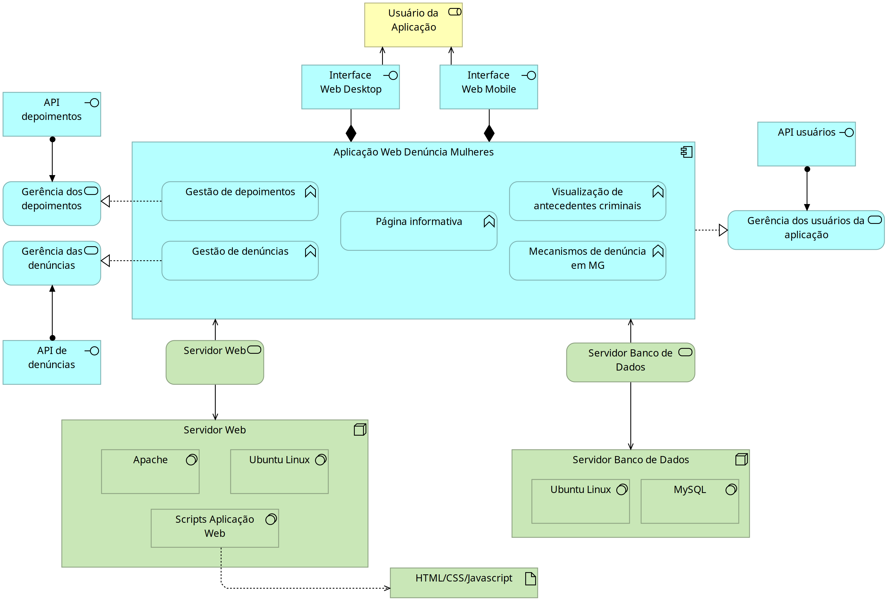

# APIs e Web Services

<b>Minas unidas</b> é um projeto que tem como objetivo auxiliar mulheres no processo de conscientização, diagnóstico de situações de violação e facilitar a realização de denúncias de atos que atentem contra sua dignidade e vida. Por meio de um website/aplicativo, os usuários podem relatar seus depoimentos e registrar suas denúncias de maus-tratos. O serviço também oferece a funcionalidade de visualização de uma lista de depoimentos/denúncias já realizadas pelo usuário, que poderá ser utilizada no futuro, conforme a necessidade do usuário.

## Objetivos da API

O objetivo principal é fornecer às aplicações web e móvel acesso ao registro de depoimentos e denúncias, bem como seu gerenciamento e posterior compartilhamento seja com as autoridades competentes em Minas Gerais ou disponibilizando no mural de depoimentos.

- Fornecer operações CRUD (Create, Read, Update, Delete) para entidades principais, como usuários;
- Facilitar a integração de novos recursos e funcionalidades caso seja necessário;
- Garantir a segurança dos dados dos usuários por meio de autenticação e autorização adequadas;
- Fornecer uma lista de atividade (denúncias e depoimentos) quando for solicitado.


## Arquitetura

Nossa arquitetura será composta inicialmente de duas APIs necessárias para a funcionalidade da aplicação, sendo elas: API de denúncias e API de depoimentos. Cada uma delas será responsável pela gerência das respectivas informações assinaladas anteriormente. Nessa nova versão da arquitetura optamos pela simplicidade para uma construção mais efetiva da base da aplicação web. Observamos ao longo da construção das APIs que essa abordagem auxiliaria na estabilidade e efetividade da aplicação. Entretanto, o objetivo é expandir essas funcionalidade de maneira que a integridade e a disponibilidade não sejam afetadas ao longo do caminho.

A remoção da funcionalidade de busca de antecedentes criminais da nossa arquitetura reflete essa nova abordagem que optamos, mas desejamos adicionar novamente essa expansão futuramente assim que as funcionalidades básicas forem estabelecidas sem falhas.



## Modelagem da Aplicação

A aplicação contará com as seguintes entidades realizando as ações descritas abaixo:

1. Usuário acessa o website/Aplicativo → se cadastra → registra a denúncia e envia para nosso banco de dados.
2. Usuário acessa o website/Aplicativo → se cadastra → registra o depoimento e envia para nosso banco de dados.


## Fluxo de Dados


## API Denúncia


- Método GET
1. O usuário acessa a página de denúncias;
2. A API Denúncia envia via HTTP a solicitação usando o método GET /api/Denúncias;
3. A API de Consulta os dados no banco de dados e lista os todos os registros de Denúncias existentes no banco de dados.


- Método POST
1. O usuário acessa a página de denúncias;
2. O usuário informa os dados do tipo de violência e a descrição da ocorrência;
3. A API de Denúncia envia via HTTP a solicitação usando o método POST e através da rota /api/Denúncias; 
4. O registro é criado no banco de dados.


- Método GET by ID
1. O usuário acessa a página de denúncias;
2. O usuário informa os dado da denúncia que deseja visualizar através do ID da denúncia;
3. A API Denúncia envia via HTTP a solicitação usando o método GET através da rota /api/Denúncias/{id};
4. É identificado pelo sistema o registro é exibido ao usuário na tela o registro solicitado.


- Método PUT
1. O usuário acessa a página de denúncias;
2. O usuário informa os dado da denúncia que deseja visualizar através do ID da denúncia;
3. A API Denúncia envia via HTTP a solicitação usando o método GET através da rota /api/Denúncias/{id};
4. É identificado pelo sistema o registro é exibido ao usuário na tela o registro solicitado.
5. O usuário seleciona a opção de Atualizar o Registro e realiza as alterações necessárias e clica no botão Salvar;
6. A API Denúncia envia via HTTP a solicitação usando o método PUT através da rota /api/Denúncias/{id};
Os dados são armazenados no Banco de Dados.


- Método DELETE
1. O usuário acessa a página de denúncias;
2. O usuário informa os dado da denúncia que deseja visualizar através do ID da denúncia;
3. A API Denúncia envia via HTTP a solicitação usando o método GET através da rota /api/Denúncias/{id};
4. É identificado pelo sistema o registro é exibido ao usuário na tela o registro solicitado.
5. O usuário seleciona a opção de Deletar o Registro e realiza as alterações necessárias e clica no botão Salvar;
6. A API Denúncia envia via HTTP a solicitação usando o método DELETE através da rota /api/Denúncias/{id};
Os dados são armazenados no Banco de Dados.


## API Depoimentos

- Método GET
1. O usuário acessa a página de depoimentos;
2. A API Denúncia envia via HTTP a solicitação usando o método GET /api/Depoimentos;
3. A API de Consulta os dados no banco de dados e lista os todos os registros de Depoimentos existentes no banco de dados.


- Método POST
1. O usuário acessa a página de depoimentos;
2. O usuário informa o descrição do seu depoimento e clica no botão Salvar;
3. A API de Denúncia envia via HTTP a solicitação usando o método POST e através da rota /api/Depoimentos; 
4. O registro é criado no banco de dados.


- Método GET by ID
1. O usuário acessa a página de Depoimentos;
2. O usuário informa os dado do depoimento que deseja visualizar através do ID da depoimento;
3. A API Depoimento envia via HTTP a solicitação usando o método GET através da rota /api/Depoimento/{id};
4. É identificado pelo sistema o registro é exibido ao usuário na tela o registro solicitado.


- Método PUT
1. O usuário acessa a página de Depoimentos;
2. O usuário informa os dado do depoimento que deseja visualizar através do ID do depoimento;
3. A API Depoimentos envia via HTTP a solicitação usando o método GET através da rota /api/Denúncias/{id};
4. É identificado pelo sistema o registro e é exibido ao usuário na tela o registro solicitado.
5. O usuário seleciona a opção de Atualizar o Registro e realiza as alterações necessárias e clica no botão Salvar;
6. A API Denúncia envia via HTTP a solicitação usando o método PUT através da rota /api/Denúncias/{id};
7. Os dados são armazenados no Banco de Dados.


- Método DELETE
1. O usuário acessa a página de denúncias;
2. O usuário informa os dado da denúncia que deseja visualizar através do ID da denúncia;
3. A API Denúncia envia via HTTP a solicitação usando o método GET através da rota /api/Denúncias/{id};
4. É identificado pelo sistema o registro é exibido ao usuário na tela o registro solicitado.
5. O usuário seleciona a opção de Deletar o Registro e realiza as alterações necessárias e clica no botão Salvar;
6. A API Denúncia envia via HTTP a solicitação usando o método DELETE através da rota /api/Denúncias/{id};
Os dados são armazenados no Banco de Dados.


## Requisitos Funcionais

Lista dos principais requisitos funcionais da API:

|ID	   |    Descrição do Requisito                                                                      |   	Prioridade|
|------|------------------------------------------------------------------------------------------------|--------|
|RF-001|   A API deve permitir que os usuários realizem denúncia através da página |    Alta|
|RF-002|   A API deve permitir gerenciar os depoimentos cadastrados (incluir, alterar, excluir e consultar).       |   Alta|


## Tecnologias Utilizadas


Principais tecnologias utilizadas no projeto.

- Framework ASP.NET Core
- JWT (Json Web Token)
- OAuth (Open Authorization)
- Microsoft entity framework core
- Microsoft entity framework core tools
- Microsoft entity framework core sqlserver
- API Rest
- Visual Studio Code
- Swagger
- Insomnia
  
## API Endpoints

Lista dos principais endpoints da API, incluindo as operações disponíveis, os parâmetros esperados e as respostas retornadas:

### API de Denuncias

### GET
- Método: GET
- URL: `/api/Denuncias`
- Parâmetros:
  - Nenhum

#### Resposta:

- Sucesso (200 OK)
  ```
  {
    "message": "Success",
    "data": []
  }
  ```
- Erro (4XX, 5XX)
  ```
  {
    "message": "Error",
    "error": {
      ...
    }
  }

 
### POST
- Método: POST
- URL: `/api/Denuncias`
- Parâmetros:
  - Nenhum
  
#### Corpo da Requisição:

- Tipo: `application/json`
```
{
  "links": [
    {
      "id": 0,
      "href": "string",
      "rel": "string",
      "metodo": "string"
    }
  ],
  "id": 0,
  "tipoViolencia": 1,
  "descricao": "Denúncia1"
}

```
#### Resposta:

- Sucesso (201 Created)
```
  {
    "id": 1,
    "tipoViolencia": 1,
    "descricao": "Denúncia1",
    "links": [
      {
        "id": 5,
        "href": "string",
        "rel": "string",
        "metodo": "string"
      }
    ]
  }
```
- Erro (4XX, 5XX)
```
  {
    "message": "Error",
    "error": {
      
    }
  }
```
  

### GET by ID
- Método: GET
- URL: `/api/Denuncias/{id}`
- Parâmetros:
  - id: *integer* (path)

#### Resposta:

- Sucesso (200 OK)
```
  {
    "id": 1,
    "tipoViolencia": 1,
    "descricao": "Denúncia1",
    "links": [
      {
        "id": 1,
        "href": "https://localhost:7084/api/Denuncias/1",
        "rel": "self",
        "metodo": "GET"
      },
      {
        "id": 1,
        "href": "https://localhost:7084/api/Denuncias/1",
        "rel": "update",
        "metodo": "PUT"
      },
      {
        "id": 1,
        "href": "https://localhost:7084/api/Denuncias/1",
        "rel": "delete",
        "metodo": "DELETE"
      }
    ]
  }
 ```
  - Erro (4XX, 5XX)
```
  {
    "message": "Error",
    "error": {
      
    }
  }
```
  


### PUT
- Método: PUT
- URL: `/api/Denuncias/{id}`
- Parâmetros:
  - id, tipoViolência e descricao

#### Corpo da Requisição:

- Tipo: `application/json`
```json
{
  "links": [
    {
      "id": 0,
      "href": "string",
      "rel": "string",
      "metodo": "string"
    }
  ],
  "id": 1,
  "tipoViolencia": 3,
  "descricao": "Denuncia atualizada"
}
```
#### Resposta:
```
curl -X PUT 'https://localhost:7084/api/Denuncias/1' \
  -H 'accept: */*' \
  -H 'Content-Type: application/json' \
  -d '{
    "links": [
      {
        "id": 0,
        "href": "string",
        "rel": "string",
        "metodo": "string"
      }
    ],
    "id": 1,
    "tipoViolencia": 3,
    "descricao": "Denuncia atualizada"
  }'

```
- Response Reader (204 - Sucesso):
```
date: Sun, 21 Apr 2024 18:55:44 GMT
server: Kestrel
```

- Response Server (200 - Sucesso):
```
Code Description Links
200 Success
```
  - Erro (4XX, 5XX)
```
  {
    "message": "Error",
    "error": {
      
    }
  }
```

### DELETE
- Método: DELETE
- URL: `/api/Denuncias/{id}`
- Parâmetros:
  - id: *integer* (path)

#### Resposta:

- Sucesso (200 OK)
  ```
  []
  ```


#### Resposta:
```
- Sucesso (204 No Content)
```
  - Erro (4XX, 5XX)
```
  {
    "message": "Error",
    "error": {
      
    }
  }
```

#### API de Depoimentos

### GET
- Método: GET
- URL: `/api/Depoimentos`
- Parâmetros:
  - Nenhum

#### Resposta:

- Sucesso (200 OK)
 
 ``` [
    {
      "id": 1,
      "descricao": "Teste2",
      "links": []
    },
    {
      "id": 2,
      "descricao": "Teste3",
      "links": []
    }
  ]
```

  - Erro (4XX, 5XX)
```
  {
    "message": "Error",
    "error": {
      
    }
  }
```


### POST
- Método: POST
- URL: `/api/Depoimentos`
- Parâmetros:
  - Nenhum
  
#### Corpo da Requisição:

- Tipo: `application/json`
```json
{
  "links": [
    {
      "id": 0,
      "href": "string",
      "rel": "string",
      "metodo": "string"
    }
  ],
  "id": 0,
  "descricao": "Teste3"
}
```

#### Resposta:

- Sucesso (201 Created)
  ```
  {
    "id": 2,
    "descricao": "Teste3",
    "links": [
      {
        "id": 4,
        "href": "string",
        "rel": "string",
        "metodo": "string"
      }
    ]
  }
  ```
  - Erro (4XX, 5XX)
```
  {
    "message": "Error",
    "error": {
      
    }
  }
```

  
### POST
- Método: POST
- URL: `/api/Depoimentos`
- Parâmetros:
  - Nenhum
  
#### Corpo da Requisição:

- Tipo: `application/json`
```json
{
  "links": [
    {
      "id": 0,
      "href": "string",
      "rel": "string",
      "metodo": "string"
    }
  ],
  "id": 0,
  "descricao": "Teste3"
}
```

#### Resposta:

- Sucesso (201 Created)

- Erro (4XX, 5XX)
```
  {
    "message": "Error",
    "error": {
      
    }
  }
```


### GET by ID
- Método: GET
- URL: `/api/Depoimentos/{id}`
- Parâmetros:
  - id: *integer* (path)

#### Resposta:

- Sucesso (200 OK)
  ```json
  {
    "id": 2,
    "descricao": "Teste3",
    "links": [
      {
        "id": 2,
        "href": "https://localhost:7084/api/Depoimentos/2",
        "rel": "self",
        "metodo": "GET"
      },
      {
        "id": 2,
        "href": "https://localhost:7084/api/Depoimentos/2",
        "rel": "update",
        "metodo": "PUT"
      },
      {
        "id": 2,
        "href": "https://localhost:7084/api/Depoimentos/2",
        "rel": "delete",
        "metodo": "DELETE"
      }
    ]
  }

- Erro (4XX, 5XX)
```
  {
    "message": "Error",
    "error": {
      
    }
  }
```


### PUT
- Método: PUT
- URL: `/api/Depoimentos/{id}`
- Parâmetros:
  - id e descricao

#### Corpo da Requisição:

- Tipo: `application/json`
```
{
  "links": [
    {
      "id": 0,
      "href": "string",
      "rel": "string",
      "metodo": "string"
    }
  ],
  "id": 1,
  "descricao": "Teste2"
}
```

#### Resposta:
```
curl -X PUT \
  https://localhost:7084/api/Depoimentos/1 \
  -H 'accept: */*' \
  -H 'Content-Type: application/json' \
  -d '{
    "links": [
      {
        "id": 0,
        "href": "string",
        "rel": "string",
        "metodo": "string"
      }
    ],
    "id": 1,
    "descricao": "Teste2"
  }'
```
- Request URL
```
https://localhost:7084/api/Depoimentos/1
```

Server response

 - Sucesso ( 204 - Undocumented Response headers)
```
date: Sun, 21 Apr 2024 18:50:51 GMT
server: Kestrel
```

- Sucesso (200)
  
- Erro (4XX, 5XX)
```
  {
    "message": "Error",
    "error": {
      
    }
  }
```

### DELETE

- Método: DELETE
- URL: `/api/Depoimentos/{id}`
- Parâmetros:
  - id: *integer* (path)

#### Resposta:

```
- Sucesso (204 No Content)
```
  - Erro (4XX, 5XX)
```
  {
    "message": "Error",
    "error": {
      
    }
  }
```


## Considerações de Segurança

A princípio as APIs de nossa aplicação web conterão funcionalidades básicas de segurança mais relacionadas ao seu código fonte e a estrutura das comunicações que as APIs farão com outros serviços da aplicação web. Como ainda não temos uma comunicação externa das APIs para a internet e nenhum dado pessoal foi alocado na aplicação, algumas características de segurança não precisam ser implantadas nesse momento. Sendo assim, a segurança nesse momento está sendo pensada mais focadamente na estrutura base da aplicação web. Segue algumas considerações já observadas e que serão consideradas até a finalização completa de nossas APIs:

| Segurança das APIs                                                                                                                                                                                                                      |
| --------------------------------------------------------------------------------------------------------------------------------------------------------------------------------------------------------------------------------------- |
| 1 - Será exigido métodos de autenticação para a comunicação da aplicação web com a API como tokens ou chaves de API. Ainda estamos trabalhando na definição de qual será o método escolhido.                                            |
| 2 - Cada usuário ou serviço conectado a API terá acesso a um grupo específico de recursos para que o princípio de menor privilégio seja atendido.                                                                                       |
| 3 - Os protocolos utilizados para a comunicação das APIs será sempre aquele que preza pela segurança das transmissões de dados enviados ou recebidos pela API. Ex: HTTPS, SFTP etc                                                      |
| 4 - O código fonte da API será implantando de maneira que seja feita sempre uma validação de entrada nos dados recebidos pela API. Isso garante que ataques como SQL Injection, Cross-Site Scripting, entre outros, não tenham sucesso. |
| 5 - Limite de taxas no número de solicitações realizadas por determinado usuário ou conta de serviço serão feitos para que ataques como força bruta não tenham sucesso.                                                                 |
| 6 -  As tecnologias utilizadas no desenvolvimento da API serão as mais estáveis e atualizadas de maneira que os patches de segurança desenvolvidos sejam aplicados.                                                                     |
| 7 - O código fonte não deverá conter nenhum senha em texto claro ou dado armazenado e transmitido sem criptografia                                                                                                                      |
| 8 - Serão aplicados ferramentas de varredura automatizada para verificação de brechas de segurança que as APIs poderão conter de maneira que as correções sejam estabelecidas                                                           |
| 9 - Se possível os logs da API serão armazenados de maneira que todas as interações com a API sejam registradas para que qualquer ataque ou alteração feita seja do conhecimento dos administradores das APIs                            |
| 10 - Se possível outras camadas de segurança serão aplicadas junto as APIs para a prevenção de atividades maliciosas ou acidentais. Alguns exemplos: WAF, firewalls, IDS/IPS, proxy etc                                                 |

## Implantação

[Instruções para implantar a aplicação distribuída em um ambiente de produção.]

1. Defina os requisitos de hardware e software necessários para implantar a aplicação em um ambiente de produção.
2. Escolha uma plataforma de hospedagem adequada, como um provedor de nuvem ou um servidor dedicado.
3. Configure o ambiente de implantação, incluindo a instalação de dependências e configuração de variáveis de ambiente.
4. Faça o deploy da aplicação no ambiente escolhido, seguindo as instruções específicas da plataforma de hospedagem.
5. Realize testes para garantir que a aplicação esteja funcionando corretamente no ambiente de produção.


 

  Resposta  1 Requisitos de hardware e software necessários:
Hardware: Um servidor com pelo menos 4 núcleos de CPU e 8 GB de RAM é recomendado para lidar com a carga esperada .
Software: Sistema operacional linux e windows, com as ferramentas de desenvolvimento necessárias instaladas, como VSCode.

Resposta 2 Hospedagem:- AWS

3.Configuração do ambiente de implantação:

Dependências necessárias no servidor:
Variáveis de ambiente necessárias: credenciais do banco de dados, chaves de API.
4.Deploy da aplicação:

5.Testes no ambiente de produção

## Testes

Foram realizados testes de validação da API que conforme as imagens abaixo pode se observar o retorno de acordo com a solicitação dos métodos GET/PUT/POST que validam a funcionalidade dos mesmos.

Dessa forma consta-se abaixo os prints dos testes da funcionalidade DENUNCIA :

1. 

2. 

3. 

4. 


  E de forma análoga logo abaixo a funcionalidade  DEPOIMENTO desta API com a adicão do metodo DELETE  funcionando conforme demonstrado abaixo :


  


# Referências

Inclua todas as referências (livros, artigos, sites, etc) utilizados no desenvolvimento do trabalho.

COULOURIS, George F. et al. Sistemas distribuídos: conceitos e projeto. 5. ed. Porto Alegre: Bookman, 2013.

GOUGH, James; BRYANT, Daniel; AUBURN, Matthew. Mastering API Architecture. O'Reilly Media, Inc.. 2021. 

LAURET, Arnaud. The Design of Web APIs. Manning Publications. 2019.
