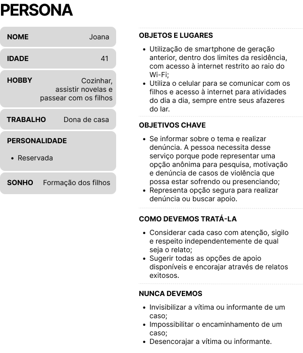
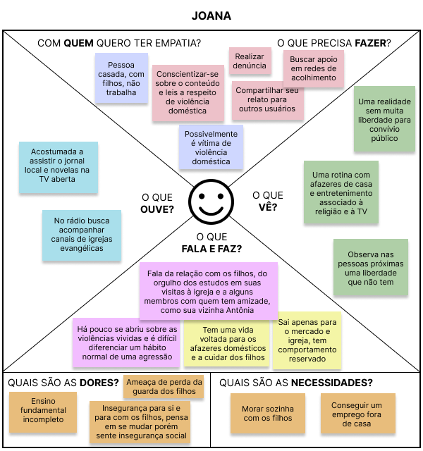
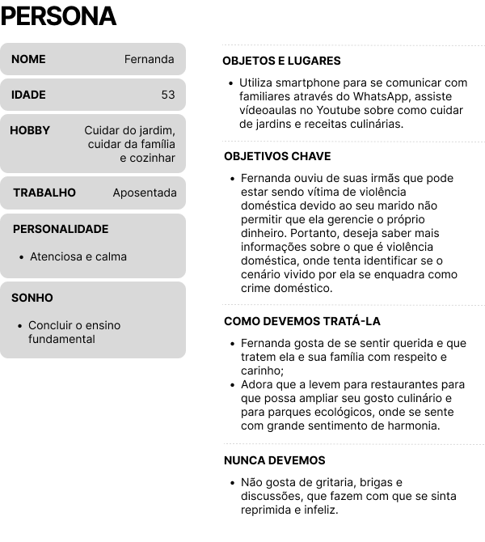
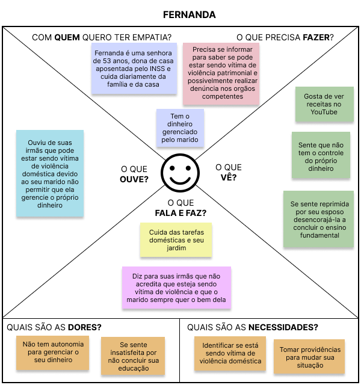
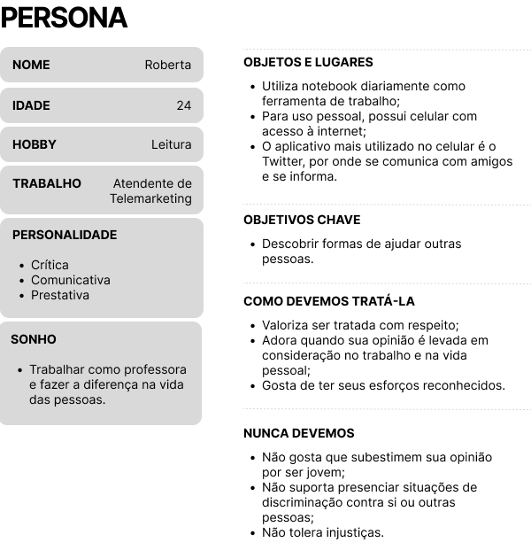
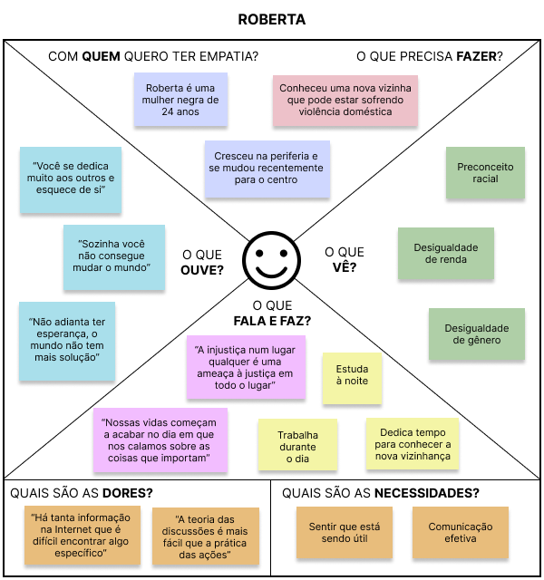
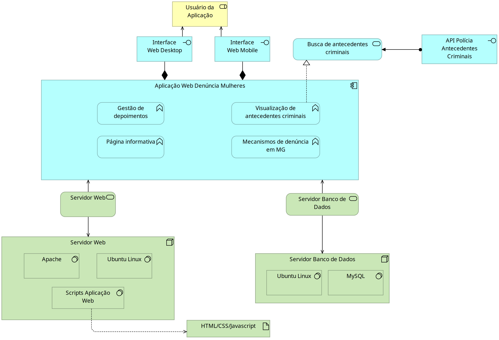

# Introdução

> Texto descritivo com a visão geral do projeto abordado. Inclui o contexto, o problema, os objetivos, a justificativa e o público-alvo do projeto.

Uma em cada três mulheres brasileiras já foi vítima de algum tipo de violência, aponta pesquisa realizada pelo Senado Federal em 2017. Somente no ano de 2020, mais de 105 mil denúncias de violência contra a mulher foram registradas nas plataformas do Ligue 180 e do Disque 100, de acordo com o Ministério da Mulher, da Família e dos Direitos Humanos.

Promulgada em 1996, a Convenção de Belém do Pará definiu violência contra a mulher como qualquer ato ou conduta baseada no gênero que lhe cause morte, dano ou sofrimento físico, sexual ou psicológico, tanto na esfera pública como na esfera privada. Dez anos depois, em 2006 a Lei Maria da Penha passou a apresentar mais duas formas de violência: moral e patrimonial, totalizando em cinco as formas de violência doméstica e familiar praticadas contra mulheres.

Muitas vezes as ações de violência cometidas contra mulheres atingem sua expressão máxima e resultam em óbito. De acordo com mapa da violência de 2015, organizado pela Faculdade Latino-Americana de Ciências Sociais (Flacso), o Brasil ocupa hoje a quinta posição no ranking mundial - em um grupo de 83 países - em feminicídio, entendido como o assassinato de uma mulher em razão de sua condição de ser mulher.

## Problema

> Nesse momento você deve apresentar o problema que a sua aplicação deve  resolver. No entanto, não é a hora de comentar sobre a aplicação. Descreva também o contexto em que essa aplicação será usada, se  houver: empresa, tecnologias, etc. Novamente, descreva apenas o que de  fato existir, pois ainda não é a hora de apresentar requisitos  detalhados ou projetos. Nesse momento, o grupo pode optar por fazer uso  de ferramentas como Design Thinking, que permite um olhar de ponta a ponta para o problema.

> **Links Úteis**:
> - [Objetivos, Problema de pesquisa e Justificativa](https://medium.com/@versioparole/objetivos-problema-de-pesquisa-e-justificativa-c98c8233b9c3)
> - [Matriz Certezas, Suposições e Dúvidas](https://medium.com/educa%C3%A7%C3%A3o-fora-da-caixa/matriz-certezas-suposi%C3%A7%C3%B5es-e-d%C3%BAvidas-fa2263633655)
> - [Brainstorming](https://www.euax.com.br/2018/09/brainstorming/)

A violência no ambiente familiar ou em comunidade representa um dos principais obstáculos para assegurar liberdades fundamentais para mulheres e meninas. Nos últimos anos é notória a intensificação dos debates a respeito, principalmente a violência doméstica. Este é um processo que seguirá em curso sobre a ampliação e aperfeiçoamento de estratégias e instituições para uma melhor abordagem deste problema social.

Para dimensionar o tamanho desse problema basta observarmos os dados mais letais referentes ao tema. Nos últimos vinte anos, 75.280 mulheres foram mortas. Somente em 2017, mulheres foram maioria entre entre as vítimas nos 209.580 registros de violência física - representando 67% do total de vítimas agredidas fisicamente. Se observarmos os perfis das mulheres vítimas de violência doméstica nos anos de 2016 a 2018, em aproximadamente 35% dos casos, são cônjuges/companheiros. A maior parte das vítimas representa parcela vulnerável da sociedade, como negras e pardas (46%) e de ensino fundamental incompleto (21%).

O desconhecimento da sociedade também contribui para fortalecer esta desorientação ao caminho correto a seguir. De acordo com pesquisa realizada pelo Data Popular (2013), a forma como a lei funciona e apoia mulheres é desconhecida pela maior parte da população: 24% sabem dos juizados especiais, 28% conhecem os serviços de saúde especializados e somente 32% conhecem as casas de abrigo temporário. Apesar do amplo conhecimento sobre as Delegacias da Mulher (97%) e a Lei Maria da Penha (66%), os serviços de apoio às mulheres em situação de violência são pouco conhecidos.

A recorrência das agressões também é uma característica comum nos casos onde a mulher não denuncia seu agressor. Entre as mulheres entrevistadas na PNAD de 2009 que procuraram a polícia quando foram agredidas, uma parcela importante não registrou queixa (12,2%), ou seja, não houve registro formal da agressão. Este número sobe (14,6%), quando se trata de um homem conhecido/próximo. A falta de confiança na polícia ou medo de represálias ao se buscar o auxílio do Estado configuram a principal causa.

A vulnerabilidade das mulheres as torna também mais inseguras, levando ao centro de nosso questionamento - a falta de conhecimento e o medo em fazer a denúncia. Apesar do debate público, ainda configura um caminho difícil para a vítima se desprender de todos os fatores que compõem o ciclo de violência e alcançar a segurança necessária para realizar a denúncia. É necessário fornecer um caminho mais curto e acessível, uma plataforma com conteúdo informativo que forneça acolhimento e estímulo para que vítimas realizem suas denúncias de modo seguro e integrado.

## Objetivos

A seguir, são apresentados os objetivos geral e específicos que guiarão o desenvolvimento do projeto.

### Objetivo geral:

Desenvolver uma plataforma integrada composta por uma aplicação web e uma versão móvel, utilizando uma arquitetura de sistemas distribuídos, para preencher a lacuna existente nas plataformas dedicadas a mulheres vítimas de violência em Minas Gerais. O foco central é fornecer informações abrangentes, facilitar o acesso a recursos e promover a conscientização, visando incentivar a denúncia e contribuir para a interrupção do ciclo de violência ao qual estão submetidas.

### Objetivos específicos:

- Disponibilizar conteúdo informativo abrangente sobre os diferentes tipos de violência, auxiliando as vítimas na identificação de sua situação;
- Oferecer acesso à legislação brasileira referente à violência contra a mulher, proporcionando conhecimento sobre seus direitos;
- Identificar e listar os principais mecanismos de denúncia em Minas Gerais, organizados por município, para facilitar o processo de denúncia;
- Construir uma plataforma que permita a inserção de depoimentos, incentivando o acolhimento e promovendo a conscientização sobre a violência contra a mulher;
- Integrar a versão móvel como uma ferramenta adicional para facilitar o processo de denúncia, tornando-o mais acessível e prático para as usuárias;
- Garantir a eficiência, escalabilidade e acessibilidade da plataforma por meio da implementação de uma arquitetura de sistemas distribuídos;
- Integrar à aplicação uma API de consulta de antecedentes criminais, proporcionando a possibilidade de verificar informações relevantes sobre potenciais agressores.

## Justificativa

> Descreva a importância ou a motivação para trabalhar com esta aplicação que você escolheu. Indique as razões pelas quais você escolheu seus objetivos específicos ou as razões para aprofundar em certos aspectos do software.
> O grupo de trabalho pode fazer uso de questionários, entrevistas e dados estatísticos, que podem ser apresentados, com o objetivo de esclarecer detalhes do problema que será abordado pelo grupo.

> **Links Úteis**:
> - [Como montar a justificativa](https://guiadamonografia.com.br/como-montar-justificativa-do-tcc/)

A solução proposta neste projeto para disseminar informações sobre a violência contra mulher, redes de apoio e canais de denúncia por meio de um site mostra-se eficaz, uma vez que o uso da internet tem aumentado no país. De acordo com a pesquisa realizada pelo Centro Regional de Estudos para o Desenvolvimento da Sociedade da Informação (CETIC) em 2020, 83% dos domicílios brasileiros possuem acesso à internet, com menores diferenças regionais em relação a 2019, com maior acesso das classes C, D e E, e 85% das mulheres utilizam a internet.

Espera-se que a página web proposta neste projeto promova o encorajamento a fazer denúncias, por esclarecer as vítimas sobre o tema da violência contra a mulher, sobre as redes de apoio, o acesso aos canais de denúncia e a publicação de depoimentos.

Portanto, o site proposto será uma fonte de informações e de redes de apoio para as vítimas, além de fomentar o registro de denúncias. O site possibilitará que as vítimas consultem esses dados de maneira discreta, pois poderão acessar dos próprios dispositivos móveis ou computadores sem que os agressores percebam.

## Público-Alvo

> Descreva quem serão as pessoas que usarão a sua aplicação indicando os diferentes perfis. O objetivo aqui não é definir quem serão os clientes ou quais serão os papéis dos usuários na aplicação. A ideia é, dentro do possível, conhecer um pouco mais sobre o perfil dos usuários: conhecimentos prévios, relação com a tecnologia, relações
hierárquicas, etc.

> Adicione informações sobre o público-alvo por meio de uma descrição textual, diagramas de personas e mapa de stakeholders.

> **Links Úteis**:
> - [Público-alvo](https://blog.hotmart.com/pt-br/publico-alvo/)
> - [Como definir o público alvo](https://exame.com/pme/5-dicas-essenciais-para-definir-o-publico-alvo-do-seu-negocio/)
> - [Público-alvo: o que é, tipos, como definir seu público e exemplos](https://klickpages.com.br/blog/publico-alvo-o-que-e/)
> - [Qual a diferença entre público-alvo e persona?](https://rockcontent.com/blog/diferenca-publico-alvo-e-persona/)

Pessoas de todos os gêneros e idades que sejam residentes em Minas Gerais. Entretanto, nosso foco será naquelas que sejam ou conheçam mulheres que tenham sido vítimas de violência doméstica de qualquer tipo (física, sexual, psicológica, moral e/ou patrimonial).

# Especificações do Projeto

Nesta seção, são abordadas as especificações do projeto, que incluem a definição do problema e a ideia de solução a partir da perspectiva do usuário. Para isso, são utilizadas técnicas como a criação de personas, histórias de usuários, requisitos funcionais e não funcionais, além das restrições do projeto.

## Personas

A seguir, estão descritas três personas que representam diferentes perfis de usuários da plataforma:

### Persona 1: Joana
Mulher de 41 anos, é casada e mãe de dois filhos, residindo em Belo Horizonte, Minas Gerais. Por vinte anos, ela enfrentou violência física por parte do marido, mas ainda não encontrou coragem para denunciar devido às ameaças de perda da guarda dos filhos. Atualmente, ela vive uma vida reclusa, limitada aos afazeres domésticos e às atividades de cuidar dos filhos. Joana anseia por se informar sobre o tema da violência doméstica e, eventualmente, encontrar coragem para realizar uma denúncia, porém, não sabe como ou onde denunciar.

### Persona 2: Fernanda
Mulher de 53 anos, aposentada e dona de casa. Não concluiu o ensino fundamental e deseja retomar os estudos para realizar o sonho de se formar. No entanto, seu marido Walter não permite que ela administre o dinheiro que recebe da aposentadoria e, por vontade própria, decidiu que não a permitiria realizar seu sonho acadêmico. Durante anos, Fernanda acreditou que esse comportamento fosse normal, mas ouviu de suas irmãs que isso era um tipo de repressão e que seu marido poderia estar violando a Lei Maria da Penha. Fernanda não entende como o confisco do seu dinheiro por seu marido pode ser considerado um crime.

### Persona 3: Roberta
Tem 24 anos, trabalha como atendente de telemarketing e recentemente se mudou para um novo bairro. Conheceu sua nova vizinha, Anne, que detalhou situações de seu casamento que, para ela, são normais, mas para sua nova vizinha se encaixam como crimes. Apesar de querer tomar uma atitude, Roberta não se sente capaz de explicar para Anne o problema da situação da melhor forma. Sendo assim, Roberta gostaria de denunciar o caso e, além disso, ter informações suficientes para conseguir explicar para Anne o motivo para as situações descritas serem problemáticas e por que ela deveria se afastar em definitivo de seu marido.

## Histórias de Usuários

Com base na análise das personas, foram identificadas as seguintes histórias de usuários:

|EU COMO... `PERSONA`| QUERO/PRECISO ... `FUNCIONALIDADE` |PARA ... `MOTIVO/VALOR`                 |
|--------------------|------------------------------------|----------------------------------------|
|Usuário vítima de violência doméstica | Denunciar a violência que sofro às autoridades competentes | Romper o ciclo de violência ao qual estou submetida e buscar ajuda de forma segura |
|Usuário em situação de emergência | Encontrar rapidamente números de telefone e endereços de redes de apoio para vítimas de violência doméstica | Buscar ajuda imediata e sair de uma situação de perigo |
|Usuário em busca de informações sobre violência doméstica | Acessar recursos educacionais e informativos sobre os diferentes tipos de violência contra a mulher | Aumentar a compreensão sobre o assunto, identificar se eu ou alguém ao meu redor está sofrendo violência e tomar medidas para mudar a situação |

## Requisitos

As tabelas que se seguem apresentam os requisitos funcionais e não funcionais que detalham o escopo do projeto. Para determinar a prioridade de requisitos, aplicar uma técnica de priorização de requisitos e detalhar como a técnica foi aplicada.

### Requisitos Funcionais

|ID    | Descrição do Requisito  | Prioridade |
|------|-----------------------------------------|----|
|RF-001| Permitir que o usuário cadastre tarefas | ALTA | 
|RF-002| Emitir um relatório de tarefas no mês   | MÉDIA |

### Requisitos não Funcionais

|ID     | Descrição do Requisito  |Prioridade |
|-------|-------------------------|----|
|RNF-001| O sistema deve ser responsivo para rodar em um dispositivos móvel | MÉDIA | 
|RNF-002| Deve processar requisições do usuário em no máximo 3s |  BAIXA | 

Com base nas Histórias de Usuário, enumere os requisitos da sua solução. Classifique esses requisitos em dois grupos:

- [Requisitos Funcionais
 (RF)](https://pt.wikipedia.org/wiki/Requisito_funcional):
 correspondem a uma funcionalidade que deve estar presente na
  plataforma (ex: cadastro de usuário).
- [Requisitos Não Funcionais
  (RNF)](https://pt.wikipedia.org/wiki/Requisito_n%C3%A3o_funcional):
  correspondem a uma característica técnica, seja de usabilidade,
  desempenho, confiabilidade, segurança ou outro (ex: suporte a
  dispositivos iOS e Android).
Lembre-se que cada requisito deve corresponder à uma e somente uma
característica alvo da sua solução. Além disso, certifique-se de que
todos os aspectos capturados nas Histórias de Usuário foram cobertos.

## Restrições

O projeto está restrito pelos itens apresentados na tabela a seguir.

|ID| Restrição                                             |
|--|-------------------------------------------------------|
|01| O projeto deverá ser entregue até o final do semestre |
|02| Não pode ser desenvolvido um módulo de backend        |

Enumere as restrições à sua solução. Lembre-se de que as restrições geralmente limitam a solução candidata.

> **Links Úteis**:
> - [O que são Requisitos Funcionais e Requisitos Não Funcionais?](https://codificar.com.br/requisitos-funcionais-nao-funcionais/)
> - [O que são requisitos funcionais e requisitos não funcionais?](https://analisederequisitos.com.br/requisitos-funcionais-e-requisitos-nao-funcionais-o-que-sao/)

# Catálogo de Serviços

|      `SERVIÇO`     |             `EXECUÇÃO`                                          |             `QUEM EXECUTA`             |
|--------------------|-----------------------------------------------------------------|----------------------------------------|
|Fazer Login | O Usuário realiza o acesso ao sistema utilizando credenciais de acesso. O usuário deve estar previamente cadastrado no sistema. | Usuário comum ou administrador. |
|Fazer Logout | O usuário sai do sistema clicando no botão de logout. A sessão do usuário é encerrada. | Usuário comum ou administrador. |
|Cadastrar Usuário | Realiza o cadastro de usuários no sistema. São informados os dados de identificação do usuário e gera-se uma senha de acesso dentro dos padrões de segurança estabelecidos. | Usuário administrador. |
|Gerenciar Usuário | Realiza o gerenciamento de usuários previamente cadastrados. O sistema apresenta as operações de Alteração, Exclusão e Consulta de usuários. | Usuário administrador. |
|Realizar Depoimento |O usuário cadastra depoimentos contando sua experiência relacionada à violência contra a mulher. | Usuário comum ou administrador. |
|Gerenciar Depoimento | O usuário pode gerenciar depoimentos que já foram cadastrados.O sistema apresenta as operações de Alteração, Exclusão e Consulta de depoimentos.| Usuário comum ou administrador. |
|Consultar Locais de Denúncia |O usuário pesquisa um local de denúncia. Após selecionar a cidade onde se encontra, o sistema lista locais de denúncia próximos a localidade informada.| Usuário comum ou administrador. |
|Realizar Denúncia |Usuários realizam as denúncias, com informações de localidade e sobre à violência sofrida para que as autoridades consigam realizar as ações necessárias.| Usuário comum ou administrador.|
|Gerenciar Denúncia |O usuário pode gerenciar as denúncias publicadas no sistema. O sistema apresenta as operações de Alteração, Exclusão e Consulta de denúncia.| Usuário comum ou administrador. |
|Consultar Redes de Apoio |O usuário pesquisa um local de apoio à vítima. Após selecionar a cidade onde se encontra, o sistema lista locais de apoio próximos a localidade informada.| Usuário comum ou administrador. |
|Gerenciar Redes de Apoio |O usuário pode gerenciar os locais de apoio cadastrados no sistema. O sistema apresenta as operações de Alteração, Exclusão e Consulta dos locais de apoio.| Usuário administrador. |
|Teste de Perfil de Violência |O usuário responde um questionário que o apoia na identificação de possíveis situações vividas de violência. Ao fim do questionário, o sistema informa se o usuário está sendo ou foi vítima de violência.| Usuário comum ou administrador. |
|Consulta dos Tipos de Violência |O usuário pode consultar informações sobre os tipos de violência, onde, são classificados em cinco tipos: Física, Moral, Patrimonial, Psicológica e Sexual.| Usuário comum ou administrador. |
|Consulta de Legislação |O usuário pode consultar o resumo da Lei Maria da Penha e o sistema fornece link de acesso externo para a Lei Maria da Penha na íntegra.| Usuário comum ou administrador. |
|Visualizar notícias |O usuário pode ler notícias relacionadas ao tema violência doméstica.| Usuário comum ou administrador. |
|Gerenciar notícias |O usuário pode gerenciar as notícias previamente cadastradas no sistema. O sistema apresenta as operações de Alteração, Exclusão e Consulta das notícias.| Usuário administrador. |
|Consultar antecedentes criminais |O usuário pode consultar informações sobre antecedentes criminais de parceiros. O sistema utiliza API da Polícia Civil como fonte de dados.| Usuário comum ou administrador. |

# Gerenciamento de Projeto

De acordo com o PMBoK v6 as dez áreas que constituem os pilares para gerenciar projetos, e que caracterizam a multidisciplinaridade envolvida, são: Integração, Escopo, Cronograma (Tempo), Custos, Qualidade, Recursos, Comunicações, Riscos, Aquisições, Partes Interessadas. Para desenvolver projetos um profissional deve se preocupar em gerenciar todas essas dez áreas. Elas se complementam e se relacionam, de tal forma que não se deve apenas examinar uma área de forma estanque. É preciso considerar, por exemplo, que as áreas de Escopo, Cronograma e Custos estão muito relacionadas. Assim, se eu amplio o escopo de um projeto eu posso afetar seu cronograma e seus custos.

## Gerenciamento de Tempo

Com diagramas bem organizados que permitem gerenciar o tempo nos projetos, o gerente de projetos agenda e coordena tarefas dentro de um projeto para estimar o tempo necessário de conclusão.

O gráfico de Gantt ou diagrama de Gantt também é uma ferramenta visual utilizada para controlar e gerenciar o cronograma de atividades de um projeto. Com ele, é possível listar tudo que precisa ser feito para colocar o projeto em prática, dividir em atividades e estimar o tempo necessário para executá-las.

## Gerenciamento de Equipe

O gerenciamento adequado de tarefas contribuirá para que o projeto alcance altos níveis de produtividade. Por isso, é fundamental que ocorra a gestão de tarefas e de pessoas, de modo que os times envolvidos no projeto possam ser facilmente gerenciados. 

# Arquitetura da Solução

Definição de como o software é estruturado em termos dos componentes que fazem parte da solução e do ambiente de hospedagem da aplicação.

## Tecnologias Utilizadas

> Descreva aqui qual(is) tecnologias você vai usar para resolver o seu problema, ou seja, implementar a sua solução. Liste todas as tecnologias envolvidas, linguagens a serem utilizadas, serviços web, frameworks, bibliotecas, IDEs de desenvolvimento, e ferramentas.

> Apresente também uma figura explicando como as tecnologias estão relacionadas ou como uma interação do usuário com o sistema vai ser conduzida, por onde ela passa até retornar uma resposta ao usuário.

### Ambiente de desenvolvimento:
- **Visual Studio Code**: IDE para desenvolvimento do código-fonte.
- **Git**: Sistema de controle de versão para rastreamento e gerenciamento de alterações no código-fonte, possibilitando colaboração e versionamento.

### Front-end:
- **HTML**: Linguagem de marcação para estruturação do conteúdo na web.
- **CSS**: Linguagem de estilização para design e apresentação visual da plataforma.
- **Bootstrap**:  Framework front-end que será empregado para facilitar o desenvolvimento responsivo, garantindo uma experiência do usuário consistente em diferentes dispositivos.
- **JavaScript**: Linguagem de programação para implementar funcionalidades dinâmicas e interativas na página web.

## Hospedagem

Explique como a hospedagem e o lançamento da plataforma foi feita.

> **Links Úteis**:
>
> - [Website com GitHub Pages](https://pages.github.com/)
> - [Programação colaborativa com Repl.it](https://repl.it/)
> - [Getting Started with Heroku](https://devcenter.heroku.com/start)
> - [Publicando Seu Site No Heroku](http://pythonclub.com.br/publicando-seu-hello-world-no-heroku.html)

# Referências

BRASIL. <b>Decreto nº. 1.973, de 1º de agosto de 1996.</b> Presidência da República, Casa Civil, Subchefia para Assuntos Jurídicos. Disponível em: http://www.planalto.gov.br/ccivil_03/decreto/1996/d1973.htm. Acesso em: 5 de mar. de 2024.

BRASIL. <b>Lei nº. 11.340, de 7 de agosto de 2006.</b> Presidência da República, Secretaria-Geral, Subchefia para Assuntos Jurídicos. Disponível em: http://www.planalto.gov.br/ccivil_03/_ato2004-2006/2006/lei/l11340.htm. Acesso em: 5 de mar. de 2024.

<b>CANAIS registram mais de 105 mil denúncias de violência contra mulher em 2020, </b>Governo do Brasil, 08 de mar. de 2021. Disponível em: https://www.gov.br/pt-br/noticias/assistencia-social/2021/03/canais-registram-mais-de-105-mil-denuncias-de-violencia-contra-mulher-em-2020. Acesso em: 5 de mar. de 2024.

CETIC, <b>TIC Domicílios 2020.</b> Disponível em: https://cetic.br/media/analises/tic_domicilios_2020_coletiva_imprensa.pdf. Acesso em: 5 de mar. de 2024.

SENADO FEDERAL. <b>Violência doméstica e familiar contra a mulher. </b> Pesquisa DataSenado. Brasília, 2017. Disponível em: https://www12.senado.leg.br/institucional/datasenado/arquivos/aumenta-numero-de-mulheres-que-declaram-ter-sofrido-violencia. Acesso em: 5 de mar. de 2024.
