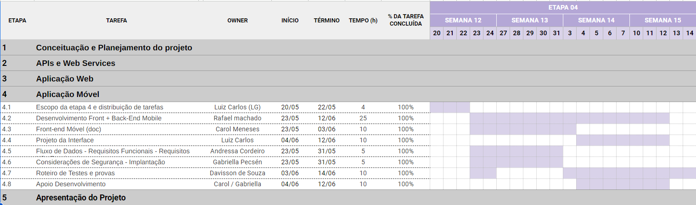
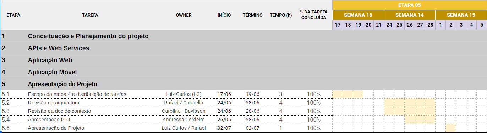
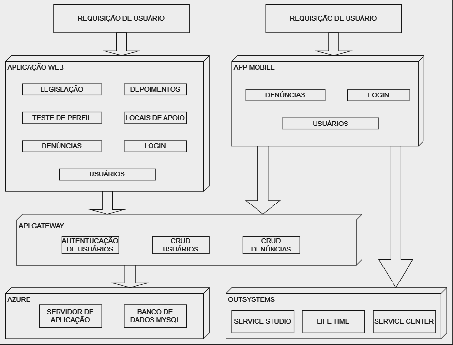

# Introdução

Uma em cada três mulheres brasileiras já foi vítima de algum tipo de violência, aponta pesquisa realizada pelo Senado Federal em 2017. Somente no ano de 2020, mais de 105 mil denúncias de violência contra a mulher foram registradas nas plataformas do Ligue 180 e do Disque 100, de acordo com o Ministério da Mulher, da Família e dos Direitos Humanos.

Promulgada em 1996, a Convenção de Belém do Pará definiu violência contra a mulher como qualquer ato ou conduta baseada no gênero que lhe cause morte, dano ou sofrimento físico, sexual ou psicológico, tanto na esfera pública quanto na esfera privada. Dez anos depois, em 2006, a Lei Maria da Penha passou a apresentar mais duas formas de violência: moral e patrimonial, totalizando cinco formas de violência doméstica e familiar praticadas contra mulheres.

Muitas vezes as ações de violência cometidas contra mulheres atingem sua expressão máxima e resultam em óbito. De acordo com o mapa da violência de 2015, organizado pela Faculdade Latino-Americana de Ciências Sociais (Flacso), o Brasil ocupa hoje a quinta posição no ranking mundial - em um grupo de 83 países - em feminicídio, entendido como o assassinato de uma mulher em razão de sua condição de ser mulher.

## Problema

A violência no ambiente familiar ou em comunidade representa um dos principais obstáculos para assegurar liberdades fundamentais para mulheres e meninas. Nos últimos anos, é notória a intensificação dos debates a respeito, principalmente a violência doméstica. Este é um processo que seguirá em curso sobre a ampliação e aperfeiçoamento de estratégias e instituições para uma melhor abordagem deste problema social.

Para dimensionar o tamanho desse problema, basta observarmos os dados mais letais referentes ao tema. Nos últimos vinte anos, 75.280 mulheres foram mortas. Somente em 2017, mulheres foram maioria entre as vítimas nos 209.580 registros de violência física - representando 67% do total de vítimas agredidas fisicamente. Se observarmos os perfis das mulheres vítimas de violência doméstica nos anos de 2016 a 2018, em aproximadamente 35% dos casos, são cônjuges/companheiros. A maior parte das vítimas representa parcela vulnerável da sociedade, como negras e pardas (46%) e de ensino fundamental incompleto (21%).

O desconhecimento da sociedade também contribui para fortalecer esta desorientação ao caminho correto a seguir. De acordo com pesquisa realizada pelo Data Popular (2013), a forma como a lei funciona e apoia mulheres é desconhecida pela maior parte da população: 24% sabem dos juizados especiais, 28% conhecem os serviços de saúde especializados e somente 32% conhecem as casas de abrigo temporário. Apesar do amplo conhecimento sobre as Delegacias da Mulher (97%) e a Lei Maria da Penha (66%), os serviços de apoio às mulheres em situação de violência são pouco conhecidos.

A recorrência das agressões também é uma característica comum nos casos em que a mulher não denuncia seu agressor. Entre as mulheres entrevistadas na PNAD de 2009 que procuraram a polícia quando foram agredidas, uma parcela importante não registrou queixa (12,2%), ou seja, não houve registro formal da agressão. Este número sobe (14,6%) quando se trata de um homem conhecido/próximo. A falta de confiança na polícia ou medo de represálias ao se buscar o auxílio do Estado configura a principal causa.

A vulnerabilidade das mulheres as torna também mais inseguras, levando ao centro de nosso questionamento - a falta de conhecimento e o medo em fazer a denúncia. Apesar do debate público, ainda se configura um caminho difícil para a vítima se desprender de todos os fatores que compõem o ciclo de violência e alcançar a segurança necessária para efetivar a denúncia. É necessário fornecer um caminho mais seguro e acessível, um aplicativo que será a extensão de uma plataforma, com conteúdo informativo que forneça acolhimento e estímulo para que vítimas realizem suas denúncias de modo rápido e integrado.

## Objetivos

A seguir, são apresentados os objetivos geral e específicos que guiarão o desenvolvimento do projeto.

### Objetivo geral:

Desenvolver uma plataforma integrada composta por uma aplicação web e uma versão móvel, utilizando uma arquitetura de sistemas distribuídos, para preencher a lacuna existente nas plataformas dedicadas a mulheres vítimas de violência em Minas Gerais. O foco central é fornecer informações abrangentes, facilitar o acesso a recursos e promover a conscientização, visando incentivar a denúncia e contribuir para a interrupção do ciclo de violência ao qual estão submetidas.

### Objetivos específicos:

- Disponibilizar conteúdo informativo abrangente sobre os diferentes tipos de violência, auxiliando as vítimas na identificação de sua situação;
- Oferecer acesso à legislação brasileira referente à violência contra a mulher, proporcionando conhecimento sobre seus direitos;
- Identificar e listar os principais mecanismos de denúncia em Minas Gerais, organizados por município, para facilitar o processo de denúncia;
- Construir uma plataforma que permita a inserção de depoimentos, incentivando o acolhimento e promovendo a conscientização sobre a violência contra a mulher;
- Integrar a versão móvel como uma ferramenta adicional para facilitar o processo de denúncia, tornando-o mais acessível e prático para as usuárias;
- Garantir a eficiência, escalabilidade e acessibilidade da plataforma por meio da implementação de uma arquitetura de sistemas distribuídos.

## Justificativa

A solução proposta neste projeto para disseminar informações sobre a violência contra a mulher, redes de apoio e canais de denúncia por meio de plataforma mostra-se eficaz, uma vez que o uso da internet tem aumentado no país. De acordo com a pesquisa realizada pelo Centro Regional de Estudos para o Desenvolvimento da Sociedade da Informação (CETIC) em 2020, 83% dos domicílios brasileiros possuem acesso à internet, com menores diferenças regionais em relação a 2019, com maior acesso das classes C, D e E, e 85% das mulheres utilizam a internet.

Espera-se que a plataforma proposta promova o encorajamento necessário às vítimas para fazer suas denúncias, por esclarecer sobre o tema da violência contra a mulher, sobre as redes de apoio, o acesso aos canais de denúncia e a publicação de depoimentos. A dualidade versão web e o aplicativo, uma vez integrados, possibilitará uma fonte essencial de recursos imediatos, além de fomentar a conscientização da população.

## Público-Alvo

Pessoas de todos os gêneros e idades que sejam residentes em Minas Gerais. Entretanto, nosso foco será naquelas que sejam ou conheçam mulheres que tenham sido vítimas de violência doméstica de qualquer tipo (física, sexual, psicológica, moral e/ou patrimonial).

# Especificações do Projeto

Nesta seção, são abordadas as especificações do projeto, que incluem a definição do problema e a ideia de solução a partir da perspectiva do usuário. Para isso, são utilizadas técnicas como a criação de personas, histórias de usuários, requisitos funcionais e não funcionais, além das restrições do projeto.

## Personas

A seguir, estão descritas três personas que representam diferentes perfis de usuários da plataforma:

### Persona 1: Joana
Mulher de 41 anos, é casada e mãe de dois filhos, residindo em Belo Horizonte, Minas Gerais. Por vinte anos, ela enfrentou violência física por parte do marido, mas ainda não encontrou coragem para denunciar devido às ameaças de perda da guarda dos filhos. Atualmente, ela vive uma vida reclusa, limitada aos afazeres domésticos e às atividades de cuidar dos filhos. Joana anseia por se informar sobre o tema da violência doméstica e, eventualmente, encontrar coragem para realizar uma denúncia, porém, não sabe como ou onde denunciar.

 

### Persona 2: Fernanda
Mulher de 53 anos, aposentada e dona de casa. Não concluiu o ensino fundamental e deseja retomar os estudos para realizar o sonho de se formar. No entanto, seu marido Walter não permite que ela administre o dinheiro que recebe da aposentadoria e, por vontade própria, decidiu que não a permitiria realizar seu sonho acadêmico. Durante anos, Fernanda acreditou que esse comportamento fosse normal, mas ouviu de suas irmãs que isso era um tipo de repressão e que seu marido poderia estar violando a Lei Maria da Penha. Fernanda não entende como o confisco do seu dinheiro por seu marido pode ser considerado um crime.

### Persona 3: Roberta
Tem 24 anos, trabalha como atendente de telemarketing e recentemente se mudou para um novo bairro. Conheceu sua nova vizinha, Anne, que detalhou situações de seu casamento que, para ela, são normais, mas para sua nova vizinha se encaixam como crimes. Apesar de querer tomar uma atitude, Roberta não se sente capaz de explicar para Anne o problema da situação da melhor forma. Sendo assim, Roberta gostaria de denunciar o caso e, além disso, ter informações suficientes para conseguir explicar para Anne o motivo para as situações descritas serem problemáticas e por que ela deveria se afastar em definitivo de seu marido.

## Histórias de Usuários

Com base na análise das personas, foram identificadas as seguintes histórias de usuários:

|EU COMO... `PERSONA`| QUERO/PRECISO ... `FUNCIONALIDADE` |PARA ... `MOTIVO/VALOR`                 |
|--------------------|------------------------------------|----------------------------------------|
|Usuário vítima de violência doméstica | Denunciar a violência que sofro às autoridades competentes | Romper o ciclo de violência ao qual estou submetida e buscar ajuda de forma segura |
|Usuário em situação de emergência | Encontrar rapidamente números de telefone e endereços de redes de apoio para vítimas de violência doméstica | Buscar ajuda imediata e sair de uma situação de perigo |
|Usuário em busca de informações sobre violência doméstica | Acessar recursos educacionais e informativos sobre os diferentes tipos de violência contra a mulher | Aumentar a compreensão sobre o assunto, identificar se eu ou alguém ao meu redor está sofrendo violência e tomar medidas para mudar a situação |

## Requisitos

As tabelas que se seguem apresentam os requisitos funcionais e não funcionais que detalham o escopo do projeto.

### Requisitos Funcionais

Para atender às demandas dos usuários, foram estabelecidos os seguintes requisitos funcionais:

| ID     | Descrição do Requisito                              | Prioridade |
|--------|-----------------------------------------------------|------------|
| RF-001 | Cadastrar denúncia de violência doméstica           | ALTA       |
| RF-002 | Consultar denúncia de violência doméstica           | ALTA       |
| RF-003 | Editar denúncia de violência doméstica              | ALTA       |
| RF-004 | Excluir denúncia de violência doméstica             | ALTA       |
| RF-005 | Gerenciar denúncias de violência doméstica          | ALTA       |
| RF-006 | Consultar redes de apoio disponíveis                | ALTA       |
| RF-007 | Visualizar depoimentos de vítimas                   | MÉDIA      |
| RF-008 | Realizar teste sobre violência doméstica            | MÉDIA      |
| RF-009 | Gerenciar perfis de usuários                        | ALTA       |
| RF-010 | Criar perfil de usuário                             | ALTA       |
| RF-011 | Consultar perfil de usuário                         | ALTA       |
| RF-012 | Editar perfil de usuário                            | ALTA       |
| RF-013 | Excluir perfil de usuário                           | ALTA       |
| RF-014 | Fazer login no sistema                              | BAIXA      |
| RF-015 | Fazer logout do sistema                             | BAIXA      |

### Requisitos não Funcionais

Abaixo estão listados os requisitos não funcionais identificados para o sistema:

| ID      | Descrição do Requisito                                                  | Prioridade |
|---------|-------------------------------------------------------------------------|------------|
| RNF-001 | Compatibilidade com os principais navegadores                           | ALTA       |
| RNF-002 | Interface gráfica responsiva                                            | MÉDIA      |
| RNF-003 | Disponibilidade do sistema por pelo menos 90% do tempo                  | ALTA       |
| RNF-004 | Tempo de resposta inferior a 3 segundos para as solicitações do usuário | MÉDIA      |
| RNF-005 | Conformidade com as normas e padrões legais                             | ALTA       |
| RNF-006 |  Implementação de medidas de segurança da informação                    | MÉDIA      |

## Restrições

O projeto está restrito pelos itens apresentados na tabela a seguir:

| ID | Restrição                                                                                         |
|----|---------------------------------------------------------------------------------------------------|
| 01 | O projeto deverá ser entregue até o final de junho de 2024                                        |
| 02 | A abrangência do projeto limita-se a Minas Gerais                                                 |
| 03 | Todo o conteúdo do sistema, incluindo textos, botões e mensagens de erro, deve estar em português |

# Catálogo de Serviços

O catálogo de serviços oferecidos pelo sistema abrange as seguintes funcionalidades:

|      SERVIÇO                  |             EXECUÇÃO                                                   |             QUEM EXECUTA             |
|-------------------------------|------------------------------------------------------------------------|--------------------------------------|
| Fazer login                   | O usuário realiza o acesso ao sistema utilizando credenciais de acesso. Para isso, é necessário estar previamente cadastrado no sistema. | Usuário comum ou administrador |
| Fazer logout                  | O usuário sai do sistema clicando no botão de sair, o que encerra sua sessão no sistema.  | Usuário comum ou administrador |
| Cadastrar usuário             | Realiza o cadastro de usuários no sistema, fornecendo dados de identificação e uma senha. | Usuário comum ou administrador |
| Gerenciar usuários            | Permite o gerenciamento de usuários já cadastrados, incluindo operações de edição, exclusão e consulta. | Usuário administrador |
| Realizar depoimento           | Permite aos usuários comuns cadastrar depoimentos sobre suas experiências relacionadas à violência contra a mulher. | Usuário comum |
| Consultar locais de denúncia  | Permite ao usuário buscar locais de denúncia próximos, selecionando a cidade desejada para listar as opções disponíveis. | Usuário comum ou administrador |
| Realizar denúncia             | Permite aos usuários realizar denúncias de violência doméstica, fornecendo informações detalhadas para as autoridades competentes. | Usuário comum |
| Gerenciar denúncias           | Oferece operações de edição, exclusão e consulta das denúncias publicadas no sistema. | Usuário comum ou administrador |
| Consultar redes de apoio      | Permite ao usuário pesquisar locais de apoio à vítima, listando opções próximas à localidade selecionada. | Usuário comum ou administrador |
| Teste de perfil de violência  | Oferece um questionário para auxiliar na identificação de possíveis situações de violência vividas pelo usuário, informando o resultado ao final. | Usuário comum |
| Consultar tipos de violência  | Permite consultar informações sobre os tipos de violência, classificados em física, moral, patrimonial, psicológica e sexual. | Usuário comum ou administrador |
| Consultar legislação          | Oferece um resumo da Lei Maria da Penha e fornece um link de acesso externo para a lei na íntegra. | Usuário comum  |
| Visualizar notícias           | Permite ao usuário visualizar notícias selecionadas relacionadas ao tema violência doméstica. | Usuário comum |

# Gerenciamento de Projeto

O gerenciamento do projeto será baseado na metodologia PMBOK (Project Management Body of Knowledge), priorizando seus cinco processos principais: Iniciação, Planejamento, Execução, Monitoramento e Encerramento. Durante todo o período do projeto, espera-se manter os membros da equipe, o líder do projeto e as tarefas alinhados em relação à demanda, produtividade, feedback e tempo.

Ao longo das cinco etapas do projeto, planeja-se aplicar as fases da metodologia de forma que, no início de cada entrega, sejam analisados os requisitos e as tarefas a serem desenvolvidas. Em seguida, de acordo com as competências de cada membro da equipe, as funções serão atribuídas de modo a otimizar a entrega. Ao final de cada etapa, será realizada uma análise dos pontos positivos e negativos, visando aprimorar a performance na entrega seguinte.

#### ETAPA 1: Conceituação e planejamento do projeto - Sistema Distribuído

- Análise dos requisitos da etapa e definição do escopo;
- Distribuição de tarefas, definição de funções e tempo disponível;
- Pesquisa e adequação do tema a uma nova funcionalidade;
- Definição de requisitos funcionais, não funcionais e restrições;
- Desenvolvimento de um documento do projeto contendo a contextualização do projeto.

### ETAPA 2: Planejar, desenvolver e gerenciar - APIs e Web Services

- Análise dos requisitos da etapa e definição do escopo;
- Distribuição de tarefas, definição de funções e tempo disponível;
- Identificação das APIs e serviços web que farão parte do sistema;
- Desenvolvimento das APIs de acordo com o projeto;
- Implementação de autenticação e segurança nas APIs, se necessário;
- Realização de testes de unidade e integração nas APIs e serviços web;
- Documentação das APIs e serviços Web no documento de projeto.

### ETAPA 3: Planejar, desenvolver e gerenciar - Aplicação Web

- Análise dos requisitos da etapa e definição do escopo;
- Distribuição de tarefas, definição de funções e tempo disponível;
- Desenvolvimento das diferentes páginas e componentes da aplicação web;
- Integração das APIs e serviços web desenvolvidos anteriormente na aplicação;
- Testes da aplicação web em diferentes navegadores e dispositivos;
- Realização de testes de desempenho e otimização da velocidade da aplicação, se necessário.
- Documentação da aplicação web no documento de projeto.

### ETAPA 4: Planejar, desenvolver e gerenciar - Aplicação Móvel

- Análise dos requisitos da etapa e definição do escopo;
- Distribuição de tarefas, definição de funções e tempo disponível;
- Definição da plataforma-alvo para a aplicação móvel (iOS, Android, etc.);
- Projeto da interface do usuário da aplicação móvel;
- Desenvolvimento das telas e fluxos de navegação da aplicação móvel;
- Integração das APIs e serviços web relevantes à aplicação móvel;
- Implementação de recursos nativos, como notificações push e geolocalização, etc;
- Realização de testes em dispositivos reais e emuladores para garantir o desempenho;
- Documentação da aplicação móvel no documento de projeto.

### ETAPA 5: Apresentação do Projeto

- Análise dos requisitos da etapa e definição do escopo;
- Preparação de materiais visuais e de apresentação, como slides ou demonstrações;
- Realização de uma apresentação para as partes interessadas, destacando os principais recursos e benefícios do sistema;
- Demonstração da funcionalidade das aplicações web e móveis, incluindo o uso das APIs e serviços web.
- Recebimento de feedback das partes interessadas e resposta a perguntas.
- Fornecimento de informações sobre como acessar e usar as aplicações após o lançamento.

# Arquitetura da Solução

Nossa solução será composta de uma aplicação web com diferentes funcionalidades para atender os requisitos funcionais e não funcionais da solução. Esse portal web será executado a partir de dois servidores, um servidor web e outro servidor para o banco de dados. Optamos por separar o front-end do back-end para a facilitação do gerenciamento e escalabilidade da solução. Para o acesso ao portal web o usuário poderá contar com duas interfaces web, uma para o acesso em desktops e outra para o acesso em dispositivos móveis. Além disso, a aplicação web contará com a integração em APIs para a expansão de suas funcionalidades. Uma das APIs que será utilizada, mostrada na arquitetura abaixo, permite a busca de antecedentes criminais de um indivíduo. Essa arquitetura poderá ser modificada e expandida ao longo do projeto, pois novas funcionalidades relativas à segurança e performance da aplicação poderão ser necessárias.

## Tecnologias Utilizadas

A seguir, estão listadas as tecnologias utilizadas no desenvolvimento do projeto:

### Ambiente de desenvolvimento:
- **Visual Studio Code**: IDE para desenvolvimento do código-fonte.
- **Git**: Sistema de controle de versão para rastreamento e gerenciamento de alterações no código-fonte, possibilitando colaboração e versionamento.
- **GitHub**: Plataforma de hospedagem de código-fonte e colaboração para desenvolvimento de projetos.
- **OutSystems Service Studio**: Ambiente de desenvolvimento para a plataforma OutSystems, utilizado para criar e gerenciar aplicações de maneira visual.

### Front-end web:
- **HTML**: Linguagem de marcação para estruturação do conteúdo na web.
- **CSS**: Linguagem de estilização para design e apresentação visual da plataforma.
- **Bootstrap**: Framework front-end que será empregado para facilitar o desenvolvimento responsivo, garantindo uma experiência do usuário consistente em diferentes dispositivos.
- **JavaScript**: Linguagem de programação para implementar funcionalidades dinâmicas e interativas na página web.

### Front-end móvel:
- **OutSystems**: Plataforma de desenvolvimento rápido de aplicações (low-code) que permite a criação de aplicações web e móveis utilizando uma abordagem visual e orientada a componentes.
- **LifeTime OutSystems**: Ferramenta utilizada para gerenciamento de ambientes, versionamento e governança das aplicações.
- **Service Center**: Ferramenta da plataforma OutSystems utilizada para gerenciamento de aplicações, monitoramento de recursos e logs de erros.

### Back-end:
- **Node.js**: Framework de execução JavaScript assíncrono orientado a eventos, projetado para construir aplicativos de rede escalonáveis, onde muitas conexões podem ser tratadas simultaneamente.
- **Express**: Framework web utilizado para criar aplicações Node.js, aproveitando seu módulo HTTP para criar as comunicações.
- **Postman**: Software utilizado para testar APIs.
- **Body-parser**: Middleware utilizado para fazer o parsing do corpo das requisições HTTP.
- **Cors**: Middleware utilizado para habilitar o CORS (Cross-Origin Resource Sharing) no servidor Express.

### Banco de dados:
- **Microsoft SQL Server**: Sistema de gerenciamento de banco de dados relacional desenvolvido pela Microsoft.

### Hospedagem
- **Azure**: A aplicação será hospedada em um servidor na nuvem Azure da Microsoft.

# Referências

BRASIL. <b>Decreto nº. 1.973, de 1º de agosto de 1996.</b> Presidência da República, Casa Civil, Subchefia para Assuntos Jurídicos. Disponível em: http://www.planalto.gov.br/ccivil_03/decreto/1996/d1973.htm. Acesso em: 5 de mar. de 2024.

BRASIL. <b>Lei nº. 11.340, de 7 de agosto de 2006.</b> Presidência da República, Secretaria-Geral, Subchefia para Assuntos Jurídicos. Disponível em: http://www.planalto.gov.br/ccivil_03/_ato2004-2006/2006/lei/l11340.htm. Acesso em: 5 de mar. de 2024.

<b>CANAIS registram mais de 105 mil denúncias de violência contra mulher em 2020, </b>Governo do Brasil, 08 de mar. de 2021. Disponível em: https://www.gov.br/pt-br/noticias/assistencia-social/2021/03/canais-registram-mais-de-105-mil-denuncias-de-violencia-contra-mulher-em-2020. Acesso em: 5 de mar. de 2024.

CETIC, <b>TIC Domicílios 2020.</b> Disponível em: https://cetic.br/media/analises/tic_domicilios_2020_coletiva_imprensa.pdf. Acesso em: 5 de mar. de 2024.

SENADO FEDERAL. <b>Violência doméstica e familiar contra a mulher. </b> Pesquisa DataSenado. Brasília, 2017. Disponível em: https://www12.senado.leg.br/institucional/datasenado/arquivos/aumenta-numero-de-mulheres-que-declaram-ter-sofrido-violencia. Acesso em: 5 de mar. de 2024.
