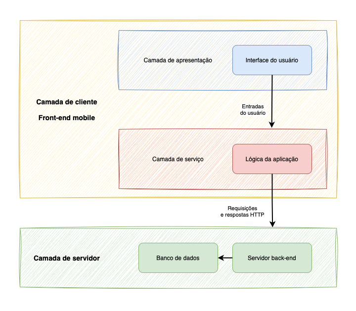
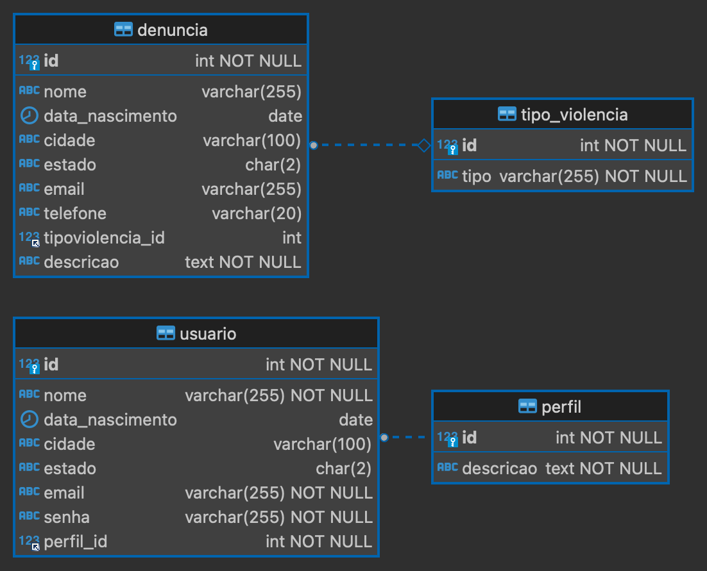
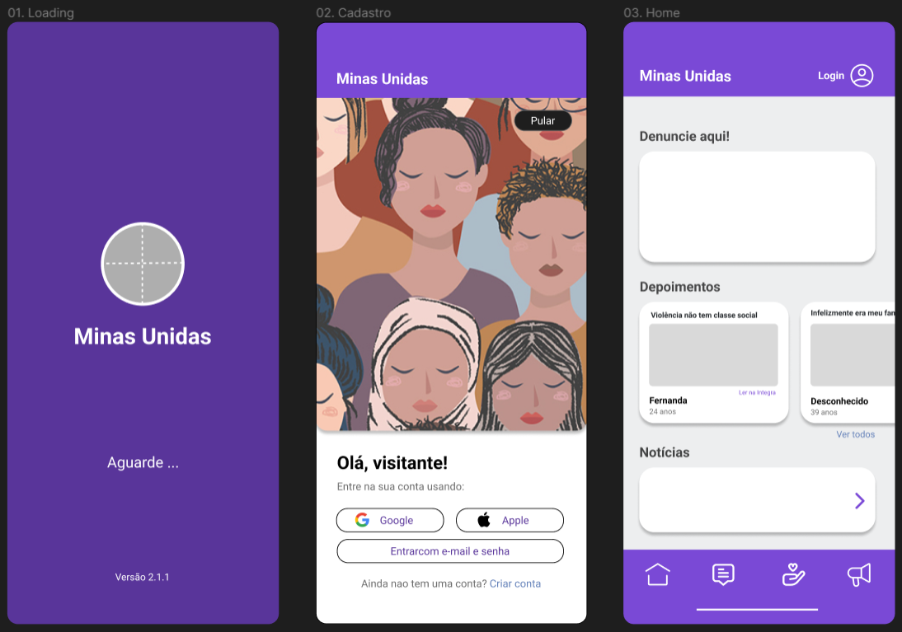

# Front-end Móvel

Este documento aborda o desenvolvimento do front-end móvel para o projeto **Minas Unidas**. O objetivo principal do front-end móvel é fornecer uma interface amigável para que os usuários possam se cadastrar e registrar denúncias diretamente de seus dispositivos móveis. O foco será na usabilidade e na integração com o back-end da aplicação.

## Tecnologias Utilizadas

A seguir, estão listadas as tecnologias utilizadas no desenvolvimento do projeto:

### Ambiente de desenvolvimento:
- **OutSystems Service Studio**: Ambiente de desenvolvimento para a plataforma OutSystems, utilizado para criar e gerenciar aplicações de maneira visual.
- **Git**: Sistema de controle de versão para rastreamento e gerenciamento de alterações no código-fonte, possibilitando colaboração e versionamento.
- **GitHub**: Plataforma de hospedagem de código-fonte e colaboração para desenvolvimento de projetos.

### Front-end móvel:
- **OutSystems**: Plataforma de desenvolvimento rápido de aplicações (low-code) que permite a criação de aplicações web e móveis utilizando uma abordagem visual e orientada a componentes.
- **LifeTime OutSystems**: Ferramenta utilizada para gerenciamento de ambientes, versionamento e governança das aplicações.
- **Service Center**: Ferramenta da plataforma OutSystems utilizada para gerenciamento de aplicações, monitoramento de recursos e logs de erros.

## Arquitetura

A arquitetura do front-end móvel segue uma abordagem cliente/servidor, com duas camadas principais: o cliente (aplicativo móvel) e o servidor (back-end).

### Componentes principais

#### 1. Camada de Cliente: Front-end Mobile

##### Camada de apresentação: Interface de Usuário

Esta camada é responsável por fornecer a interface com o usuário, incluindo elementos visuais, interações e fluxo de tela. Contém os componentes visuais da aplicação, como botões, campos de entrada, listas e outros elementos de interface. É responsável por capturar eventos do usuário, como cliques, toques e gestos.

##### Camada de serviço: Lógica da Aplicação

Nesta camada reside a lógica da aplicação, onde as solicitações do cliente são processadas. Inclui as regras de negócio, validações e processamento de dados. Comunica-se com a camada de servidor para acessar recursos e dados.

#### 2. Camada de Servidor: Back-end e Banco de Dados

##### Servidor Back-end

O servidor back-end é responsável por receber as requisições do cliente, rotear essas requisições para os endpoints apropriados e retornar as respostas adequadas.

##### Banco de Dados

O banco de dados armazena e gerencia os dados da aplicação, permitindo que sejam acessados, modificados e removidos conforme necessário.

### Interações

As interações entre as camadas são principalmente realizadas por meio de requisições HTTP. Quando o usuário interage com a interface do aplicativo móvel, como fazer login, cadastrar-se ou registrar uma denúncia, o front-end móvel envia uma requisição HTTP para o back-end. O back-end processa a requisição, executa a lógica necessária e interage com o banco de dados, se necessário, para obter ou manipular os dados. Em seguida, o back-end retorna uma resposta ao front-end móvel, que é então apresentada ao usuário na interface.

## Modelagem da Aplicação

Nesta seção, será apresentada a modelagem da aplicação, que inclui a definição das entidades do sistema, seus atributos e relacionamentos.

### Entidades

A seguir, são detalhadas as entidades do sistema:

#### 1. Tipo de violência:

- Representa os cinco tipos de violência: física, psicológica, moral, sexual ou patrimonial;
- Atributos: ID (chave primária), Tipo.

#### 2. Perfil:

- Define os diferentes perfis de usuários no sistema;
- Atributos: ID (chave primária), Descrição.

#### 3. Usuário:

- Representa os usuários do sistema;
- Atributos: ID (chave primária), Nome, Data de Nascimento, Cidade, Estado, E-mail, Senha, Perfil ID (chave estrangeira referenciando o perfil associado).

#### 4. Denúncia:

- Armazena as denúncias feitas pelos usuários;
- Atributos: ID (chave primária), Nome, Data de Nascimento, Cidade, Estado, E-mail, Telefone, Tipo de Violência ID (chave estrangeira referenciando o tipo de violência associado), Descrição.

## Projeto da Interface

### Wireframes

### Design Visual

A estrutura visual do aplicativo está dividido em três partes: barra superior (logo do projeto, login), body (principais atividades da página - denúncia, ler depoimentos, acesso a página web) e o menu de navegação.
Quanto a composição das páginas, temos:

- Página de carregamento do app: página de espera para adentrar ao conteúdo do app, composta somente por logo e informacao sobre o status de carregamento da página (nao deveria ultrapassar os 3s);
- Página Inicial de login: onde o usuário tem a opcao de entrar de imediato com seu login/senha, cadastrar ou mesmo entrar no app como visitante (acionando a opcao "pular");
- Página principal: página com a estrutura básica do app, onde o usuário poderá novamente fazer login ou cadastrar-se, registrar um depoimento/ denúncia ou acessar a página web do projeto através de um link direto;
- Demais páginas (cadastro de depoimento/ denúncia, gerenciamento de usuário): páginas seguem o mesmo padrão considerando campos para serem preenchidos ou editados após a confirmação do usuário na pergunta do pop-up.

Referente ao padrao estético do app optamos por seguir a mesma tendência de cores e estilos empregada na versao web. Sendo assim, recordamos as principais características:

- Cor: 20% de Azul-magenta (59359a), 75% Branco (ffffff), escolhido como "fundo" da página e 5% Cian-azul (cfd5da) para destacar elementos;
- Tipografia: A fonte principal usada no corpo do texto é "Helvetica";
- Elementos gráficos: botões e campos apresentam formato arredondado nas suas extremidades, alertas são mostrados na tela para indicar acões necessárias ou apenas a finalização de um requerimento.

### Layout Responsivo

O aplicativo aplica design responsivo com recursos do React Native, garantindo uma experiência de usuário consistente em vários dispositivos. Fontes ajustáveis proporcionalmente ao tamanho da tela, imagens adaptáveis, uso de unidades relativas, Flexbox e estados eficientes permitem um layout dinâmico e adaptável, proporcionando uma navegação agradável em diversos contextos.

### Interações do Usuário

O front-end mobile foi desenvolvido em torno de um objetivo claro e simples que é a denúncia das vítimas e textemunhas com foco principal em garantir praticidade. As ações de interação com o usuário giram em torno de informações que são visualizadas na tela através dos depoimentos e inputs que podem ser registrados no banco de dados através dos cadastros de depoimento/ denúncia/ usuário. Esses cadastros podem conter campos com opcões suspensas para serem elegidas. 

Pop-ups são mostrados no centro ou na parte superior da tela para indicar alerta, negação ou sucesso em alguma solicitação. 

## Fluxo de Dados

[Diagrama ou descrição do fluxo de dados na aplicação.]

1. Cadastro de Usuário
- Entrada de Dados: O usuário insere suas informações pessoais, como nome, data de nascimento, cidade, estado, e-mail e senha.
- Processamento: Esses dados são validados no front-end para garantir que todos os campos obrigatórios estão preenchidos e que o formato dos dados é adequado.
- Envio para o Back-End: Após a validação, os dados são enviados ao back-end, utilizando requisições HTTP.
- Resposta do Back-End: O back-end processa o cadastro e retorna uma resposta ao front-end, confirmando o sucesso do cadastro ou indicando erros específicos que devem ser corrigidos pelo usuário.

2. Login do Usuário
- Entrada de Dados: O usuário insere seu e-mail e senha.
- Processamento: O front-end valida se os campos estão preenchidos.
- Envio para o Back-End: As credenciais são enviadas ao back-end para autenticação.
- Resposta do Back-End: Se as credenciais forem válidas, o back-end autorizará ações subsequentes do usuário.

3. Registro de Denúncias:
- Entrada de Dados: O usuário insere detalhes da denúncia, incluindo tipo de violência, descrição e informações de contato (opcional).
- Processamento: O front-end valida os dados para assegurar que todas as informações necessárias foram fornecidas.
- Envio para o Back-End: Os dados da denúncia são enviados ao back-end através de uma API segura.
- Resposta do Back-End: O back-end confirma o registro da denúncia e retorna uma mensagem de confirmação ao usuário.

4. Consulta de Denúncias:
- Solicitação: O usuário solicita visualizar suas denúncias registradas.
- Processamento: O front-end envia uma requisição autenticada ao back-end.
- Resposta do Back-End: O back-end retorna os dados das denúncias que são então exibidos no aplicativo.

5. Interações e Atualizações:
- Atualização de Perfil: O usuário pode atualizar suas informações pessoais. O front-end envia os dados atualizados ao back-end para processamento.
- Resposta do Back-End: O back-end valida e salva as atualizações, retornando uma confirmação ao front-end.
- Recuperação de Conexão: Caso ocorra uma perda de conexão durante o registro de uma denúncia, o aplicativo tenta salvar localmente e reenvia os dados quando a conexão for restabelecida.

## Requisitos Funcionais

[Liste os principais requisitos funcionais da aplicação.]
1. Gerenciamento de Usuário:
Permitir que os usuários se cadastrem na aplicação fornecendo informações como nome, data de nascimento, cidade, estado, e-mail e senha.

2. Registro de Denúncias:
Possibilitar que os usuários registrem denúncias, incluindo informações como tipo de violência.

3. Cadastro de Denúncias:
Permitir que os usuários visualizem, editem e excluam suas denúncias registradas.

4. Autenticação de Usuário:
Implementar um sistema de autenticação para garantir que apenas usuários autorizados possam acessar certas funcionalidades da aplicação.

## Requisitos Não Funcionais

[Liste os principais requisitos não funcionais da aplicação, como desempenho, segurança, escalabilidade, etc.]
1. Desempenho:
O tempo de carregamento da aplicação em dispositivos móveis deve ser inferior a 5 segundos.

2. Segurança:
Implementar práticas de segurança conforme as diretrizes do OWASP MASVS, incluindo armazenamento seguro de dados sensíveis, uso de métodos de criptografia, autenticação segura, prevenção de vazamento de dados e garantia de tráfego de rede seguro.

3. Escalabilidade:
Garantir que a aplicação possa lidar com um aumento de 1000 usuários simultâneos sem queda significativa no desempenho.

4. Disponibilidade: A aplicação deve estar funcional 95% do tempo, ou seja, estar funcional 23 horas do dia.

5. Privacidade:
Minimizar o acesso a dados sensíveis, prevenir a identificação do usuário, ser transparente quanto à coleta e uso de dados e oferecer controle ao usuário sobre seus próprios dados.

6. Compatibilidade e Interoperabilidade:
Garantir que a aplicação seja compatível com pelo menos dois diferentes sistemas operacionais móveis, como Android e iOS.

7. Navegação entre Telas: Fornecer uma navegação fluida entre as diferentes telas da aplicação para uma melhor experiência.

## Considerações de Segurança

Para a segurança de nossa aplicação mobile tomamos como critério o OWASP MASVS, um dos padrões de segurança utilizados para a garantia da segurança em uma aplicação mobile.

Nesse padrão ocorre uma divisão da segurança em algumas categorias. Optamos pelo nível de segurança L1 mais simples devido ao tempo de execução do trabalho. Tentaremos ao máximo seguir esses princípios para o sucesso da segurança de nosso aplicativo móvel.

Segue abaixo as boas práticas de segurança a serem implementadas:

1. Categoria de ARMAZENAMENTO

- Caso algum dado sensível seja armazenado localmente ou externamente, esse dado será guardado de maneira segura independentemente da localização.
- O aplicativo previne vazamento de dados sensíveis.

2. Categoria de CRIPTOGRAFIA

- O aplicativo usurá métodos de criptografia fortes e seguindo as melhores práticas.
- O aplicativo realizará o gerenciamento de chaves.

3. Categoria de AUTENTICAÇÃO E AUTORIZAÇÃO

- O aplicativo usurá protocolos seguros para a autenticação e autorização.
- O aplicativo contará com um método adicional de autenticação para as operações sensíveis.

4. Categoria de REDE

- Todo o tráfego de rede que passará pelo aplicativo será seguro.

5. Categoria de INTERAÇÃO NA PLATAFORMA

- O aplicativo usará os mecanismos de IPC (inter-process communication) de maneira segura.
- O aplicativo usará as WebViews de maneira segura.
- O aplicativo usará a interface de usuário de maneira segura.

6. Categoria de QUALIDADE DE CÓDIGO

- O aplicativo exigirá uma plataforma atualizada para a sua execução.
- O aplicativo apenas usará componentes de software que não possuem vulnerabilidades.
- O aplicativo validará e limpará qualquer "input" suspeito.

7. Categoria de PRIVACIDADE

- O aplicativo minimiza o acesso a dados sensíveis e recursos.
- O aplicativo previne a identificação do usuário.
- O aplicativo é transparente quanto a coleta de dados e seu uso.
- O aplicativo oferece ao usuário controle sobre os seus dados.

## Implantação

A implementação de nossa aplicação será realizada com a plataforma Expo, uma plataforma que simplifica o desenvolvimento e o deploy de aplicativos móveis utilizando JavaScript e React Native.

Os passos utilizados para a implementação da aplicação serão descritos posteriormente.

## Testes

### Plano de Testes de Software
Tendo em vista que o processo de testes compreende numa tarefa de suma importancia tomamos como base que  como um todo o aplicativo deve atender positivamente no minimo 60% de toda essa fase ,para podermos garantir assim um produto de qualidade para nosso usuário final que são as mulheres em situação de vulnerabilidade.

**Fluxo de Trabalho de Teste**
  
O sistema como um todo sera validados em um programa de testes que está constituído em varias etapas de testes, com dois exemplos práticos em cada, relacionadas à unidade, integração e sistema.

   |                        |                 Recursos Humanos                                |               |
   |-------------------------|------------------|--------------------------------------------------------------------------|
   |Nome    |   Papel          |Responsabilidades ou Comentários Específicos                                 |
   |Andressa Cordeiro e Luiz Carlos Ferreira | Analista de teste|          Planejamento das etapas de  testes|
   |Davisson José e Rafael |Tester                                        |Execução do roteiro de teste|
   |Carolina e Gabriella Victória |Programador|Cria os componentes de teste necessários para suportar os requisitos |

   
### Categorias de Testes

**- Teste de Funcionalidade**
    
O teste funcional é um processo de garantia de qualidade onde o software  em relação às funcionalidades, requisitos e regras de negócios. Nessa fase essencial do ciclo de desenvolvimento avaliaremos se o aplicativo funciona conforme o esperado de acordo com as interações  dos usuários e testaremos o comportamento para ver se é aceitável. Por isso focamos na simulação do uso real do app.

|Caso De Teste|CT01 - Gerência de denúncia           |
|-----------------------|------------------------------------------------------------------------------------------------------|
|Pré-Condição|Ter o app instalado no telefone                                                                                           |
|Procedimento 1| O Ator inicia abrindo o app e clicando no botão "Denuncie aqui! " em seguida preenchendo  alguns simples dados começa a registrar sua denúncia.Finalizando clica em CADASTRAR .                                                                                |
|Pré-condição| Estar cadastrado  e ter uma denuncia registrada                                                                                                    |
|Procedimento 2| Após concluido o procedimento 1 O ator realiza o login clica no icone de editar ,logo em seguida "Minhas Denúncias"escolhe a denuncia a ser editada realiza a alteração e depois clica em "ATUALIZAR"   |
|Pré-condição| Estar cadastrado    e ter uma denuncia registrada                                                                       |
|Procedimento 3| Após concluido o procedimento 1 O ator realiza o login clica no icone de editar ,logo em seguida "Minhas Denúncias"escolhe a denuncia a ser excluida em seguida clica no icone de lixeira clica no ok do pop-up que aparece e a denuncia é excluida |
|Resultado esperado|  O sistema deve realizar a denuncia sem falhas , assim como deve permitir a edição  que o usuário julgar necessário  e este poderá apagar quando a denuncia quando quiser                                                                    |
|Dados de entrada|Nome,Data de Nascimento,Estado Email,Telefone Tipo de Violência,Descrição da denúncia|
|Prioridade|Alta|
|Técnica|Manual|
|Iteração|1ª Iteração|

|Caso De Teste|CT02 - Gerência de usuário                                                                     |
|-----------------|--------------------------------------------------------------------------------------------|
|Pré-Condição     |Ter o app instalado no celular                                                                                 |
|Procedimento 1    |   O Ator inicia abrindo o app e clicando no botão de "Criar conta" em seguida preenche os dados solicitados  e clica em cadastrar|
|Pré-Condição     |Ter o app instalado no celular   e estar cadastrado                                                                 |
|Procedimento 2| Após concluido o procedimento 1 O ator realiza o login clica no icone de editar no canto inferior direito e clica em editar, editando assim o dado que julgar necessário e clica em salvar|
|Pré-Condição     |Ter o app instalado no celular   e estar cadastrado                                                                 |
|Procedimento 3|  Após concluido o procedimento 1 O ator realiza o login clica no icone de editar no canto inferior direito e clica em "EXCLUIR CADASTRO", Logo apos aparece um pop-up clique em ok para finalizar a exclusão                        |
|Resultado esperado| O App deve aceitar todos os comandos do ator                                                                 |
|Dados de entrada|Nome, data de nascimento,Estado, E-mail, Confirmação de E-mail, Senha, Confirmação de Senha|
|Prioridade|Alta|
|Técnica|Manual|
|Iteração|1ª Iteração|

 ## Relatório de Execução dos Testes

 **- Casos de Teste executados com sucesso:**

 Durante os testes foi contatado que o sistema funcionou de forma satisfatória atendendo positivamente mais de 60% do teste de funcionalidade ,como requisitado no prólogo dessa seção.Abaixo alguns prints das páginas comprovando a assertividade do app.

 

|Categoria De Teste|                           Funcionalidade                                                                  |
|-----------------|--------------------------------------------------------------------------------------------|
| Página inicial    |   |
|  Sucesso de login   |                                 |
|Denúncia realizada com sucesso     |   |
| Login realizado com sucesso    |               |
|  Exclusão de denúncia   |                           |
| Tela de Cadastrar Denúncia    |                          |
      

# Referências

Inclua todas as referências (livros, artigos, sites, etc) utilizados no desenvolvimento do trabalho.
