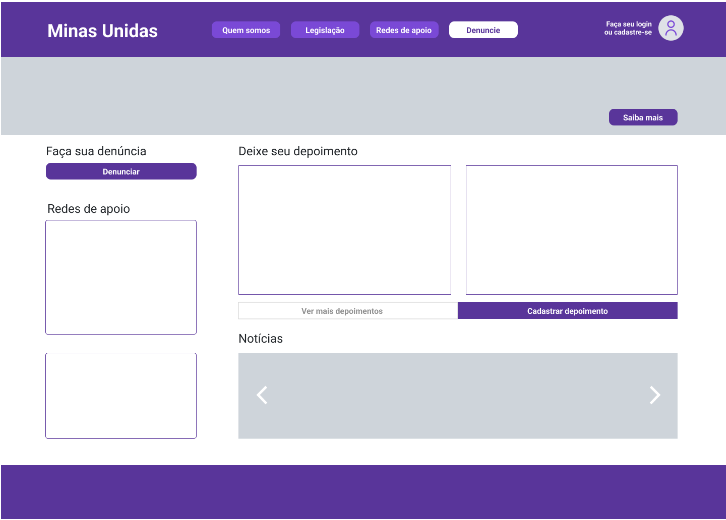
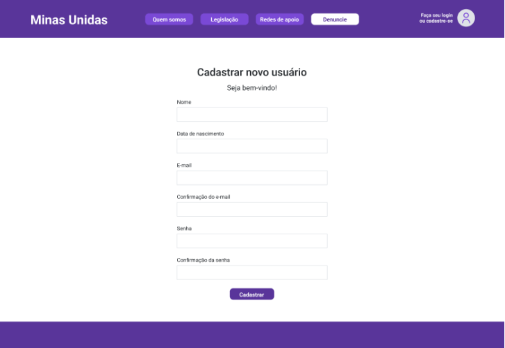

# Front-end Web

Este documento aborda o desenvolvimento do front-end web para o projeto **Minas Unidas**. O objetivo principal do front-end web é fornecer uma interface amigável e intuitiva para os usuários interagirem com as funcionalidades oferecidas pelo sistema. Isso inclui o registro e login de usuários, visualização e criação de denúncias e depoimentos. O front-end será desenvolvido utilizando tecnologias como HTML, CSS, Bootstrap e JavaScript. O foco será na usabilidade e na integração com o back-end da aplicação.

## Tecnologias Utilizadas

A seguir, estão listadas as tecnologias utilizadas no desenvolvimento do projeto:

### Ambiente de desenvolvimento:
- **Visual Studio Code**: IDE para desenvolvimento do código-fonte.
- **Git**: Sistema de controle de versão para rastreamento e gerenciamento de alterações no código-fonte, possibilitando colaboração e versionamento.
- **GitHub**: Plataforma de hospedagem de código-fonte e colaboração para desenvolvimento de projetos.

### Front-end:
- **HTML**: Linguagem de marcação para estruturação do conteúdo na web.
- **CSS**: Linguagem de estilização para design e apresentação visual da plataforma.
- **Bootstrap**: Framework front-end que será empregado para facilitar o desenvolvimento responsivo, garantindo uma experiência do usuário consistente em diferentes dispositivos.
- **JavaScript**: Linguagem de programação para implementar funcionalidades dinâmicas e interativas na página web.

### Back-end:
- **Node.js**: Framework de execução JavaScript assíncrono orientado a eventos, projetado para construir aplicativos de rede escalonáveis, onde muitas conexões podem ser tratadas simultaneamente.
- **Express**: Framework web utilizado para criar aplicações Node.js, aproveitando seu módulo HTTP para criar as comunicações.
- **Postman**: Software utilizado para testar APIs.
- **Body-parser**: Middleware utilizado para fazer o parsing do corpo das requisições HTTP.
- **Cors**: Middleware utilizado para habilitar o CORS (Cross-Origin Resource Sharing) no servidor Express.

### Banco de dados:
- **Microsoft SQL Server**: Sistema de gerenciamento de banco de dados relacional desenvolvido pela Microsoft.

### Hospedagem
- **Azure**: A aplicação será hospedada em um servidor na nuvem Azure da Microsoft.

## Arquitetura

A arquitetura das APIs do projeto será baseada em uma abordagem de microsserviços, visando modularidade, escalabilidade e facilidade de manutenção. As APIs serão desenvolvidas utilizando Node.js com o framework Express.

### Componentes principais

1. **Serviço de Denúncias**:
- Fornece operações CRUD (Create, Read, Update, Delete) para manipulação de denúncias.

2. **Serviço de Depoimentos**:
- Permite aos usuários registrar e visualizar depoimentos sobre suas experiências de violência doméstica.

3. **Serviço de Usuários**:
- Fornece operações CRUD (Create, Read, Update, Delete) para manipulação de usuários;
- Responsável pela autenticação de usuários, integrando-se ao serviço de autenticação para fornecer tokens de acesso.

4. **Serviço de Autenticação**:
- Responsável por gerenciar o processo de autenticação de usuários, fornecendo tokens de acesso para operações seguras nas APIs;
- Implementado utilizando JSON Web Tokens (JWT) para autenticação segura.

### Interações:

- As aplicações web e móveis interagem com os serviços através de requisições HTTP, utilizando endpoints específicos para cada operação;
- O serviço de autenticação valida as credenciais dos usuários e emite tokens JWT para permitir acesso seguro aos outros serviços;
- Os serviços de denúncias, depoimentos e usuários utilizam o banco de dados para armazenar e recuperar informações relevantes;
- A comunicação entre os serviços é realizada de forma assíncrona;
- A segurança é garantida por meio de práticas como autenticação de usuários, autorização de acesso e validação de entrada de dados.

## Modelagem da Aplicação

Nesta seção, será apresentada a modelagem da aplicação, que inclui a definição das entidades do sistema, seus atributos e relacionamentos.

### Entidades

A seguir, são detalhadas as entidades do sistema:

#### 1. Tipo de violência:

- Representa os cinco tipos de violência: física, psicológica, moral, sexual ou patrimonial;
- Atributos: ID (chave primária), Tipo.

#### 2. Perfil:

- Define os diferentes perfis de usuários no sistema;
- Atributos: ID (chave primária), Descrição.

#### 3. Usuário:

- Representa os usuários do sistema;
- Atributos: ID (chave primária), Nome, Data de Nascimento, Cidade, Estado, E-mail, Senha, Perfil ID (chave estrangeira referenciando o perfil associado).

#### 4. Denúncia:

- Armazena as denúncias feitas pelos usuários;
- Atributos: ID (chave primária), Nome, Data de Nascimento, Cidade, Estado, E-mail, Telefone, Tipo de Violência ID (chave estrangeira referenciando o tipo de violência associado), Descrição.

#### 5. Depoimento:

- Armazena os depoimentos dos usuários sobre suas experiências;
- Atributos: ID (chave primária), Descrição.

## Projeto da Interface Web
A interface web está composta por seis módulos de interação com o usuário, são eles: 
- Home, onde sao visualizados o mural de depoimentos, carrossel de notícias e acessado o "Teste de Perfil de Violência";
- Quem somos, com breve resumo da página;
- Legislação, com informação atualizada sobre a lei e tipos de violências;
- Redes de apoio, com idenficação e visualizacao dos atores presentes no Estado;
- Denuncie, disponibilidade de realizar uma denúncia diretamente aos orgãos competentes;
- Login e cadastro de usuário, para identificação e gerenciamento de informações do indivíduo.

### Wireframes

**1) Homepage:** 
Página inicial que contém os principais elementos de visualização e acesso as principais funcoes.
  - Header - Logo, Menu de navegação e login de usuário;
  - Body - Mural de depoimentos, carrossel de notícias, acesso a outras páginas (denúncia, cadastro de depoimentos, quem somos);
  - Footer - Informações de identificação e contato. 

  
**2) Quem somos:** 
Através da homepage, no menu de navegação é possível acessar a página de identificação do projeto.  
Na página é possível conhecer aspectos importantes do projeto como missão, história, integrantes e iniciativas implementadas.

**3) Legislação:** 
A partir da homepage, utilizando o menu de navegação, o usuário acessa a página com informações legais a cerca do tema do projeto e conteúdo relacionado aos tipos de violência.

**4) Redes de apoio:** 
A partir da homepage, utilizando o menu de navegação, o usuário acessa a página onde poderá buscar por redes de apoio localizadas no Estado de Minas Gerais.

**5) Denúncia:** 
A partir da homepage, é possível clicar no card “Faça sua denúncia” ou no botão “Denuncie” na barra de navegação para acessar a página “Faça sua denúncia”. Nesta página, o usuário poderá registrar o sua denúncia que posteriormente será encaminhada a autoridade competente.

**6) Login e cadastro de usuário:** 
- Página onde o usuário ou visitante pode acessar desde a homepage. Para o usuário cadastrado é permitido ingressar ao sistema mediante usuário e senha.
  

- Para o visitante da página é permitido através da opção “Inscrever-se”, acessar a página de cadastro de usuário.

### Design Visual

**1. Paleta de cores:** Foi elegido para o projeto a triade de cores, que são:

- 20% de Azul-magenta (59359a), cor fortemente relacionada ao movimendo em defesa a violência da mulher;
- 75% Branco (ffffff), escolhido como "fundo" da página, fácil composicao de contraste e representa formalidade do projeto;
- 5% Cian-azul (cfd5da) para destacar elementos e fazer uma transição harmônica com o fundo da página.

**2. Tipografia:** A fonte principal usada no corpo do texto é "Helvetica" com uma escala de variação para tamanho e negrito para realcar textos e títulos. A fonte é legível em todos os horários do dia e possui aparência formal necessária ao projeto.

**3. Elementos gráficos:** Os elementos da página, como botões e campos, apresentam formato arredondado nas suas extremidades e ganham cores diferentes á medida que forem selecionados ou devam ser acionados, como no caso dos campos de preenchimento. A letra em cor branca sobre botões de cor Azul-magenta repreesenta o contraste necessário para o projeto.
   

### Layout Responsivo
[Discuta como a interface será adaptada para diferentes tamanhos de tela e dispositivos.]
***FALTA ESSE**

### Interações do Usuário
Nosso projeto foi idealizado para servir principalmente a mulheres vítimas ou testemunhas de situações de violência. Portanto, foi adotado uma interface simples para ser acessível a qualquer classe social, que proporciona-se uma clara visualizacao da informacao e um foco muito claro no objetivo final  a denúncia. 

Citamos alguns elementos de interação com os usuários:

- Carrosssel de notícias (homepage): permite ao usuario/visitante consuitar todas as notícias disponíveis acionando seta para direita;
- Teste de Perfil de Violência: Através de input de informacoes (SIM/ NAO), o sistema gera um resultado ao final de 5 etapas.
- Redes de Apoio: Seleciona uma opcao dentro do menu disponível de cidades e o sistema gera automaticamente uma resposta. 
  
## Fluxo de Dados

Neste fluxo, descrevemos as etapas do ciclo de interação entre os usuários e a aplicação:

- **Registro e Autenticação do Usuário**: Ao acessar a aplicação, os usuários podem se cadastrar ou fazer login. O serviço de usuários gerencia essas ações, validando as credenciais e fornecendo tokens JWT para autenticar os usuários;
- **Criação de Denúncias e Depoimentos**: Os usuários têm a capacidade de registrar denúncias ou compartilhar depoimentos sobre suas experiências. Esses dados são submetidos às APIs correspondentes, onde são validados e armazenados no banco de dados;
- **Visualização de Dados**: As denúncias e depoimentos armazenados no banco de dados podem ser acessados e visualizados pelos usuários através da interface da aplicação. As APIs recuperam esses dados do banco e os entregam às interfaces do usuário;
- **Operações de CRUD**: As operações CRUD, como criar, ler, atualizar e excluir, são aplicáveis aos usuários e às denúncias. As APIs correspondentes lidam com essas solicitações, interagindo com o banco de dados para executar as operações conforme necessário;
- **Autenticação e autorização**: As solicitações de usuário são autenticadas e autorizadas usando tokens JWT. O serviço de autenticação valida os tokens e verifica as permissões do usuário antes de processar a solicitação.

### Requisitos Funcionais

Para atender às demandas dos usuários, foram estabelecidos os seguintes requisitos funcionais:

| ID     | Descrição do Requisito                              | Prioridade |
|--------|-----------------------------------------------------|------------|
| RF-001 | Cadastrar denúncia de violência doméstica           | ALTA       |
| RF-002 | Consultar denúncia de violência doméstica           | ALTA       |
| RF-003 | Editar denúncia de violência doméstica              | ALTA       |
| RF-004 | Excluir denúncia de violência doméstica             | ALTA       |
| RF-005 | Gerenciar denúncias de violência doméstica          | ALTA       |
| RF-006 | Consultar redes de apoio disponíveis                | ALTA       |
| RF-007 | Visualizar depoimentos de vítimas                   | MÉDIA      |
| RF-008 | Realizar teste sobre violência doméstica            | MÉDIA      |
| RF-009 | Gerenciar perfis de usuários                        | ALTA       |
| RF-010 | Criar perfil de usuário                             | ALTA       |
| RF-011 | Consultar perfil de usuário                         | ALTA       |
| RF-012 | Editar perfil de usuário                            | ALTA       |
| RF-013 | Excluir perfil de usuário                           | ALTA       |
| RF-014 | Fazer login no sistema                              | BAIXA      |
| RF-015 | Fazer logout do sistema                             | BAIXA      |

### Requisitos não Funcionais

Abaixo estão listados os requisitos não funcionais identificados para o sistema:

| ID      | Descrição do Requisito                                                  | Prioridade |
|---------|-------------------------------------------------------------------------|------------|
| RNF-001 | Compatibilidade com os principais navegadores                           | ALTA       |
| RNF-002 | Interface gráfica responsiva                                            | MÉDIA      |
| RNF-003 | Disponibilidade do sistema por pelo menos 90% do tempo                  | ALTA       |
| RNF-004 | Tempo de resposta inferior a 3 segundos para as solicitações do usuário | MÉDIA      |
| RNF-005 | Conformidade com as normas e padrões legais                             | ALTA       |
| RNF-006 |  Implementação de medidas de segurança da informação                    | MÉDIA      |

## Considerações de Segurança

Para garantir a segurança da aplicação distribuída, foram implementadas as seguintes considerações de segurança:

- **Autenticação de usuários**: A autenticação de usuários é realizada utilizando tokens JWT (JSON Web Tokens). Isso permite que apenas usuários autenticados tenham acesso às funcionalidades protegidas da aplicação;
- **Proteção de senhas**: As senhas dos usuários são protegidas utilizando o algoritmo de hash bcrypt. Isso garante que as senhas não sejam armazenadas em texto simples no banco de dados, aumentando a segurança em caso de violações de dados;
- **Controle de acesso**: As operações de CRUD (Create, Read, Update, Delete) são protegidas por meio de controle de acesso baseado em funções. Isso garante que apenas usuários autorizados possam realizar alterações no sistema.
- **Proteção contra injeção de SQL**: Para proteger contra ataques de injeção de SQL, consultas parametrizadas são utilizadas ao acessar o banco de dados;
- **Cors**: O pacote é utilizado para configurar as políticas de compartilhamento de recursos entre origens diferentes, ajudando a evitar ataques de scripts entre sites.

## Implantação

[Instruções para implantar a aplicação distribuída em um ambiente de produção.]

1. Defina os requisitos de hardware e software necessários para implantar a aplicação em um ambiente de produção.
2. Escolha uma plataforma de hospedagem adequada, como um provedor de nuvem ou um servidor dedicado.
3. Configure o ambiente de implantação, incluindo a instalação de dependências e configuração de variáveis de ambiente.
4. Faça o deploy da aplicação no ambiente escolhido, seguindo as instruções específicas da plataforma de hospedagem.
5. Realize testes para garantir que a aplicação esteja funcionando corretamente no ambiente de produção.

## Testes

PLANO DE TESTES DE SOFTWARE

  **Fluxo de Trabalho de Teste**
  
O sistema como um todo sera validados em um programa de testes que está constituído em varis etapas de testes, com dois exemplos práticos em cada, relacionadas à unidade, integração e sistema.

   |                     |                    Recursos Humanos                          |                      |
   |-------------------------|------------------|--------------------------------------------------------------------------|
   |Nome    |   papel          |Responsabilidades ou Comentários Específicos                                 |
 Categorias de Testes
 
    Teste de Funcionalidade
O teste funcional é um processo de garantia de qualidade onde o software é testado em relação às funcionalidades, requisitos e regras de negócios. É focado no desempenho de processamento, desse modo, se concentra na simulação do uso real do software.

|Caso De Teste|CT01 - Cadastrar denúncia online                                                                     |
|-------------------------------------------------------------------------------------------------------------------|
|Pré-Condição|Não existe                                                                                            |
|Procedimento|O ator acessa a home page,Na barra de menu seleciona a opção “Denuncie”,Na tela de denúncia, seleciona a opção de denúncia “online”,Na tela de cadastro, o ator registra as informações relacionadas a denúncia,O ator seleciona “Publicar",O sistema armazena as informações disponibilizadas pelo ator emitindo a mensagem “Denúncia publicada com sucesso|

        

# Referências

BRASIL. <b>Decreto nº. 1.973, de 1º de agosto de 1996.</b> Presidência da República, Casa Civil, Subchefia para Assuntos Jurídicos. Disponível em: http://www.planalto.gov.br/ccivil_03/decreto/1996/d1973.htm. Acesso em: 5 de mar. de 2024.

BRASIL. <b>Lei nº. 11.340, de 7 de agosto de 2006.</b> Presidência da República, Secretaria-Geral, Subchefia para Assuntos Jurídicos. Disponível em: http://www.planalto.gov.br/ccivil_03/_ato2004-2006/2006/lei/l11340.htm. Acesso em: 5 de mar. de 2024.

<b>CANAIS registram mais de 105 mil denúncias de violência contra mulher em 2020, </b>Governo do Brasil, 08 de mar. de 2021. Disponível em: https://www.gov.br/pt-br/noticias/assistencia-social/2021/03/canais-registram-mais-de-105-mil-denuncias-de-violencia-contra-mulher-em-2020. Acesso em: 5 de mar. de 2024.

CETIC, <b>TIC Domicílios 2020.</b> Disponível em: https://cetic.br/media/analises/tic_domicilios_2020_coletiva_imprensa.pdf. Acesso em: 5 de mar. de 2024.

SENADO FEDERAL. <b>Violência doméstica e familiar contra a mulher. </b> Pesquisa DataSenado. Brasília, 2017. Disponível em: https://www12.senado.leg.br/institucional/datasenado/arquivos/aumenta-numero-de-mulheres-que-declaram-ter-sofrido-violencia. Acesso em: 5 de mar. de 2024.
