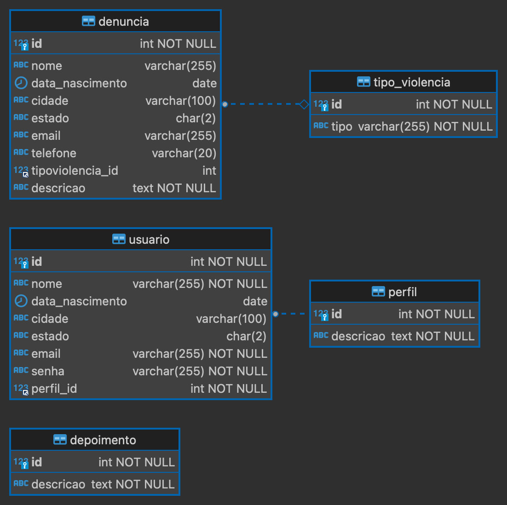
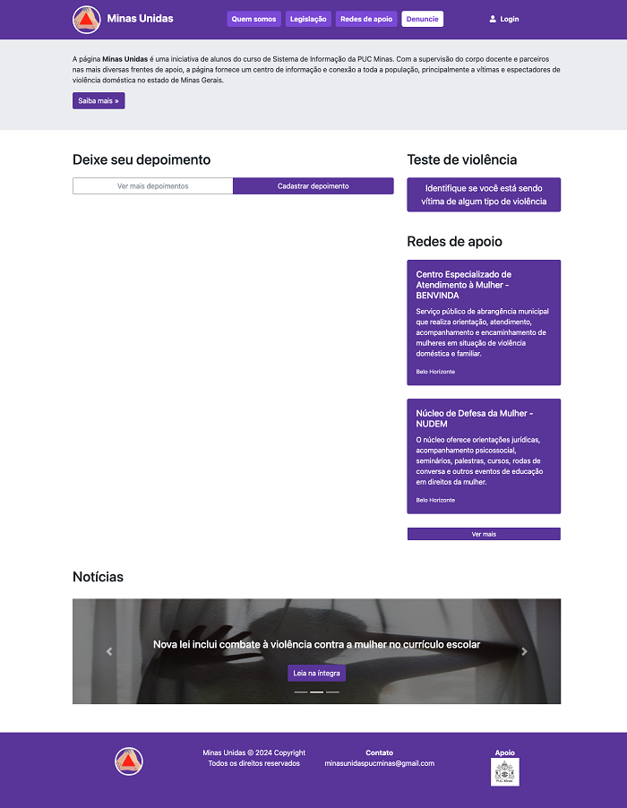
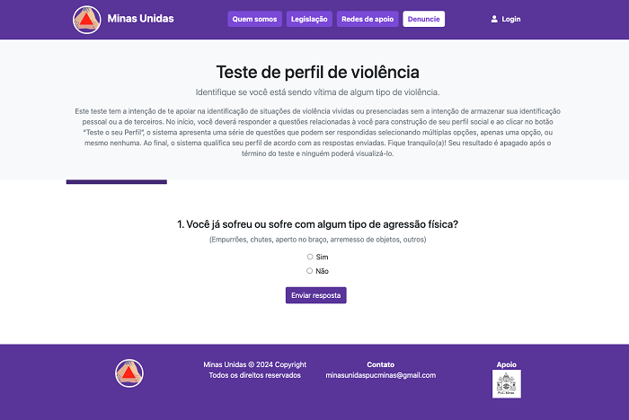
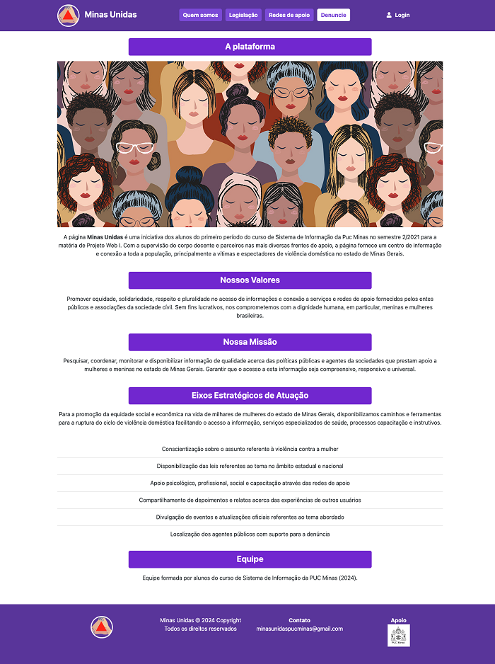
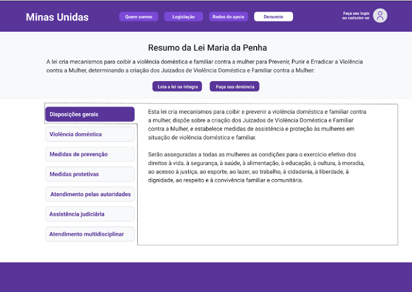
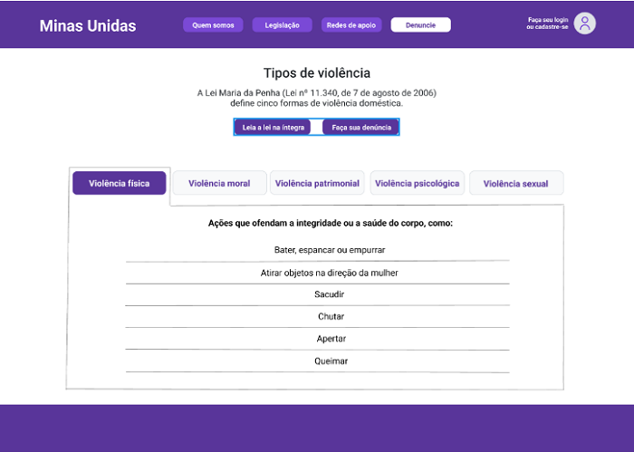
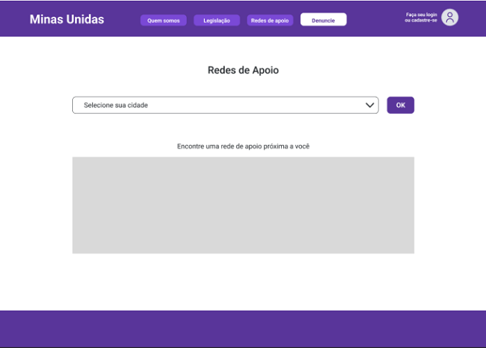
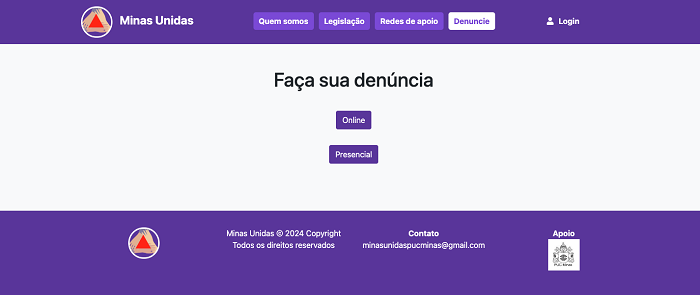
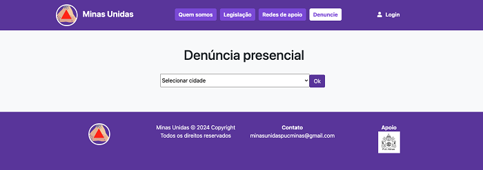
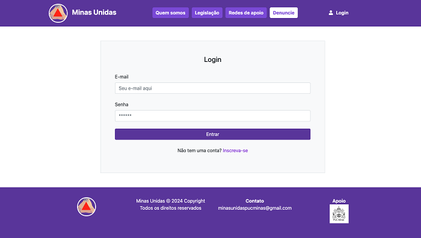

# Front-end Web

Este documento aborda o desenvolvimento do front-end web para o projeto **Minas Unidas**. O objetivo principal do front-end web é fornecer uma interface amigável e intuitiva para os usuários interagirem com as funcionalidades oferecidas pelo sistema. Isso inclui o registro e login de usuários, visualização e criação de denúncias e depoimentos. O front-end será desenvolvido utilizando tecnologias como HTML, CSS, Bootstrap e JavaScript. O foco será na usabilidade e na integração com o back-end da aplicação.

## Tecnologias Utilizadas

A seguir, estão listadas as tecnologias utilizadas no desenvolvimento do projeto:

### Ambiente de desenvolvimento:
- **Visual Studio Code**: IDE para desenvolvimento do código-fonte.
- **Git**: Sistema de controle de versão para rastreamento e gerenciamento de alterações no código-fonte, possibilitando colaboração e versionamento.
- **GitHub**: Plataforma de hospedagem de código-fonte e colaboração para desenvolvimento de projetos.

### Front-end:
- **HTML**: Linguagem de marcação para estruturação do conteúdo na web.
- **CSS**: Linguagem de estilização para design e apresentação visual da plataforma.
- **Bootstrap**: Framework front-end que será empregado para facilitar o desenvolvimento responsivo, garantindo uma experiência do usuário consistente em diferentes dispositivos.
- **JavaScript**: Linguagem de programação para implementar funcionalidades dinâmicas e interativas na página web.

### Back-end:
- **Node.js**: Framework de execução JavaScript assíncrono orientado a eventos, projetado para construir aplicativos de rede escalonáveis, onde muitas conexões podem ser tratadas simultaneamente.
- **Express**: Framework web utilizado para criar aplicações Node.js, aproveitando seu módulo HTTP para criar as comunicações.
- **Postman**: Software utilizado para testar APIs.
- **Body-parser**: Middleware utilizado para fazer o parsing do corpo das requisições HTTP.
- **Cors**: Middleware utilizado para habilitar o CORS (Cross-Origin Resource Sharing) no servidor Express.

### Banco de dados:
- **Microsoft SQL Server**: Sistema de gerenciamento de banco de dados relacional desenvolvido pela Microsoft.

### Hospedagem
- **Azure**: A aplicação será hospedada em um servidor na nuvem Azure da Microsoft.

## Arquitetura

A arquitetura das APIs do projeto será baseada em uma abordagem de microsserviços, visando modularidade, escalabilidade e facilidade de manutenção. As APIs serão desenvolvidas utilizando Node.js com o framework Express.

### Componentes principais

1. **Serviço de Denúncias**:
- Fornece operações CRUD (Create, Read, Update, Delete) para manipulação de denúncias.

2. **Serviço de Depoimentos**:
- Permite aos usuários registrar e visualizar depoimentos sobre suas experiências de violência doméstica.

3. **Serviço de Usuários**:
- Fornece operações CRUD (Create, Read, Update, Delete) para manipulação de usuários;
- Responsável pela autenticação de usuários, integrando-se ao serviço de autenticação para fornecer tokens de acesso.

4. **Serviço de Autenticação**:
- Responsável por gerenciar o processo de autenticação de usuários, fornecendo tokens de acesso para operações seguras nas APIs;
- Implementado utilizando JSON Web Tokens (JWT) para autenticação segura.

### Interações:

- As aplicações web e móveis interagem com os serviços através de requisições HTTP, utilizando endpoints específicos para cada operação;
- O serviço de autenticação valida as credenciais dos usuários e emite tokens JWT para permitir acesso seguro aos outros serviços;
- Os serviços de denúncias, depoimentos e usuários utilizam o banco de dados para armazenar e recuperar informações relevantes;
- A comunicação entre os serviços é realizada de forma assíncrona;
- A segurança é garantida por meio de práticas como autenticação de usuários, autorização de acesso e validação de entrada de dados.

## Modelagem da Aplicação

Nesta seção, será apresentada a modelagem da aplicação, que inclui a definição das entidades do sistema, seus atributos e relacionamentos.

### Entidades

A seguir, são detalhadas as entidades do sistema:

#### 1. Tipo de violência:

- Representa os cinco tipos de violência: física, psicológica, moral, sexual ou patrimonial;
- Atributos: ID (chave primária), Tipo.

#### 2. Perfil:

- Define os diferentes perfis de usuários no sistema;
- Atributos: ID (chave primária), Descrição.

#### 3. Usuário:

- Representa os usuários do sistema;
- Atributos: ID (chave primária), Nome, Data de Nascimento, Cidade, Estado, E-mail, Senha, Perfil ID (chave estrangeira referenciando o perfil associado).

#### 4. Denúncia:

- Armazena as denúncias feitas pelos usuários;
- Atributos: ID (chave primária), Nome, Data de Nascimento, Cidade, Estado, E-mail, Telefone, Tipo de Violência ID (chave estrangeira referenciando o tipo de violência associado), Descrição.

#### 5. Depoimento:

- Armazena os depoimentos dos usuários sobre suas experiências;
- Atributos: ID (chave primária), Descrição.

## Projeto da Interface Web
A interface web está composta por seis módulos de interação com o usuário, são eles: 
- Home, onde sao visualizados o mural de depoimentos, carrossel de notícias e acessado o "Teste de Perfil de Violência";
- Quem somos, com breve resumo da página;
- Legislação, com informação atualizada sobre a lei e tipos de violências;
- Redes de apoio, com idenficação e visualizacao dos atores presentes no Estado;
- Denuncie, disponibilidade de realizar uma denúncia diretamente aos orgãos competentes;
- Login e cadastro de usuário, para identificação e gerenciamento de informações do indivíduo.

### Wireframes

**1) Homepage:** 
Página inicial que contém os principais elementos de visualização e acesso as principais funcoes.
  - Header - Logo, Menu de navegação e login de usuário;
  - Body - Mural de depoimentos, carrossel de notícias, acesso a outras páginas (denúncia, cadastro de depoimentos, quem somos);
  - Footer - Informações de identificação e contato. 

O 'teste de perfil de violência' também pode ser acessado desde a homepage através de botao interativo.

**2) Quem somos:** 
Através da homepage, no menu de navegação é possível acessar a página de identificação do projeto.  
Na página é possível conhecer aspectos importantes do projeto como missão, história, integrantes e iniciativas implementadas.

**3) Legislação:** 
A partir da homepage, utilizando o menu de navegação, o usuário acessa a página com informações legais a cerca do tema do projeto e conteúdo relacionado aos tipos de violência.

**4) Redes de apoio:** 
A partir da homepage, utilizando o menu de navegação, o usuário acessa a página onde poderá buscar por redes de apoio localizadas no Estado de Minas Gerais.

**5) Denúncia:** 
A partir da homepage, é possível clicar no card “Faça sua denúncia” ou no botão “Denuncie” na barra de navegação para acessar a página “Faça sua denúncia”. 

Nesta página (opção escolhida 'denúncia presencial'), o usuário poderá selecionar a cidade de preferencial para uma lista de resultados ser visualizada abaixo.

Nesta página (opção escolhida 'denúncia online'), o usuário poderá registrar o sua denúncia online que posteriormente será encaminhada a autoridade competente.

**6) Login:** 
Página onde o usuário ou visitante pode acessar desde a homepage. Para o usuário cadastrado é permitido ingressar ao sistema mediante usuário e senha.
  

### Design Visual

**1. Paleta de cores:** Foi elegido para o projeto a triade de cores, que são:

- 20% de Azul-magenta (59359a), cor fortemente relacionada ao movimendo em defesa a violência da mulher;
- 75% Branco (ffffff), escolhido como "fundo" da página, fácil composicao de contraste e representa formalidade do projeto;
- 5% Cian-azul (cfd5da) para destacar elementos e fazer uma transição harmônica com o fundo da página.

**2. Tipografia:** A fonte principal usada no corpo do texto é "Helvetica" com uma escala de variação para tamanho e negrito para realcar textos e títulos. A fonte é legível em todos os horários do dia e possui aparência formal necessária ao projeto.

**3. Elementos gráficos:** Os elementos da página, como botões e campos, apresentam formato arredondado nas suas extremidades e ganham cores diferentes á medida que forem selecionados ou devam ser acionados, como no caso dos campos de preenchimento. A letra em cor branca sobre botões de cor Azul-magenta repreesenta o contraste necessário para o projeto.
   

### Layout Responsivo
A adaptação da interface web para diferentes tamanhos de tela e dispositivos é um aspecto importante do projeto e será guiado por conceitos de design responsivo. 
O objetivo é garantir que a experiência do usuário seja consistente, eficiente e estável em qualquer dispositivo, prioritariamente um smartphone, tablet, notebook ou desktop.

Mencionamos a seguir boas práticas e técnicas que foram utilizadas para alcançar essa adaptação.

**1. Flexible Grid Layouts:** O design da web utiliza unidades flexíveis como porcentagens para definir dimensões e espaçamento, diferentemente da versão em pixels que é estática. Isso nos permite ter uma acomodação do conteúdo para diferentes tamanhos de telas e dispositivos. Nesse caso contamos com um framework responsivo, o Bodstrap.

**2. Imagens Responsivas:** Utilizando atributos e elementos HTML para configurar imagens que serao adequadas a diferentes resoluções e tamanhos de tela automaticamente.

**3. Media Queries:** A adoção de media queries em nosso CSS permite aplicar estilos específicos com base nas características de cada dispositivo, possibilitando ajustes como tamanho de fontes, orientação, reorganizar e omitir elementos da página.

**4. Fontes flexíceis:** Primordial para a visualização do conteúdo web, utilizamos unidades relativas como 'em' e 'rem' para ajustar o tamanho e a fonte do conteúdo apresentado para que independente do dispositivo o conteúdo esteja 100% visível e estéticamente agradável.

**5. Elementos Interativos:** Elementos como o carrossel de notícias, botões, teste de violência e os campos de preenchimento receberam tratamento adequado quanto a sua dimensão e correto espaçamento compreendendo os diferentes tipos de telas e dispositivos, garantindo boa usabilidade ao usuario.

**6. Teste e Otimização:** Utilizamos ferramentas de desenvolvimento do navegador google chrome para emular diferentes dispositivos e tamanhos de tela. Verificando assim, o comportamento da interface em várias resoluções e orientações.

### Interações do Usuário
Nosso projeto foi idealizado para servir principalmente a mulheres vítimas ou testemunhas de situações de violência. Portanto, foi adotado uma interface simples para ser acessível a qualquer classe social, que proporciona-se uma clara visualizacao da informacao e um foco muito claro no objetivo final  a denúncia. 

Citamos alguns elementos de interação com os usuários:

- Carrosssel de notícias (homepage): permite ao usuario/visitante consuitar todas as notícias disponíveis acionando seta para direita;
- Teste de Perfil de Violência: Através de input de informacoes (SIM/ NAO), o sistema gera um resultado ao final de 5 etapas.
- Redes de Apoio: Seleciona uma opcao dentro do menu disponível de cidades e o sistema gera automaticamente uma resposta. 
  
## Fluxo de Dados

Neste fluxo, descrevemos as etapas do ciclo de interação entre os usuários e a aplicação:

- **Registro e Autenticação do Usuário**: Ao acessar a aplicação, os usuários podem se cadastrar ou fazer login. O serviço de usuários gerencia essas ações, validando as credenciais e fornecendo tokens JWT para autenticar os usuários;
- **Criação de Denúncias e Depoimentos**: Os usuários têm a capacidade de registrar denúncias ou compartilhar depoimentos sobre suas experiências. Esses dados são submetidos às APIs correspondentes, onde são validados e armazenados no banco de dados;
- **Visualização de Dados**: As denúncias e depoimentos armazenados no banco de dados podem ser acessados e visualizados pelos usuários através da interface da aplicação. As APIs recuperam esses dados do banco e os entregam às interfaces do usuário;
- **Operações de CRUD**: As operações CRUD, como criar, ler, atualizar e excluir, são aplicáveis aos usuários e às denúncias. As APIs correspondentes lidam com essas solicitações, interagindo com o banco de dados para executar as operações conforme necessário;
- **Autenticação e autorização**: As solicitações de usuário são autenticadas e autorizadas usando tokens JWT. O serviço de autenticação valida os tokens e verifica as permissões do usuário antes de processar a solicitação.

### Requisitos Funcionais

Para atender às demandas dos usuários, foram estabelecidos os seguintes requisitos funcionais:

| ID     | Descrição do Requisito                              | Prioridade |
|--------|-----------------------------------------------------|------------|
| RF-001 | Cadastrar denúncia de violência doméstica           | ALTA       |
| RF-002 | Consultar denúncia de violência doméstica           | ALTA       |
| RF-003 | Editar denúncia de violência doméstica              | ALTA       |
| RF-004 | Excluir denúncia de violência doméstica             | ALTA       |
| RF-005 | Gerenciar denúncias de violência doméstica          | ALTA       |
| RF-006 | Consultar redes de apoio disponíveis                | ALTA       |
| RF-007 | Visualizar depoimentos de vítimas                   | MÉDIA      |
| RF-008 | Realizar teste sobre violência doméstica            | MÉDIA      |
| RF-009 | Gerenciar perfis de usuários                        | ALTA       |
| RF-010 | Criar perfil de usuário                             | ALTA       |
| RF-011 | Consultar perfil de usuário                         | ALTA       |
| RF-012 | Editar perfil de usuário                            | ALTA       |
| RF-013 | Excluir perfil de usuário                           | ALTA       |
| RF-014 | Fazer login no sistema                              | BAIXA      |
| RF-015 | Fazer logout do sistema                             | BAIXA      |

### Requisitos não Funcionais

Abaixo estão listados os requisitos não funcionais identificados para o sistema:

| ID      | Descrição do Requisito                                                  | Prioridade |
|---------|-------------------------------------------------------------------------|------------|
| RNF-001 | Compatibilidade com os principais navegadores                           | ALTA       |
| RNF-002 | Interface gráfica responsiva                                            | MÉDIA      |
| RNF-003 | Disponibilidade do sistema por pelo menos 90% do tempo                  | ALTA       |
| RNF-004 | Tempo de resposta inferior a 3 segundos para as solicitações do usuário | MÉDIA      |
| RNF-005 | Conformidade com as normas e padrões legais                             | ALTA       |
| RNF-006 |  Implementação de medidas de segurança da informação                    | MÉDIA      |

## Considerações de Segurança

Para garantir a segurança da aplicação distribuída, foram implementadas as seguintes considerações de segurança:

- **Autenticação de usuários**: A autenticação de usuários é realizada utilizando tokens JWT (JSON Web Tokens). Isso permite que apenas usuários autenticados tenham acesso às funcionalidades protegidas da aplicação;
- **Proteção de senhas**: As senhas dos usuários são protegidas utilizando o algoritmo de hash bcrypt. Isso garante que as senhas não sejam armazenadas em texto simples no banco de dados, aumentando a segurança em caso de violações de dados;
- **Controle de acesso**: As operações de CRUD (Create, Read, Update, Delete) são protegidas por meio de controle de acesso baseado em funções. Isso garante que apenas usuários autorizados possam realizar alterações no sistema.
- **Proteção contra injeção de SQL**: Para proteger contra ataques de injeção de SQL, consultas parametrizadas são utilizadas ao acessar o banco de dados;
- **Cors**: O pacote é utilizado para configurar as políticas de compartilhamento de recursos entre origens diferentes, ajudando a evitar ataques de scripts entre sites.

## Implantação

[Instruções para implantar a aplicação distribuída em um ambiente de produção.]

1. Defina os requisitos de hardware e software necessários para implantar a aplicação em um ambiente de produção.
2. Escolha uma plataforma de hospedagem adequada, como um provedor de nuvem ou um servidor dedicado.
3. Configure o ambiente de implantação, incluindo a instalação de dependências e configuração de variáveis de ambiente.
4. Faça o deploy da aplicação no ambiente escolhido, seguindo as instruções específicas da plataforma de hospedagem.
5. Realize testes para garantir que a aplicação esteja funcionando corretamente no ambiente de produção.

## Testes

PLANO DE TESTES DE SOFTWARE

  **Fluxo de Trabalho de Teste**
  
O sistema como um todo sera validados em um programa de testes que está constituído em varias etapas de testes, com dois exemplos práticos em cada, relacionadas à unidade, integração e sistema.

   |                        |                 Recursos Humanos                                |               |
   |-------------------------|------------------|--------------------------------------------------------------------------|
   |Nome    |   Papel          |Responsabilidades ou Comentários Específicos                                 |
   |Andressa Cordeiro e Luiz Carlos Ferreira | Analista de teste|          Planejamento das etapas de  testes|
   |Davisson José e Rafael |Tester                                        |Execução do roteiro de teste|
   |Ana Carolina e Gabriella Victória |Programador|Cria os componentes de teste necessários para suportar os requisitos |

   
 Categorias de Testes
 
   **Teste de Funcionalidade**
    
O teste funcional é um processo de garantia de qualidade onde o software é testado em relação às funcionalidades, requisitos e regras de negócios. É focado no desempenho de processamento, desse modo, se concentra na simulação do uso real do software.

|Caso De Teste|CT01 - Registrar , editar  e excluir denúncia                 |
|-----------------------|------------------------------------------------------------------------------------------------------|
|Pré-Condição|Não existe                                                                                            |
|Procedimento|O ator acessa a home page,Na barra de menu seleciona a opção “Denuncie”,Na tela de denúncia, seleciona a opção de denúncia “online”,Na tela de cadastro, o ator registra as informações relacionadas a denúncia,O ator seleciona “Publicar",O sistema armazena as informações disponibilizadas pelo ator emitindo a mensagem “Denúncia publicada com sucesso,logo em seguida edita e exclui a denúncia|
|Resultado esperado|O sistema deve guardar todas as informações disponibilizadas pelo ator e registrá-las em nosso banco de dados compartilhado.Em seguida que a denúncia seja editada e excluida|
|Dados de entrada|Cidade, Estado, CEP, E-mail, Telefone, Denúncia|
|Prioridade|Alta|
|Técnica|Manual|
|Iteração|1ª Iteração|

|Caso De Teste|CT02 - Cadastrar ,Editar e excluir usuário                                                                     |
|-----------------|--------------------------------------------------------------------------------------------|
|Pré-Condição     |Não existe                                                                                  |
|Procedimento     | O ator acessa a home page,Na barra de menu seleciona a opção “Login",Na tela de login, seleciona a opção “Inscreva-se”,Na tela de cadastro, o ator registra as informações relacionadas ao seu usuário,O ator seleciona “Cadastrar”,O sistema armazena as informações disponibilizadas pelo ator emitindo a mensagem “Cadastro de usuário realizado com sucesso.” Em seguida o usuário e editado e excluido|
|Resultado esperado|O sistema deve guardar todas as informações disponibilizadas pelo ator e registrá-las em nosso banco de dados, como também é possível editar e excluir|
|Dados de entrada|Nome, data de nascimento, E-mail, Confirmação de E-mail, Senha, Confirmação de Senha|
|Prioridade|Alta|
|Técnica|Manual|
|Iteração|1ª Iteração|

   **Teste de Usabilidade**

    O teste de usabilidade busca entender como o sistema se comporta no dia a dia, na naturalidade da utilização, e se ele atende aos requisitos pensados e estabelecidos.

|Caso De Teste|CT03 - Teste de Perfil (Fluidez e facilidade entre as diversas telas do sistema que envolve tal processo e quanto ao resultado e suas transições). Foram observados dois atores com características distintas entre si.|
|------------------|-------------------------------------------------------------------------------------------------------------------------------------------------------------------------------------------------------------------------------------------------------------------------------------------------------------------------------------------------------------------------------------------------------------------------------------------------------------------------------------------------------------------------------------------------------------------------------------------------------------------------------------------------------------------------------------------------------------------------------------------------------------------------------------------------------------------------|
|Pré-Condição|Não existe |
|Procedimento|O ator acessa a home page,Na barra lateral, aciona o botão “Identifique se você está sendo vítima de algum tipo de violência”,O texto compreende 5 etapas de perguntas objetivas com confirmação em cada etapa através do botão “Enviar Resposta”,Na sexta tela deve ser apresentado um resultado diagnóstico e a apresentação de 3 opções de botão,
|Continua procedimento|Entenda sobre (encaminha o ator até a página de legislação onde estão as informações complementares Denuncie (encaminha o ator até a página de denúncia)|
|Continua procedimento|Refazer o teste(Possibilita de forma imediata realizar novamente o teste, regressando a tela de teste inicial, O ator pode regressar à homepage diretamente pelo logo do “Minas Unidas” no canto superior esquerdo|
|Resultado esperado|O sistema deve guardar todas as respostas de todas as perguntas do teste e apresentar ao final o resultado compatível com a proposta inicial. Espera-se que seja um fluxo de menos de 1 minuto para todo o questionário e de fácil manuseio para diferentes atores.|
|Dados de entrada|Respostas “Sim” ou “Não”|
|Prioridade|Alta|
|Técnica|Manual|
|Iteração|1ª Iteração|

|Caso De Teste|CT04 - Consulta por redes de apoio e depoimentos publicados|
|--------------------|----------------------------------------------------------------------------------------------------------------------------------------------------------------------------------------------------------------------------------------------------------|
|Pré-Condição|Não existe |
|Procedimento|Redes de Apoio,O ator acessa a home page,Na barra de menu seleciona a opção “Redes de Apoio”,Na nova tela, o ator deve escolher uma cidade e confirmar com a opção “OK”,Existem duas possibilidades de resposta para a busca, a primeira é o resultado das unidades de apoio presentes para a cidade escolhida. E na segunda possibilidade, a emissão da mensagem “Não localizamos redes de apoio na sua cidade.”, onde o ator poderá através do email disponibilizado enviar informações a respeito de uma unidade de apoio para aquela cidade.|
|Depoimentos|O ator acessa a home page, No corpo da homepage pode acessar a opção “Ver mais depoimentos”,Na nova tela, o ator encontrará disponível todos os depoimentos cadastrados no sistema com a possibilidade de expandir-los e curtir,Nessa mesma tela também é possível encontrar o botão para cadastrar um novo depoimento|
|Resultado esperado|Espera-se que o sistema apresente os resultados das informações cadastradas com fluidez e em poucos passos.
|Dados de entrada|Redes de apoio - Escolher opção de cidade e confirmar com a opção “OK”. Depoimentos - Maximizar, minimizar se for necessário|
|Prioridade|Alta|
|Técnica|Manual|
|Iteração|1ª Iteração|

|Caso De Teste|CT05 - Realizar principais tarefas no ambiente de administrador da conta (inserir, ampliar, editar e excluir) para as opções de depoimento, perfil de usuário, denúncia, redes de apoio e notícias|
|--------------------------------|-------------------------------------------------------------------------------------------------------------------------------------------------------------------------------------------------------------------------------------------------------------------------------------------------------------------------------------------------------------------------------------|
|Pré-Condição|Login (E-mail), Senha válida|
|Procedimento|O ator acessa a home page;Na barra de menu seleciona a opção “Login”;Na tela de login, inserir login (E-mail) e Senha válida;Ao adentrar ao ambiente de usuário, encontra-se a barra lateral esquerda de Gerenciamento de conta (Usuários, Depoimentos, Denúncias, Redes de Apoio e Notícias) - existem versões distintas para usuário normal (sem opções de “Notícia”, “Usuário” e “Redes de Apoio”); Ao clicar em cada uma das opções é disponibilizada uma nova tela de gerenciamento da opção escolhida; Na nova tela visualizada são apresentados os dados cadastrados no sistema ao nível do usuário e ao final de cada cadastro é encontrado os ícones que representam as funções de “ampliar”, “editar” e “apagar” Ao final de todas as informações registradas existe o botão que permite “Inserir” um novo elemento no sistema direcionando para uma tela de cadastro(depoimento, rede de apoio, denúncia, notícia e usuário); Ao clicar no ícone de ampliar, permite visualizar todas as informações do cadastro registrado em um pop-up;Ao clicar no ícone de editar, permite editar as informações do cadastro registrado em um pop-up;Ao clicar no ícone de “apagar” permite eliminar as informações do cadastro registro mediante um pop-up de alerta e confirmação da ação solicitada|
|Resultado esperado|Espera-se que o sistema possibilite o acesso a todas as telas no ambiente de usuário e permite acionar de forma fluida e segura as modificações solicitadas pelo usuário apresentando informações de confirmação a cada solicitação|
|Dados de entrada|Login(E-mail), Senha válida. Informações relacionadas aos cadastros solicitados em “Inserir” e “Editar” e confirmação em “Sim” ou "Não" para os casos de “Apagar”| 
|Prioridade|Alta|
|Técnica|Manual|
|Iteração|1ª Iteração|

**Teste de Desempenho**

É projetado para testar o desempenho do software durante a sua execução, particularmente, para sistemas de tempo real cujo requisito de desempenho é crucial.

|Caso De Teste|CT06 - Realização de 40 testes de perfil simultâneos|
|--------------------------|-----------------------------------------------------------------------------------------------------------------------------------------------------------------------------------------------------------------------------------------------------------------------------------------------------------------------------------------------------------------------------|
|Pré-Condição|Configuração na ferramenta de teste escolhida|
|Procedimento|Criar código na ferramenta de automação de testes para execução dos cadastros de receita simultâneos;Executar o teste automatizado na ferramenta configurada;Registrar resultados obtidos,caso tenha concluído com sucesso ou anotar observações caso problemas tenham surgido na execução do teste.|
|Resultado esperado|O sistema deve executar os 40 testes de perfil simultaneamente, sem apresentar morosidade ou qualquer instabilidade associada, gerando assim resultados dentro do limite de tempo esperado (1 minuto)|
|Dados de entrada|Respostas “Sim” ou “Não”|
|Prioridade|Alta|
|Técnica|Ferramenta de Benchmark|
|Iteração|1ª Iteração|

|Caso De Teste|CT07 - Cadastrar 40 denúncias online simultaneamente|
|----------------------|--------------------------------------------------------------------------------------------------------------------------------------------------------------------------------------------------------------------------------------------------------------------------------------------------------------------------------------------------------------------------------------------|
|Pré-Condição|Configuração na ferramenta de teste escolhida|
|Procedimento|Criar código na ferramenta de automação de testes para execução dos cadastros de receita simultâneos;Executar o teste automatizado na ferramenta configurada;Registrar resultados obtidos, caso tenha concluído com sucesso ou anotar observações caso problemas tenham surgido na execução do teste.|
|Resultado esperado|O sistema deve apresentar uma mensagem pop-up informando que a(s) denúncia(s) foram armazenadas com sucesso sem apresentar morosidade ou qualquer instabilidade associada.|
|Dados de entrada|Cidade, Estado, CEP, E-mail, Telefone, Denúncia|
|Prioridade|Alta|
|Técnica|Ferramenta de Benchmark|
|Iteração|1ª Iteração|

   **Teste de Carga**
   
  Tem por objetivo simular condições incomuns de utilização do sistema, testando provocar aumentos ou reduções sucessivas de transações de forma a superar os volumes máximos previstos para o software

|Caso De Teste|CT08 - Realizar 50 logins simultâneos                                               |
|-------------------------------|-----------------------------------------------------------------------------------------------------------------------------------------------------------------------------------------------------------------------------------------------------------------------------------------------------------------------------------------------------------------------------|
|Pré-Condição|Ferramenta de teste automatizado configurada para realização dos cadastros simultâneos.|
|Procedimento|Criar código na ferramenta de automação de testes para execução dos logins simultâneos;Executar o teste automatizado na ferramenta configurada;Documentar os resultados obtidos do teste. Se o resultado for negativo e com erros, anotar detalhadamente.|
|Resultado esperado|O sistema deve executar os 50 logins simultâneos, suportando a ação sem apresentar ou reportar erros.|
|Dados de entrada|Login e senha válidos|
|Prioridade|Alta|
|Técnica|Ferramenta de benchmark|
|Iteração|1ª Iteração|

|Caso de Teste|CT09 - Realizar 50 cadastros de depoimentos simultâneos|
|------------------------|-------------------------------------------------------------------------------------------------------------------------------------------------------------------------------------------------------------------------------------------------------------------------------------------------------------------------------------------------------------------------------------|
|Pré-Condição|Ferramenta de teste automatizado configurada para realização de cadastro de depoimentos simultâneos.|
|Procedimento|Criar código na ferramenta de automação de testes para execução de depoimentos simultâneos;Executar o teste automatizado na ferramenta configurada;Documentar os resultados obtidos do teste. Se o resultado for negativo e com erros, anotar detalhadamente.|
|Resultado esperado|O sistema deve executar os 50 cadastros de depoimentos simultâneos, suportando a ação sem apresentar ou reportar erros.|
|Dados de entrada|Nome, Cidade, Depoimento, Opção de Depoimento Anônimo.|
|Prioridade|Alta|
|Técnica|Ferramenta de benchmark|
|Iteração|1ª Iteração|

**Teste de Configuração**

Busca validar se o sistema funciona conforme pretendido mesmo em diferentes condições de hardware e software.

|Caso De Teste|CT10 - Cadastrar usuário acessando o sistema em 2 máquinas com diferentes Sistemas Operacionais. O Teste será realizado em 1 máquina com Windows 11 e 1 máquina com macOS.|
|---------------------------|---------------------------------------------------------------------------------------------------------------------------------------------------------------------------------------------------------------------------------------------------|
|Pré-Condição|Não existe pré-condição|
|Procedimento|O ator acessa a tela de Login;O ator clica no link “Cadastrar um novo usuário”;O ator preenche os campos Nome Completo, Data de Nascimento, E-mail,Confirmação de E-mail, Senha,Confirmação da Senha;O ator clica no botão “CADASTRAR”;O sistema grava os dados do novo cadastro e abre a página do usuário.|
|Resultado esperado|Espera-se que o fluxo de criação de novo usuário funcione corretamente em todas as máquinas onde o teste for realizado,e que a diferença do sistema operacional de cada uma delas não afete os cadastros|
|Dados de entrada|Nome Completo, Data de Nascimento, E-mail, Confirmação do E-mail, Senha e Confirmação da senha.|
|Prioridade|Alta|
|Técnica|Manual|
|Iteração|1ª Iteração|

|Caso de Teste|CT11 - Realizar o login no sistema utilizando 2 navegadores diferentes: Safari e Chrome, com usuário e senha válidos.|
|---------------------------|---------------------------------------------------------------------------------------------------------------------------------------------------------------------------------------------------------------------------------------------------|
|Pré-Condição|Usuário utilizado para o login já ter sido cadastrado anteriormente e possuir senha válida.|
|Procedimento|O ator acessa a tela de Login;O ator informa o e-mail e a senha;O ator clica no botão “Entrar”; O sistema abre a tela inicial para o ator.|
|Resultado esperado|Espera-se que o login no sistema funcione corretamente em todos os navegadores testados.|
|Dados de entrada|Nome de usuário e Senha|
|Prioridade|Alta|
|Técnica|Manual|
|Iteração|1ª Iteração|

**Teste de Recuperação**

Verifica se o software é capaz de retornar para um estado operacional após estar em um estado de falha.

|Caso de Teste|CT012 - Tentar salvar a denúncia após perda do sinal de internet e registrar os resultados|
|-----------------------|---------------------------------------------------------------------------------------------------------------------------------------------------------------------------------------------------------------------------------------------------|
|Pré-Condição|O usuário possuir login válido e senha cadastrada para acessar o sistema e as telas|
|Procedimento|O ator acessa a tela de Login;O ator informa um login válido no campo “E-mail”, uma senha válida no campo "Senha" e clicar no botão “Entrar”;O ator clica no botão “Realizar Denúncia";O ator digita os dados necessários para realizar a denúncia;O ator escreve a denúncia;O ator desliga a conexão de internet da máquina onde está realizando o teste;O ator clica no botão "Enviar Denúncia”;O ator anota o comportamento do sistema neste momento;O ator restabelece a conexão de internet;O ator clica no botão “Enviar Denúncia”novamente;O ator anota o comportamento do sistema neste momento.|
|Resultado Esperado|Na primeira tentativa de enviar a denúncia sem acesso a internet, o sistema deve apresentar mensagem informando "Falha ao Enviar a Denúncia’'.Após restabelecer a conexão com a internet e tentar enviar novamente a denúncia, o  sistema deve enviá-la com sucesso.Espera-se que os dados preenchidos em tela não sejam perdidos ao tentar salvar  a denúncia sem internet.|
|Dados de Entrada|Login(E-mail), Senha válida, Rua, Número, Bairro, Cidade, Estado, CEP, E-mail, Telefone e Denúncia e se deseja salvar a mesma|
|Prioridade|Alta|
|Técnica|Manual|
|Iteração|1ª Iteração|

|Caso de Teste|CT013 - Tentar salvar o depoimento após perda do sinal de internet e registrar os resultados|
|------------------------------|---------------------------------------------------------------------------------------------------------------------------------------------------------------------------------------------------------------------------------------|
|Pré-Condição|O usuário possuir acesso ao site|
|Procedimento|O ator acessa a tela de Inicial;O ator clica na área para Realizar o Depoimento;O ator completa os campos para realizar o depoimento;O ator desliga a conexão de internet da máquina onde está realizando o teste;O ator clica no botão “Publicar”;O ator anota o comportamento do sistema neste momento;O ator restabelece a conexão de internet;O ator clica no botão “Publicar” novamente;O ator anota o comportamento do sistema neste momento.|
|Resultado esperado|Na primeira tentativa de salvar  a denúncia sem a internet, o sistema deve apresentar mensagem informando ‘Falha ao publicar o depoimento'.|
|Dados de entrada|Nome, Cidade, Depoimento, Opção de Depoimento Anônimo.|
|Prioridade|Alta|
|Técnica|Manual|
|Iteração|1ª Iteração|

**Teste de Contingência**

   Tem por objetivo descrever as medidas a serem tomadas para restabelecer o sistema ao seu estado funcional ou minimamente aceitável em caso de paralisação do mesmo.
   
|Caso de Teste|CT14 – Tentar salvar as as novas configurações no gerenciamento de usuários após a reiniciação obrigatória do dispositivo com internet|
|------------------------------|------------------------------------------------------------------------------------------------------------------------------------------------------------------------------------------------------------------------------------------------------------------------------------------------------------------------------------------------------------------------------------|
|Pré-Condição|O usuário possuir login de administrador válido e senha cadastrada para acesso ao sistema|
|Procedimento|O ator acessa a tela de Login;O ator informa um login válido no campo "E-mail”, uma senha válida e clica no botão “Entrar”; O ator clica em "Usuários" no lado esquerdo da tela inicial, para acessar a área do usuário;O ator clica no botão de “Configurações” do usuário escolhido;O ator escolhe a opção necessária para o usuário escolhido;O ator reinicia a máquina onde está realizando o teste;O ator clica no botão “Salvar”;O ator anota o comportamento do sistema neste momento;O ator restabelece a conexão de internet;O ator clica no botão “Salvar” novamente;O ator anota o comportamento do sistema neste momento.
|Resultado esperado|Espera-se que o sistema funcione corretamente após a reiniciação forçada da máquina.|
|Dados de entrada|Configuração escolhida para o perfil|
|Prioridade|Alta|
|Técnica|Manual|
|Iteração|1ª Iteração|

|Caso de Teste|CT15 – Realizar a recuperação do banco de dados do sistema|
|--------------------------|-------------------------------------------------------------------------------------------------------------------------------------------------------------------------------------------------------------------------------------------------------------------------------------------------------------------------------------------------------------------------------------------|
|Pré-Condição|Não possui pré-condição|
|Procedimento|O ator realiza o processo de recuperação do backup do banco;O ator deleta todos os dados do banco de dados; O ator acessa o sistema e verifica como as telas se comportam após a exclusão repentina dos dados;corretamente.O ator realiza a recuperação do backup;O ator verifica se os dados voltaram para o banco de dados e como as telas se comportam|
|Resultado esperado|Espera-se que o sistema funcione corretamente após a recuperação do backup.|
|Dados de entrada|Dados do Banco de Dados|
|Prioridade|Alta|
|Técnica|Manual|
|Iteração|1ª Iteração|

**Relatório de Execução dos Testes**

-Casos de Teste executados com sucesso:
CT01, CT02, CT04, CT10

-Casos de Teste executados e que apresentaram erro (detalhes constam no relatório de defeitos):
 CT05 CT011

**Relatório de Defeitos**

|Descrição|Ao tentar acessar o perfil de usuário com senha inválida, o sistema atualmente não emite a mensagem em pop-up do erro diagnosticado.|
|--------------------------------------|------------------------------------------------------------------------------------------------------------------------------------------------------------------------------------------------------------------------------------------------------------------------------------------------------------------------------------------------------------------------------------------------------------------------------------------------------------------------------------------------------------------------|
|Descrição|Ao acessar o painel de gerenciamento do usuário tanto o acesso às telas de depoimentos, redes de apoio, notícias e usuários quanto os botões de editar, ampliar, inserir e apagar não funcionam corretamente (inacessíveis ou não existem). | 
|Categoria de Teste|Teste de Usabilidade (CT05) - Realizar principais tarefas no ambiente de administrador da conta (inserir, ampliar, editar e excluir) para as opções de depoimento, perfil de usuário, denúncia, redes de apoio e notícias.|
|Impacto|Alto|
|Reprodução passo a passo|O ator acessa a home page;Na barra de menu seleciona a opção “Login”;Na tela de login, inserir login (E-mail)e Senha válida;No painel de gerenciamento, somente a tela de denúncia se encontra acessível para visualização de dados cadastrados e os botões de editar, ampliar e apagar e inserir não aparecem na tela como programado.
|Evidência|             |
|Proposta de Correção|São necessários ajustes no código para a correta visualização das páginas que estão inativas dentro do painel de gerenciamento. Quanto aos botões citados, é necessário uma revisão do processo programado para diagnóstico e edição do código implementado (CRUD)|

|Descrição|Atualmente não é possível acessar a área de usuário a partir do E-mail e senha (tela de login) porque o sistema parou de responder impossibilitando ingressar de modo imediato ao perfil não apresentando qualquer resposta de erro ao ator solicitante e diferente da plataforma de acesso.|
|----------------------------------|------------------------------------------------------------------------------------------------------------------------------------------------------------------------------------------------------------------------|
|Categoria de Teste|Teste de Configuração (CT011) - Realizar o login no sistema utilizando 2 navegadores diferentes: Safari e Chrome, com usuário e senha válidos.|
|Impacto|Alto|
|Reprodução passo a passo|O ator acessa a tela de Login;O ator informa o e-mail e a senha;O ator clica no botão “Entrar”;O sistema abre a tela inicial para o ator (ERRO).|
|Evidência|       |
|Evidência|       |
|Evidência|      |
|Proposta de Correção|É necessária uma revisão do código implementado a fim de diagnosticar o erro de inatividade para o ingresso ao sistema já que a tela de ambiente do usuário encontra-se criada e parcialmente funcional, como também implementar mensagem de erro associada à inatividade da tela por qualquer motivo.|

        

# Referências

BRASIL. <b>Decreto nº. 1.973, de 1º de agosto de 1996.</b> Presidência da República, Casa Civil, Subchefia para Assuntos Jurídicos. Disponível em: http://www.planalto.gov.br/ccivil_03/decreto/1996/d1973.htm. Acesso em: 5 de mar. de 2024.

BRASIL. <b>Lei nº. 11.340, de 7 de agosto de 2006.</b> Presidência da República, Secretaria-Geral, Subchefia para Assuntos Jurídicos. Disponível em: http://www.planalto.gov.br/ccivil_03/_ato2004-2006/2006/lei/l11340.htm. Acesso em: 5 de mar. de 2024.

<b>CANAIS registram mais de 105 mil denúncias de violência contra mulher em 2020, </b>Governo do Brasil, 08 de mar. de 2021. Disponível em: https://www.gov.br/pt-br/noticias/assistencia-social/2021/03/canais-registram-mais-de-105-mil-denuncias-de-violencia-contra-mulher-em-2020. Acesso em: 5 de mar. de 2024.

CETIC, <b>TIC Domicílios 2020.</b> Disponível em: https://cetic.br/media/analises/tic_domicilios_2020_coletiva_imprensa.pdf. Acesso em: 5 de mar. de 2024.

SENADO FEDERAL. <b>Violência doméstica e familiar contra a mulher. </b> Pesquisa DataSenado. Brasília, 2017. Disponível em: https://www12.senado.leg.br/institucional/datasenado/arquivos/aumenta-numero-de-mulheres-que-declaram-ter-sofrido-violencia. Acesso em: 5 de mar. de 2024.
