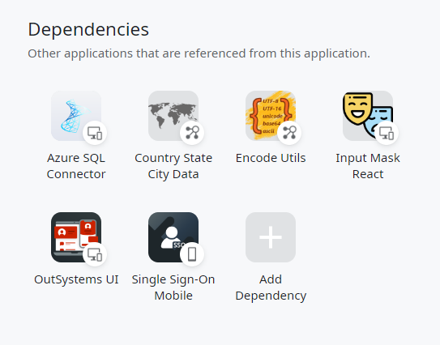
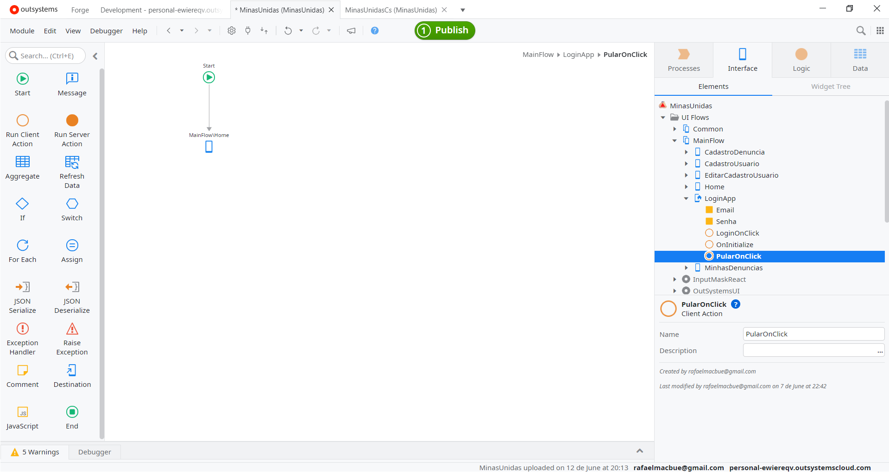
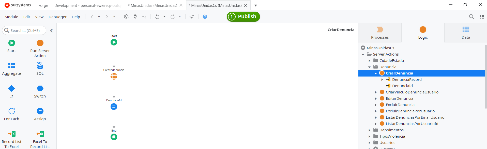

# Aplicativo Minas Unidas

## Introdução

O desenvolvimento do aplicativo foi realizado utilizando a IDE de desenvolvimento OutSystems, conhecida como Service Studio.

## Módulos de Desenvolvimento

Foram criados dois módulos para o aplicativo:

- **MinasUnidas**: Módulo responsável pelo desenvolvimento do frontend.
- **MinasUnidasCs (Service)**: Módulo responsável pelo desenvolvimento do backend através do consumo de APIs.


## Dependências

As seguintes dependências foram criadas:



- **Azure SQL Connector:** Facilita a integração e a comunicação entre a plataforma OutSystems e o Azure SQL Database, permitindo operações de leitura e escrita de dados. Utilizado para criar conexão ao banco de dados para implementar a funcionalidade de listar denúncias, uma vez que a API não possui esta funcionalidade.

- **Country State City Data:** Fornece dados padronizados e atualizados de países, estados e cidades, simplificando o preenchimento de formulários e o uso de informações geográficas.

- **Encode Utils:** Biblioteca de utilitários para codificação e decodificação de dados, útil para operações que envolvem transformação de formatos de dados como Base64 e URL encoding.

- **Input Mask React:** Componente que permite a criação de máscaras de entrada para campos de formulário, garantindo que os dados inseridos sigam um formato específico, como números de telefone e datas.

- **OutSystems UI:** Biblioteca de componentes de interface de usuário pré-construídos e personalizáveis que facilita a criação de interfaces consistentes e responsivas.
•  Single Sign-On Mobile: Módulo que permite a implementação de Single Sign-On (SSO) em aplicativos móveis, proporcionando uma experiência de login unificada e segura. Esta dependência não foi utilizada; o login e registro de usuário foram desenvolvidos através do consumo da API de autenticação de usuários e cadastro de usuários fornecida pelo backend da aplicação web.

## Configuração de Integração com uma API através do OutSystems

Para consumir uma API através do OutSystems, siga os seguintes passos:
1.	Na aba Lógica , abra a pasta Integrações .
2.	Clique com o botão direito no elemento REST e selecione Consumir API REST...


3.	Na caixa de diálogo exibida, escolha Adicionar método único:


4.	Preencha as informações sobre a URL do Método. Você pode incluir parâmetros entre chaves na URL para os parâmetros de entrada do método.

Exemplos:
GET https://api.example.com/Portal/rest/Contacts/GetAll
GET https://api.example.com/Portal/rest/Contacts/Get?Id={Id}
POST https://api.example.com/Portal/rest/Contacts/Create
Cada parâmetro de entrada definido entre chaves na URL torna-se um parâmetro de entrada do método.

## Configuração de integração da API Web Minas Unidas

### API de Autenticação: 


### API de Usuários:


### API de Denúncias:


## Interfaces do Aplicativo

A estrutura principal das interfaces pode ser consultada através do menu Interface e selecionando na árvore de componentes a opção MainFlow. A estrutura foi dividida nas seguintes telas: 

 **LoginAPP:** Tela inicial onde o usuário pode realizar login, direcionar para a tela de cadastro de usuários ou pular para acesso annimo.
- **Home:** Esta tela fornece os links para direcionar para a tela de denúncia e para a aplicação web, além de listar depoimentos.
- **CadastroUsuário:** Tela para cadastro de usuários.
- **CadastroDenuncia:** Tela para cadastro de denúncias.
- **EditarCadastroUsuario:** Tela para edição e exclusão de cadastro de usuários.
- **MinhasDenuncias:** Tela para edição e exclusão de cadastro de denúncias.


### Tema de interface

Para se desenvolver a interface, foi utilizado o tema padrão, nativo do OutSystems:


### Tela de login (LoginAPP)


## CSS Nativo

```

/* ===================================================================== */
/*  The following CSS was created using Theme Editor.                    */
/*  To modify this CSS, click "Open Theme Editor".                       */
/* ===================================================================== */

/* ===================================================================== */
/*  Root - CSS Variables                                                 */
/* ===================================================================== */

:root {
    
    /* Color - Brand */
    --color-primary: #59359a;
    --color-secondary: #59359a;

    --color-primary-hover: #432874;
    --color-primary-selected: rgba(89, 53, 154, .12);
    
    /* App Settings */
    --color-background-body: #ffffff;
    --color-background-login: #9c3823;
    --header-color: #59359a;
    
    /* Dark Theme */
    --background-dark-theme: rgba(255, 255, 255, .1);
    --background-dark-theme-hover: rgba(255, 255, 255, .2);
}

/* ===================================================================== */
/*  Border-Radius                                                        */
/* ===================================================================== */

.alert,
.btn, 
.form-control[data-input],
.tag,
.search--wrapper input,
.choices__list--multiple .choices__item,
.checkbox:before,
.choices__inner,
.button-group,
.pika-button,
.is-focused .choices__inner,
.is-open .choices__inner,
.choices.is-open.is-focused .choices__inner, 
.pagination-button,
[data-dropdown] > div.dropdown-display,
[data-dropdown] > select.dropdown-display {
    border-radius: var(--border-radius-rounded);
}

.button-group-item:first-child {
    border-top-left-radius: var(--border-radius-rounded);
    border-bottom-left-radius: var(--border-radius-rounded);
}

.button-group-item:last-child {
    border-top-right-radius: var(--border-radius-rounded);
    border-bottom-right-radius: var(--border-radius-rounded);
}

.choices[data-type*="select-multiple"] .choices__inner,
.choices[data-type*="select-multiple"].is-open .choices__inner {
    border-radius: var(--border-radius-soft);
}

/* ===================================================================== */
/*  Box-Shadow                                                           */
/* ===================================================================== */

.btn, 
.form-control[data-input],
.form-control[data-textarea],
[data-checkbox]:before,
.radio-button:before,
[data-switch]:empty:before,
.accordion,
.alert,
.card,
.progress-bar,
.avatar,
.badge,
.card-background,
.noUi-horizontal .noUi-handle,
.tag,
.choices__inner,
.button-group,
.pika-single,
.chat-message,
.dropdown-content-list,
.layout-login-form,
.split-screen-wrapper,
.choices__list--dropdown,
.tippy-popper .tooltip,
.tippy-tooltip.light-theme,
.pagination-button, 
.table, 
[data-dropdown] > div.dropdown-display,
[data-dropdown] > div.dropdown-list, 
[data-dropdown] > select.dropdown-display {
    box-shadow: var(--shadow-m);
}

.card .card,
.animated-label-input .form-control[data-input],
.pagination-button.is--ellipsis {
    box-shadow: var(--shadow-none);
}

/* Login and Splash Gradient */

.login-screen {
    background-image: linear-gradient(180deg, transparent 0%, rgba(0, 0, 0, 0.4) 100%);
}

/* Login and Splash Color */

.login-screen,
.layout-native .login-screen {
    background-color: var(--color-background-login);
}

.login-form,
.tablet .layout-native .login-form {
    background-color: var(--background-dark-theme);
}

.login-screen .animated-label-text {
    color: rgba(255, 255, 255, 0.7);
}

.splash-loading {
    background-color: rgba(255, 255, 255, 0.2);
}

.splash-loading-bar {
    background: var(--color-neutral-0);
}

.login-screen label {
    color: rgba(255, 255, 255, 0.7);
}

.login-form a {
    color: rgba(255, 255, 255, 0.7);
}

.login-screen [class*='text-neutral'] {
    color: var(--color-neutral-0);
}

/* Header Color */

.header,
.header a,
.menu-back {
    color: var(--color-neutral-0);
}

.submenu-item,
.submenu.active .submenu-item,
.desktop .submenu.active .submenu-header:hover .submenu-item,
.submenu.active .submenu-item a {
    color: var(--color-neutral-0);
    opacity: .8;
}

.submenu-icon:before {
    border: 1px solid var(--color-neutral-0);
    border-top: 0;
    border-right: 0;
    opacity: .8;
}

.submenu.active .submenu-icon:before {
    border: 1px solid var(--color-neutral-0);
    border-top: 0;
    border-right: 0;
}

.submenu:hover .submenu-icon:before {
    border: 1px solid var(--color-neutral-0);  
    border-top: 0;
    border-right: 0;  
    opacity: 1;
}

.app-menu-links a {
    color: var(--color-neutral-0);
    opacity: .8;
}

.desktop .submenu:hover .submenu-item,
.desktop .submenu-item a:hover {
    color: var(--color-neutral-0);
    opacity: 1;
}

.desktop .submenu-items a:hover {
    background-color: var(--background-dark-theme);
    color: var(--color-neutral-0);
}

.layout-side .app-menu-content,
.aside-overlay .app-menu-content,
.tablet .app-menu-content,
.phone .app-menu-content {
    background-color: var(--header-color);
    color: var(--color-neutral-0);
}

.submenu-items a.active, 
.desktop .submenu-items a.active:hover, 
.submenu.active.open .submenu-item
.app-menu-links a:hover, 
.app-menu-links a.active {
    color: var(--color-neutral-0);
}

.menu-icon-line {
    background-color: #fff;
}

/* Username Color - applies the same header rules defined in the Theme Editor */
.username-built-with-theme-editor {
    color: var(--color-neutral-0);
}

.header i {
    color: var(--color-neutral-0);
}

/* Footer Color - applies the same header rules defined in the Theme Editor */
.footer-built-with-theme-editor {
    color: var(--color-neutral-0);
}

.footer-built-with-theme-editor a,
.footer-built-with-theme-editor a:visited {
    color: var(--color-neutral-0);
    text-decoration-color: var(--color-neutral-0);
}

CSS personalizado:

.botaosobreposto {
    z-index: 1;
    position: relative;
}

```
### CSS Personalizado
```
.botaosobreposto {
    z-index: 1;
    position: relative;
}
```

## Client Actions e Server Actions

As Client Actions define ações executadas do lado do cliente e as Server Actions ações executadas do lado do servidor.

Foram criadas três Client Actions, responsáveis por executar lógicas do lado do cliente para validar o formulário e executar Server Actions:


### LoginOnClick:


Ao clicar no botão "Login", a ação cliente LoginOnClick é iniciada. Esta, por sua vez, executa a Client Action ValidarDados, que valida se os campos de e-mail e senha estão preenchidos.


Ao finalizar a execução, o fluxo retorna para a ação LoginOnClick.

Valida-se se o retorno da client action ValidarDados foi bem-sucedido. Caso positivo, a ação Server Action (executada do lado do servidor) é iniciada.


Nesta server action, verifica-se se o usuário existe utilizando o e-mail e a senha fornecidos. Se ambos estiverem corretos, a autenticação é enviada através do método PostAuthentication que consome a API de autenticação.


Ao validar as credenciais, o token de autenticação gerado pela API é recebido. Em seguida, o fluxo retorna para a client action LoginOnClick, concluindo o login com sucesso.

### PularOnClick:

Ao pressionar o botão "Pular", o usuário é direcionado para a tela "Home", onde pode acessar as funcionalidades de inserção de denúncias anônimas, verificação de depoimentos e links que direcionam para a aplicação web.



### OnInitialize:

Esta client action verifica se o usuário está logado. Caso positivo, o usuário é direcionado para a tela "Home".


### Tela de cadastro de usuários (CadastroUsuario)


## CSS Nativo

```

/* ===================================================================== */
/*  The following CSS was created using Theme Editor.                    */
/*  To modify this CSS, click "Open Theme Editor".                       */
/* ===================================================================== */

/* ===================================================================== */
/*  Root - CSS Variables                                                 */
/* ===================================================================== */

:root {
    
    /* Color - Brand */
    --color-primary: #59359a;
    --color-secondary: #59359a;

    --color-primary-hover: #432874;
    --color-primary-selected: rgba(89, 53, 154, .12);
    
    /* App Settings */
    --color-background-body: #ffffff;
    --color-background-login: #9c3823;
    --header-color: #59359a;
    
    /* Dark Theme */
    --background-dark-theme: rgba(255, 255, 255, .1);
    --background-dark-theme-hover: rgba(255, 255, 255, .2);
}

/* ===================================================================== */
/*  Border-Radius                                                        */
/* ===================================================================== */

.alert,
.btn, 
.form-control[data-input],
.tag,
.search--wrapper input,
.choices__list--multiple .choices__item,
.checkbox:before,
.choices__inner,
.button-group,
.pika-button,
.is-focused .choices__inner,
.is-open .choices__inner,
.choices.is-open.is-focused .choices__inner, 
.pagination-button,
[data-dropdown] > div.dropdown-display,
[data-dropdown] > select.dropdown-display {
    border-radius: var(--border-radius-rounded);
}

.button-group-item:first-child {
    border-top-left-radius: var(--border-radius-rounded);
    border-bottom-left-radius: var(--border-radius-rounded);
}

.button-group-item:last-child {
    border-top-right-radius: var(--border-radius-rounded);
    border-bottom-right-radius: var(--border-radius-rounded);
}

.choices[data-type*="select-multiple"] .choices__inner,
.choices[data-type*="select-multiple"].is-open .choices__inner {
    border-radius: var(--border-radius-soft);
}

/* ===================================================================== */
/*  Box-Shadow                                                           */
/* ===================================================================== */

.btn, 
.form-control[data-input],
.form-control[data-textarea],
[data-checkbox]:before,
.radio-button:before,
[data-switch]:empty:before,
.accordion,
.alert,
.card,
.progress-bar,
.avatar,
.badge,
.card-background,
.noUi-horizontal .noUi-handle,
.tag,
.choices__inner,
.button-group,
.pika-single,
.chat-message,
.dropdown-content-list,
.layout-login-form,
.split-screen-wrapper,
.choices__list--dropdown,
.tippy-popper .tooltip,
.tippy-tooltip.light-theme,
.pagination-button, 
.table, 
[data-dropdown] > div.dropdown-display,
[data-dropdown] > div.dropdown-list, 
[data-dropdown] > select.dropdown-display {
    box-shadow: var(--shadow-m);
}

.card .card,
.animated-label-input .form-control[data-input],
.pagination-button.is--ellipsis {
    box-shadow: var(--shadow-none);
}

/* Login and Splash Gradient */

.login-screen {
    background-image: linear-gradient(180deg, transparent 0%, rgba(0, 0, 0, 0.4) 100%);
}

/* Login and Splash Color */

.login-screen,
.layout-native .login-screen {
    background-color: var(--color-background-login);
}

.login-form,
.tablet .layout-native .login-form {
    background-color: var(--background-dark-theme);
}

.login-screen .animated-label-text {
    color: rgba(255, 255, 255, 0.7);
}

.splash-loading {
    background-color: rgba(255, 255, 255, 0.2);
}

.splash-loading-bar {
    background: var(--color-neutral-0);
}

.login-screen label {
    color: rgba(255, 255, 255, 0.7);
}

.login-form a {
    color: rgba(255, 255, 255, 0.7);
}

.login-screen [class*='text-neutral'] {
    color: var(--color-neutral-0);
}

/* Header Color */

.header,
.header a,
.menu-back {
    color: var(--color-neutral-0);
}

.submenu-item,
.submenu.active .submenu-item,
.desktop .submenu.active .submenu-header:hover .submenu-item,
.submenu.active .submenu-item a {
    color: var(--color-neutral-0);
    opacity: .8;
}

.submenu-icon:before {
    border: 1px solid var(--color-neutral-0);
    border-top: 0;
    border-right: 0;
    opacity: .8;
}

.submenu.active .submenu-icon:before {
    border: 1px solid var(--color-neutral-0);
    border-top: 0;
    border-right: 0;
}

.submenu:hover .submenu-icon:before {
    border: 1px solid var(--color-neutral-0);  
    border-top: 0;
    border-right: 0;  
    opacity: 1;
}

.app-menu-links a {
    color: var(--color-neutral-0);
    opacity: .8;
}

.desktop .submenu:hover .submenu-item,
.desktop .submenu-item a:hover {
    color: var(--color-neutral-0);
    opacity: 1;
}

.desktop .submenu-items a:hover {
    background-color: var(--background-dark-theme);
    color: var(--color-neutral-0);
}

.layout-side .app-menu-content,
.aside-overlay .app-menu-content,
.tablet .app-menu-content,
.phone .app-menu-content {
    background-color: var(--header-color);
    color: var(--color-neutral-0);
}

.submenu-items a.active, 
.desktop .submenu-items a.active:hover, 
.submenu.active.open .submenu-item
.app-menu-links a:hover, 
.app-menu-links a.active {
    color: var(--color-neutral-0);
}

.menu-icon-line {
    background-color: #fff;
}

/* Username Color - applies the same header rules defined in the Theme Editor */
.username-built-with-theme-editor {
    color: var(--color-neutral-0);
}

.header i {
    color: var(--color-neutral-0);
}

/* Footer Color - applies the same header rules defined in the Theme Editor */
.footer-built-with-theme-editor {
    color: var(--color-neutral-0);
}

.footer-built-with-theme-editor a,
.footer-built-with-theme-editor a:visited {
    color: var(--color-neutral-0);
    text-decoration-color: var(--color-neutral-0);
}


```
### CSS Personalizado
```
.botaosobreposto {
    z-index: 1;
    position: relative;
}
```
## Client Actions e Server Actions

Foram criadas três client actions, responsáveis por executar lógicas no lado do cliente para validar o formulário:


### CadastrarOnClick

A client action valida se as informações do formulário foram preenchidas corretamente e, em seguida, insere o usuário no banco de dados através do consumo da API CriarAtualizarUsuario. 

Se algum campo não estiver preenchido, uma mensagem de erro é retornada, indicando que o campo está em branco. 

Caso o e-mail já tenha sido utilizado no cadastro de outro usuário, uma mensagem será exibida informando que já existe um usuário cadastrado com o e-mail informado.


Se os dados atenderem às condições para criar o usuário, o método CriarAtualizarUsuario é executado, consumindo a API para inserir o novo usuário no banco de dados.


O método valida se o usuário possui ID nulo e se for verdadeiro, cria o usuário através do consumo do método POST da API.


### DropdownOnChange


Client Action responsável por listar estados e cidades no formulário de criar usuários:


A lista de estados e cidades é disponibilizada através da dependência Country State City Data.

### InputNameONChange:

Action Client responsável por inserir o nome informado no formulário em uma variável.


## Tela Home

A tela "Home" é composta por três componentes: um link para direcionamento à tela de denúncias, um carrossel que lista os depoimentos inseridos no sistema web e um link para direcionamento ao sistema web.


## CSS Nativo

```

/* ===================================================================== */
/*  The following CSS was created using Theme Editor.                    */
/*  To modify this CSS, click "Open Theme Editor".                       */
/* ===================================================================== */

/* ===================================================================== */
/*  Root - CSS Variables                                                 */
/* ===================================================================== */

:root {
    
    /* Color - Brand */
    --color-primary: #59359a;
    --color-secondary: #59359a;

    --color-primary-hover: #432874;
    --color-primary-selected: rgba(89, 53, 154, .12);
    
    /* App Settings */
    --color-background-body: #ffffff;
    --color-background-login: #9c3823;
    --header-color: #59359a;
    
    /* Dark Theme */
    --background-dark-theme: rgba(255, 255, 255, .1);
    --background-dark-theme-hover: rgba(255, 255, 255, .2);
}

/* ===================================================================== */
/*  Border-Radius                                                        */
/* ===================================================================== */

.alert,
.btn, 
.form-control[data-input],
.tag,
.search--wrapper input,
.choices__list--multiple .choices__item,
.checkbox:before,
.choices__inner,
.button-group,
.pika-button,
.is-focused .choices__inner,
.is-open .choices__inner,
.choices.is-open.is-focused .choices__inner, 
.pagination-button,
[data-dropdown] > div.dropdown-display,
[data-dropdown] > select.dropdown-display {
    border-radius: var(--border-radius-rounded);
}

.button-group-item:first-child {
    border-top-left-radius: var(--border-radius-rounded);
    border-bottom-left-radius: var(--border-radius-rounded);
}

.button-group-item:last-child {
    border-top-right-radius: var(--border-radius-rounded);
    border-bottom-right-radius: var(--border-radius-rounded);
}

.choices[data-type*="select-multiple"] .choices__inner,
.choices[data-type*="select-multiple"].is-open .choices__inner {
    border-radius: var(--border-radius-soft);
}

/* ===================================================================== */
/*  Box-Shadow                                                           */
/* ===================================================================== */

.btn, 
.form-control[data-input],
.form-control[data-textarea],
[data-checkbox]:before,
.radio-button:before,
[data-switch]:empty:before,
.accordion,
.alert,
.card,
.progress-bar,
.avatar,
.badge,
.card-background,
.noUi-horizontal .noUi-handle,
.tag,
.choices__inner,
.button-group,
.pika-single,
.chat-message,
.dropdown-content-list,
.layout-login-form,
.split-screen-wrapper,
.choices__list--dropdown,
.tippy-popper .tooltip,
.tippy-tooltip.light-theme,
.pagination-button, 
.table, 
[data-dropdown] > div.dropdown-display,
[data-dropdown] > div.dropdown-list, 
[data-dropdown] > select.dropdown-display {
    box-shadow: var(--shadow-m);
}

.card .card,
.animated-label-input .form-control[data-input],
.pagination-button.is--ellipsis {
    box-shadow: var(--shadow-none);
}

/* Login and Splash Gradient */

.login-screen {
    background-image: linear-gradient(180deg, transparent 0%, rgba(0, 0, 0, 0.4) 100%);
}

/* Login and Splash Color */

.login-screen,
.layout-native .login-screen {
    background-color: var(--color-background-login);
}

.login-form,
.tablet .layout-native .login-form {
    background-color: var(--background-dark-theme);
}

.login-screen .animated-label-text {
    color: rgba(255, 255, 255, 0.7);
}

.splash-loading {
    background-color: rgba(255, 255, 255, 0.2);
}

.splash-loading-bar {
    background: var(--color-neutral-0);
}

.login-screen label {
    color: rgba(255, 255, 255, 0.7);
}

.login-form a {
    color: rgba(255, 255, 255, 0.7);
}

.login-screen [class*='text-neutral'] {
    color: var(--color-neutral-0);
}

/* Header Color */

.header,
.header a,
.menu-back {
    color: var(--color-neutral-0);
}

.submenu-item,
.submenu.active .submenu-item,
.desktop .submenu.active .submenu-header:hover .submenu-item,
.submenu.active .submenu-item a {
    color: var(--color-neutral-0);
    opacity: .8;
}

.submenu-icon:before {
    border: 1px solid var(--color-neutral-0);
    border-top: 0;
    border-right: 0;
    opacity: .8;
}

.submenu.active .submenu-icon:before {
    border: 1px solid var(--color-neutral-0);
    border-top: 0;
    border-right: 0;
}

.submenu:hover .submenu-icon:before {
    border: 1px solid var(--color-neutral-0);  
    border-top: 0;
    border-right: 0;  
    opacity: 1;
}

.app-menu-links a {
    color: var(--color-neutral-0);
    opacity: .8;
}

.desktop .submenu:hover .submenu-item,
.desktop .submenu-item a:hover {
    color: var(--color-neutral-0);
    opacity: 1;
}

.desktop .submenu-items a:hover {
    background-color: var(--background-dark-theme);
    color: var(--color-neutral-0);
}

.layout-side .app-menu-content,
.aside-overlay .app-menu-content,
.tablet .app-menu-content,
.phone .app-menu-content {
    background-color: var(--header-color);
    color: var(--color-neutral-0);
}

.submenu-items a.active, 
.desktop .submenu-items a.active:hover, 
.submenu.active.open .submenu-item
.app-menu-links a:hover, 
.app-menu-links a.active {
    color: var(--color-neutral-0);
}

.menu-icon-line {
    background-color: #fff;
}

/* Username Color - applies the same header rules defined in the Theme Editor */
.username-built-with-theme-editor {
    color: var(--color-neutral-0);
}

.header i {
    color: var(--color-neutral-0);
}

/* Footer Color - applies the same header rules defined in the Theme Editor */
.footer-built-with-theme-editor {
    color: var(--color-neutral-0);
}

.footer-built-with-theme-editor a,
.footer-built-with-theme-editor a:visited {
    color: var(--color-neutral-0);
    text-decoration-color: var(--color-neutral-0);
}

CSS personalizado:

.botaosobreposto {
    z-index: 1;
    position: relative;
}

```
### CSS Personalizado
```
.botaosobreposto {
    z-index: 1;
    position: relative;
}
```

## Client Actions e Server Actions

As Client Actions define ações executadas do lado do cliente e as Server Actions ações executadas do lado do servidor.

Foram criadas três Client Actions, responsáveis por executar lógicas do lado do cliente para validar o formulário e executar Server Actions:


### LoginOnClick:


Ao clicar no botão "Login", a ação cliente LoginOnClick é iniciada. Esta, por sua vez, executa a Client Action ValidarDados, que valida se os campos de e-mail e senha estão preenchidos.


Ao finalizar a execução, o fluxo retorna para a ação LoginOnClick.

Valida-se se o retorno da client action ValidarDados foi bem-sucedido. Caso positivo, a ação Server Action (executada do lado do servidor) é iniciada.


Nesta server action, verifica-se se o usuário existe utilizando o e-mail e a senha fornecidos. Se ambos estiverem corretos, a autenticação é enviada através do método PostAuthentication que consome a API de autenticação.


Ao validar as credenciais, o token de autenticação gerado pela API é recebido. Em seguida, o fluxo retorna para a client action LoginOnClick, concluindo o login com sucesso.

### PularOnClick:

Ao pressionar o botão "Pular", o usuário é direcionado para a tela "Home", onde pode acessar as funcionalidades de inserção de denúncias anônimas, verificação de depoimentos e links que direcionam para a aplicação web.


### OnInitialize:

Esta client action verifica se o usuário está logado. Caso positivo, o usuário é direcionado para a tela "Home".


### Tela de cadastro de usuários (CadastroUsuario)


## CSS Nativo

```
/* ===================================================================== */
/*  The following CSS was created using Theme Editor.                    */
/*  To modify this CSS, click "Open Theme Editor".                       */
/* ===================================================================== */

/* ===================================================================== */
/*  Root - CSS Variables                                                 */
/* ===================================================================== */

:root {
    
    /* Color - Brand */
    --color-primary: #59359a;
    --color-secondary: #59359a;

    --color-primary-hover: #432874;
    --color-primary-selected: rgba(89, 53, 154, .12);
    
    /* App Settings */
    --color-background-body: #ffffff;
    --color-background-login: #9c3823;
    --header-color: #59359a;
    
    /* Dark Theme */
    --background-dark-theme: rgba(255, 255, 255, .1);
    --background-dark-theme-hover: rgba(255, 255, 255, .2);
}

/* ===================================================================== */
/*  Border-Radius                                                        */
/* ===================================================================== */

.alert,
.btn, 
.form-control[data-input],
.tag,
.search--wrapper input,
.choices__list--multiple .choices__item,
.checkbox:before,
.choices__inner,
.button-group,
.pika-button,
.is-focused .choices__inner,
.is-open .choices__inner,
.choices.is-open.is-focused .choices__inner, 
.pagination-button,
[data-dropdown] > div.dropdown-display,
[data-dropdown] > select.dropdown-display {
    border-radius: var(--border-radius-rounded);
}

.button-group-item:first-child {
    border-top-left-radius: var(--border-radius-rounded);
    border-bottom-left-radius: var(--border-radius-rounded);
}

.button-group-item:last-child {
    border-top-right-radius: var(--border-radius-rounded);
    border-bottom-right-radius: var(--border-radius-rounded);
}

.choices[data-type*="select-multiple"] .choices__inner,
.choices[data-type*="select-multiple"].is-open .choices__inner {
    border-radius: var(--border-radius-soft);
}

/* ===================================================================== */
/*  Box-Shadow                                                           */
/* ===================================================================== */

.btn, 
.form-control[data-input],
.form-control[data-textarea],
[data-checkbox]:before,
.radio-button:before,
[data-switch]:empty:before,
.accordion,
.alert,
.card,
.progress-bar,
.avatar,
.badge,
.card-background,
.noUi-horizontal .noUi-handle,
.tag,
.choices__inner,
.button-group,
.pika-single,
.chat-message,
.dropdown-content-list,
.layout-login-form,
.split-screen-wrapper,
.choices__list--dropdown,
.tippy-popper .tooltip,
.tippy-tooltip.light-theme,
.pagination-button, 
.table, 
[data-dropdown] > div.dropdown-display,
[data-dropdown] > div.dropdown-list, 
[data-dropdown] > select.dropdown-display {
    box-shadow: var(--shadow-m);
}

.card .card,
.animated-label-input .form-control[data-input],
.pagination-button.is--ellipsis {
    box-shadow: var(--shadow-none);
}

/* Login and Splash Gradient */

.login-screen {
    background-image: linear-gradient(180deg, transparent 0%, rgba(0, 0, 0, 0.4) 100%);
}

/* Login and Splash Color */

.login-screen,
.layout-native .login-screen {
    background-color: var(--color-background-login);
}

.login-form,
.tablet .layout-native .login-form {
    background-color: var(--background-dark-theme);
}

.login-screen .animated-label-text {
    color: rgba(255, 255, 255, 0.7);
}

.splash-loading {
    background-color: rgba(255, 255, 255, 0.2);
}

.splash-loading-bar {
    background: var(--color-neutral-0);
}

.login-screen label {
    color: rgba(255, 255, 255, 0.7);
}

.login-form a {
    color: rgba(255, 255, 255, 0.7);
}

.login-screen [class*='text-neutral'] {
    color: var(--color-neutral-0);
}

/* Header Color */

.header,
.header a,
.menu-back {
    color: var(--color-neutral-0);
}

.submenu-item,
.submenu.active .submenu-item,
.desktop .submenu.active .submenu-header:hover .submenu-item,
.submenu.active .submenu-item a {
    color: var(--color-neutral-0);
    opacity: .8;
}

.submenu-icon:before {
    border: 1px solid var(--color-neutral-0);
    border-top: 0;
    border-right: 0;
    opacity: .8;
}

.submenu.active .submenu-icon:before {
    border: 1px solid var(--color-neutral-0);
    border-top: 0;
    border-right: 0;
}

.submenu:hover .submenu-icon:before {
    border: 1px solid var(--color-neutral-0);  
    border-top: 0;
    border-right: 0;  
    opacity: 1;
}

.app-menu-links a {
    color: var(--color-neutral-0);
    opacity: .8;
}

.desktop .submenu:hover .submenu-item,
.desktop .submenu-item a:hover {
    color: var(--color-neutral-0);
    opacity: 1;
}

.desktop .submenu-items a:hover {
    background-color: var(--background-dark-theme);
    color: var(--color-neutral-0);
}

.layout-side .app-menu-content,
.aside-overlay .app-menu-content,
.tablet .app-menu-content,
.phone .app-menu-content {
    background-color: var(--header-color);
    color: var(--color-neutral-0);
}

.submenu-items a.active, 
.desktop .submenu-items a.active:hover, 
.submenu.active.open .submenu-item
.app-menu-links a:hover, 
.app-menu-links a.active {
    color: var(--color-neutral-0);
}

.menu-icon-line {
    background-color: #fff;
}

/* Username Color - applies the same header rules defined in the Theme Editor */
.username-built-with-theme-editor {
    color: var(--color-neutral-0);
}

.header i {
    color: var(--color-neutral-0);
}

/* Footer Color - applies the same header rules defined in the Theme Editor */
.footer-built-with-theme-editor {
    color: var(--color-neutral-0);
}

.footer-built-with-theme-editor a,
.footer-built-with-theme-editor a:visited {
    color: var(--color-neutral-0);
    text-decoration-color: var(--color-neutral-0);
}

```

### CSS Personalizado

```
.containerImagem1{
    background-image: url('/MinasUnidas/img/MinasUnidas.bannerdenuncie.png');
    width: 100%;
    height: 100%;
    left: 0px;
    top: 0px;
}

.containerImagem2{
    background-image: url('/MinasUnidas/img/MinasUnidas.quem_somos.jpg');
    width: 100%;
    height: 100%;
    left: 0px;
    top: 0px;
}

```

## Client Actions e Server Actions

Este método é responsável por buscar os dados dos depoimentos no banco de dados do sistema WEB:


Para listar os depoimentos, executar-se a Server Action ListarDepoimentos:


Ela realiza uma consulta direta ao banco de dados na tebela Depoimento e passa a variável DepoimentosList os dados e retorna a Server Action Depoimentos.

## Tela de cadastro de denuncias (CadastroDenuncia)


## Client Actions e Server Actions

### CadastrarOnClick


A client action valida se as informações do formulário foram preenchidas corretamente e insere a denúncia no banco de dados através do consumo da API.

Primeiro, verifica-se se algum campo não foi preenchido. Se houver campos em branco, uma mensagem de erro é retornada. Se todos os dados estiverem devidamente preenchidos, a server action CriarDenuncia é executada.



Ao executar a server action, a denúncia é criada através do consumo da API, e o ID da denúncia é inserido em uma variável.

Ao retornar para a client action, verifica-se se o usuário está logado. Se estiver, o vínculo da denúncia com o usuário é criado, e uma mensagem de sucesso é exibida ao usuário, retornando-o à tela "Home". 

Caso o usuário não esteja logado, a denúncia é inserida como anônima.

### DropdownOnChange

Client Action responsável por listar estados e cidades no formulário de criar usuários:


A lista de estados e cidades é disponibilizada através da dependência Country State City Data.

### InputNameONChange:

Action Client responsável por inserir o nome informado no formulário em uma variável.


### ListarTipoDeViolencia

A Server Action é responsável por listar os valores pré definidos dos tipos de violência no formulário, onde, executa o método ListarViolênica:


## Tela editar de cadastro de usuário (EditarCadastroUsuario)

Responsável por listar os dados e disponibilizar botões para acessar as funcionalidades de editar e excluir o usuário. Também há um botão para direcionar para a tela das denúncias realizadas pelo usuário.


## CSS Nativo

```
/* ===================================================================== */
/*  The following CSS was created using Theme Editor.                    */
/*  To modify this CSS, click "Open Theme Editor".                       */
/* ===================================================================== */

/* ===================================================================== */
/*  Root - CSS Variables                                                 */
/* ===================================================================== */

:root {
    
    /* Color - Brand */
    --color-primary: #59359a;
    --color-secondary: #59359a;

    --color-primary-hover: #432874;
    --color-primary-selected: rgba(89, 53, 154, .12);
    
    /* App Settings */
    --color-background-body: #ffffff;
    --color-background-login: #9c3823;
    --header-color: #59359a;
    
    /* Dark Theme */
    --background-dark-theme: rgba(255, 255, 255, .1);
    --background-dark-theme-hover: rgba(255, 255, 255, .2);
}

/* ===================================================================== */
/*  Border-Radius                                                        */
/* ===================================================================== */

.alert,
.btn, 
.form-control[data-input],
.tag,
.search--wrapper input,
.choices__list--multiple .choices__item,
.checkbox:before,
.choices__inner,
.button-group,
.pika-button,
.is-focused .choices__inner,
.is-open .choices__inner,
.choices.is-open.is-focused .choices__inner, 
.pagination-button,
[data-dropdown] > div.dropdown-display,
[data-dropdown] > select.dropdown-display {
    border-radius: var(--border-radius-rounded);
}

.button-group-item:first-child {
    border-top-left-radius: var(--border-radius-rounded);
    border-bottom-left-radius: var(--border-radius-rounded);
}

.button-group-item:last-child {
    border-top-right-radius: var(--border-radius-rounded);
    border-bottom-right-radius: var(--border-radius-rounded);
}

.choices[data-type*="select-multiple"] .choices__inner,
.choices[data-type*="select-multiple"].is-open .choices__inner {
    border-radius: var(--border-radius-soft);
}

/* ===================================================================== */
/*  Box-Shadow                                                           */
/* ===================================================================== */

.btn, 
.form-control[data-input],
.form-control[data-textarea],
[data-checkbox]:before,
.radio-button:before,
[data-switch]:empty:before,
.accordion,
.alert,
.card,
.progress-bar,
.avatar,
.badge,
.card-background,
.noUi-horizontal .noUi-handle,
.tag,
.choices__inner,
.button-group,
.pika-single,
.chat-message,
.dropdown-content-list,
.layout-login-form,
.split-screen-wrapper,
.choices__list--dropdown,
.tippy-popper .tooltip,
.tippy-tooltip.light-theme,
.pagination-button, 
.table, 
[data-dropdown] > div.dropdown-display,
[data-dropdown] > div.dropdown-list, 
[data-dropdown] > select.dropdown-display {
    box-shadow: var(--shadow-m);
}

.card .card,
.animated-label-input .form-control[data-input],
.pagination-button.is--ellipsis {
    box-shadow: var(--shadow-none);
}

/* Login and Splash Gradient */

.login-screen {
    background-image: linear-gradient(180deg, transparent 0%, rgba(0, 0, 0, 0.4) 100%);
}

/* Login and Splash Color */

.login-screen,
.layout-native .login-screen {
    background-color: var(--color-background-login);
}

.login-form,
.tablet .layout-native .login-form {
    background-color: var(--background-dark-theme);
}

.login-screen .animated-label-text {
    color: rgba(255, 255, 255, 0.7);
}

.splash-loading {
    background-color: rgba(255, 255, 255, 0.2);
}

.splash-loading-bar {
    background: var(--color-neutral-0);
}

.login-screen label {
    color: rgba(255, 255, 255, 0.7);
}

.login-form a {
    color: rgba(255, 255, 255, 0.7);
}

.login-screen [class*='text-neutral'] {
    color: var(--color-neutral-0);
}

/* Header Color */

.header,
.header a,
.menu-back {
    color: var(--color-neutral-0);
}

.submenu-item,
.submenu.active .submenu-item,
.desktop .submenu.active .submenu-header:hover .submenu-item,
.submenu.active .submenu-item a {
    color: var(--color-neutral-0);
    opacity: .8;
}

.submenu-icon:before {
    border: 1px solid var(--color-neutral-0);
    border-top: 0;
    border-right: 0;
    opacity: .8;
}

.submenu.active .submenu-icon:before {
    border: 1px solid var(--color-neutral-0);
    border-top: 0;
    border-right: 0;
}

.submenu:hover .submenu-icon:before {
    border: 1px solid var(--color-neutral-0);  
    border-top: 0;
    border-right: 0;  
    opacity: 1;
}

.app-menu-links a {
    color: var(--color-neutral-0);
    opacity: .8;
}

.desktop .submenu:hover .submenu-item,
.desktop .submenu-item a:hover {
    color: var(--color-neutral-0);
    opacity: 1;
}

.desktop .submenu-items a:hover {
    background-color: var(--background-dark-theme);
    color: var(--color-neutral-0);
}

.layout-side .app-menu-content,
.aside-overlay .app-menu-content,
.tablet .app-menu-content,
.phone .app-menu-content {
    background-color: var(--header-color);
    color: var(--color-neutral-0);
}

.submenu-items a.active, 
.desktop .submenu-items a.active:hover, 
.submenu.active.open .submenu-item
.app-menu-links a:hover, 
.app-menu-links a.active {
    color: var(--color-neutral-0);
}

.menu-icon-line {
    background-color: #fff;
}

/* Username Color - applies the same header rules defined in the Theme Editor */
.username-built-with-theme-editor {
    color: var(--color-neutral-0);
}

.header i {
    color: var(--color-neutral-0);
}

/* Footer Color - applies the same header rules defined in the Theme Editor */
.footer-built-with-theme-editor {
    color: var(--color-neutral-0);
}

.footer-built-with-theme-editor a,
.footer-built-with-theme-editor a:visited {
    color: var(--color-neutral-0);
    text-decoration-color: var(--color-neutral-0);
}


```

## Client Actions e Server Actions

### OnInitialize

Verifica se há usuário logado. Se positivo, lista os dados do usuário. Caso contrário, direciona para tela do home.


### ObterDadosUsuario

Server Action que é executada para listar os dados do usuário. Ao executar o fluxo, chama a Server Action ObterUsuarioPorId através do consumo da API.


"[Server Action para obeter dados do usuário ](img/sa-ObterUsuarioPorId.png)

### CadastrarOnClick

Na tela de usuários, ao clicar no botão "Editar", o sistema executa a client action EditarOnClick, que armazena os dados do usuário em uma variável e direciona para a tela de edição de usuários. 

Quando o usuário preenche os dados e clica no botão "Salvar", a client action CadastrarOnClick é executada.


É validado se os campos Nome, Data de Nascimento, Estado e Cidade estão preenchidos adequadamente. Em seguida, a server action CriarAtualizaUsuario é executada, finalizando o processo e retornando para a tela de listagem dos dados do usuário.


A server action valida se o usuário existe. Caso exista, a atualização do registro do usuário é realizada via consumo da API, finalizando o processo e retornando para o fluxo da client action CadastrarOnClick.

### EditarOnClick

Action Client EditarOnClick que armazena os dados do usuário em uma variável direciona para a edição de usuários.


### ExcluirOnClick

Action Client que é executada ao usuário clicar no botão Excluir.


Ao iniciar o fluxo, executa a Server Action ExcluirUsuario:


O sistema passa o ID do usuário e consome o método delete da API para realizar a exclusão do usuário.

Ao finalizar, o usuário é direcionado para a tela de login.

### VoltarOnClick

Quando o usuário está na tela de edição, ao clicar no botão "Voltar", a client action é executada para retornar à tela de listagem dos dados do usuário.


## Tela de edição e exclusão de denúncias (MinhasDenuncias)

Através da tela minhas denúncias, é possível editar e excluir as denúncias realizadas.


## CSS Nativo


```
/* ===================================================================== */
/*  The following CSS was created using Theme Editor.                    */
/*  To modify this CSS, click "Open Theme Editor".                       */
/* ===================================================================== */

/* ===================================================================== */
/*  Root - CSS Variables                                                 */
/* ===================================================================== */

:root {
    
    /* Color - Brand */
    --color-primary: #59359a;
    --color-secondary: #59359a;

    --color-primary-hover: #432874;
    --color-primary-selected: rgba(89, 53, 154, .12);
    
    /* App Settings */
    --color-background-body: #ffffff;
    --color-background-login: #9c3823;
    --header-color: #59359a;
    
    /* Dark Theme */
    --background-dark-theme: rgba(255, 255, 255, .1);
    --background-dark-theme-hover: rgba(255, 255, 255, .2);
}

/* ===================================================================== */
/*  Border-Radius                                                        */
/* ===================================================================== */

.alert,
.btn, 
.form-control[data-input],
.tag,
.search--wrapper input,
.choices__list--multiple .choices__item,
.checkbox:before,
.choices__inner,
.button-group,
.pika-button,
.is-focused .choices__inner,
.is-open .choices__inner,
.choices.is-open.is-focused .choices__inner, 
.pagination-button,
[data-dropdown] > div.dropdown-display,
[data-dropdown] > select.dropdown-display {
    border-radius: var(--border-radius-rounded);
}

.button-group-item:first-child {
    border-top-left-radius: var(--border-radius-rounded);
    border-bottom-left-radius: var(--border-radius-rounded);
}

.button-group-item:last-child {
    border-top-right-radius: var(--border-radius-rounded);
    border-bottom-right-radius: var(--border-radius-rounded);
}

.choices[data-type*="select-multiple"] .choices__inner,
.choices[data-type*="select-multiple"].is-open .choices__inner {
    border-radius: var(--border-radius-soft);
}

/* ===================================================================== */
/*  Box-Shadow                                                           */
/* ===================================================================== */

.btn, 
.form-control[data-input],
.form-control[data-textarea],
[data-checkbox]:before,
.radio-button:before,
[data-switch]:empty:before,
.accordion,
.alert,
.card,
.progress-bar,
.avatar,
.badge,
.card-background,
.noUi-horizontal .noUi-handle,
.tag,
.choices__inner,
.button-group,
.pika-single,
.chat-message,
.dropdown-content-list,
.layout-login-form,
.split-screen-wrapper,
.choices__list--dropdown,
.tippy-popper .tooltip,
.tippy-tooltip.light-theme,
.pagination-button, 
.table, 
[data-dropdown] > div.dropdown-display,
[data-dropdown] > div.dropdown-list, 
[data-dropdown] > select.dropdown-display {
    box-shadow: var(--shadow-m);
}

.card .card,
.animated-label-input .form-control[data-input],
.pagination-button.is--ellipsis {
    box-shadow: var(--shadow-none);
}

/* Login and Splash Gradient */

.login-screen {
    background-image: linear-gradient(180deg, transparent 0%, rgba(0, 0, 0, 0.4) 100%);
}

/* Login and Splash Color */

.login-screen,
.layout-native .login-screen {
    background-color: var(--color-background-login);
}

.login-form,
.tablet .layout-native .login-form {
    background-color: var(--background-dark-theme);
}

.login-screen .animated-label-text {
    color: rgba(255, 255, 255, 0.7);
}

.splash-loading {
    background-color: rgba(255, 255, 255, 0.2);
}

.splash-loading-bar {
    background: var(--color-neutral-0);
}

.login-screen label {
    color: rgba(255, 255, 255, 0.7);
}

.login-form a {
    color: rgba(255, 255, 255, 0.7);
}

.login-screen [class*='text-neutral'] {
    color: var(--color-neutral-0);
}

/* Header Color */

.header,
.header a,
.menu-back {
    color: var(--color-neutral-0);
}

.submenu-item,
.submenu.active .submenu-item,
.desktop .submenu.active .submenu-header:hover .submenu-item,
.submenu.active .submenu-item a {
    color: var(--color-neutral-0);
    opacity: .8;
}

.submenu-icon:before {
    border: 1px solid var(--color-neutral-0);
    border-top: 0;
    border-right: 0;
    opacity: .8;
}

.submenu.active .submenu-icon:before {
    border: 1px solid var(--color-neutral-0);
    border-top: 0;
    border-right: 0;
}

.submenu:hover .submenu-icon:before {
    border: 1px solid var(--color-neutral-0);  
    border-top: 0;
    border-right: 0;  
    opacity: 1;
}

.app-menu-links a {
    color: var(--color-neutral-0);
    opacity: .8;
}

.desktop .submenu:hover .submenu-item,
.desktop .submenu-item a:hover {
    color: var(--color-neutral-0);
    opacity: 1;
}

.desktop .submenu-items a:hover {
    background-color: var(--background-dark-theme);
    color: var(--color-neutral-0);
}

.layout-side .app-menu-content,
.aside-overlay .app-menu-content,
.tablet .app-menu-content,
.phone .app-menu-content {
    background-color: var(--header-color);
    color: var(--color-neutral-0);
}

.submenu-items a.active, 
.desktop .submenu-items a.active:hover, 
.submenu.active.open .submenu-item
.app-menu-links a:hover, 
.app-menu-links a.active {
    color: var(--color-neutral-0);
}

.menu-icon-line {
    background-color: #fff;
}

/* Username Color - applies the same header rules defined in the Theme Editor */
.username-built-with-theme-editor {
    color: var(--color-neutral-0);
}

.header i {
    color: var(--color-neutral-0);
}

/* Footer Color - applies the same header rules defined in the Theme Editor */
.footer-built-with-theme-editor {
    color: var(--color-neutral-0);
}

.footer-built-with-theme-editor a,
.footer-built-with-theme-editor a:visited {
    color: var(--color-neutral-0);
    text-decoration-color: var(--color-neutral-0);
}


```

## Client Actions e Server Actions

### ListarDenuncias

Action server executa a consulta e listagem das denúncias do usuário. Ao executar o fluxo, executa a Server Action ListarDenunciasPorUsuarioId através do ID do usuário através do método GET da API e também pelo email através da Server Action ListarDenunciasPorEmailUsuario.


Através destas Server Actions, o sistema lista todas as denuncias criadas por um usuário e também para o caso da denúncia ter sido criada por outro usuário.

Ao ientificar as denúncias, retorna os dados para uma lista de denúncias.

### ListarTipoDeViolencia

A Server Action é responsável por listar os valores pré definidos dos tipos de violência no formulário, onde, executa o método ListarViolênica:


### EditarOnClick

Ao clicar no botão editar em uma denúncia, o sistema executa a Action Client EditarOnClick que passa em uma variável o ID da denúncia para tela de edição.


Após o usuário editar os dados da denúncia são verificados se os campos do formulário estão preenchidos corretamente. Caso estejam vazios, retorna a mensagem para o usuário que o campo em branco está vazio e é necessário preenche-lo:

"[Client Action AtualizarOnclick](img/ca-atualizarOnClick-denuncia.png)

Após a validação, executa a Server Action EditarDenuncia que através do consumo da API, atualiza os dados no banco de dados:

[Server Action EditarDenuncia](img/sa-editarDenuncia.png.png)

Ao final, retorna ao fluxo do Client Action e exibe mensagem ao usuário que a denúncia foi atualizada com sucesso.

### ExcluirOnClick

Action Client responsável por iniciar o fluxo de exclusão de usuário:


Quando o usuário clica no botão Excluir na tela de Minhas Denúncias, executa o método ExcluirDenuncia através do consumo da API, onde é passado o ID da denúncia:


Ao finalizar a exclusão, o sistema recarrega a tela de minhas denúncias e lista novamente as denúncias remanescentes, caso existam.


